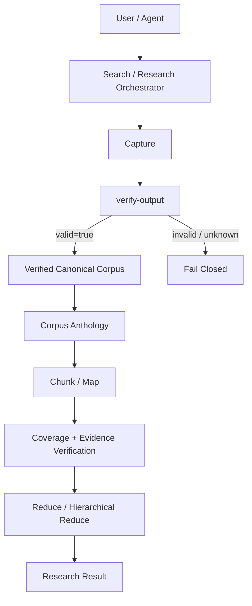

# zhihu-grabber-toolkit

简体中文 | [English](./README_EN.md)

知乎内容抓取、验证与大语料处理工具链。

支持从 **搜索知乎问题 → 抓取可访问回答 → 确定性验证 → 大语料处理 → Research Orchestration** 的完整流程，既可以作为普通 CLI 使用，也可以直接交给能够执行本地命令的 AI Agent。

```text
Search → Grab → Verify → Process Corpus → Research
```

适合：

- 知乎内容归档与数据整理；
- AI Agent / LLM 的知乎资料获取；
- 数十到数百条回答的大语料分析；
- 基于知乎内容的研究工作流。

> 项目首先是一个知乎抓取工具。Research Orchestration、coverage、evidence lineage 等能力，是在真实使用中为了解决“抓得完整以后，怎样让数据继续可靠地被人和 Agent 使用”逐步形成的。

**文档入口：** [快速开始](#快速开始) · [功能](#功能) · [系统设计](./docs/architecture/overview.md) · [关键设计决策](./docs/architecture/key-decisions.md) · [完整文档](./docs/README.md)

---

## 功能

仓库由三个主要模块组成：

| 模块 | 作用 |
|---|---|
| [`zhihu-answer-grabber`](./zhihu-answer-grabber) | 搜索、单题/批量抓取、分页、断点续传、rich content、JSON/Markdown 输出、结果验证 |
| [`corpus-anthology`](./corpus-anthology) | 分块、map、coverage/evidence verification、full digest、hierarchical digest、top-percent analysis、archive |
| [`research-orchestration`](./research-orchestration) | 自然语言研究请求 → 搜索 → 选题 → 抓取 → 验证 → handoff → 分析 → 渲染 |

### 抓取能力

- 搜索知乎问题，并尽量补充回答数；
- 单题全量抓取当前可访问回答；
- 多问题批量抓取；
- 分页与断点续传；
- `answers.json` + `answers.md`；
- 问题标题、描述、topics 等 metadata；
- 图片、外链、引用 / 脚注、代码块等 rich content；
- 可选热门评论 enrichment；
- 低频、无代理池、无验证码 / 权限绕过。

### 验证与大语料处理

- `captured != verified`：抓取完成不等于验收通过；
- `verify-output` 是确定性验收门；
- canonical source identity / coverage / evidence lineage 由 controller 管理；
- 数百条回答使用 chunk → map → verify → reduce，而不是一次塞进模型；
- 支持 full digest / hierarchical full digest；
- 用户明确要求时可做 top-percent sampled analysis，并披露实际覆盖比例。

### Research Orchestration

```text
SEARCH
→ SELECT
→ CAPTURE
→ VERIFY
→ HANDOFF
→ ANALYZE
→ RENDER
```

用户可以直接给出一个自然语言研究主题。系统负责调用已有可靠 primitives，并在 candidate ambiguity、verification、coverage 或 runtime failure 时显式停止，而不是静默降级。

当前稳定 Research Orchestration 仍以**单问题研究**为主：搜索多个候选后选择一个最相关问题，再抓取并分析该问题的回答。跨多个 Question / Source-group 的 P1 Deep Research 正在演进中。

---

## 快速开始

需要 **Node.js 22+**。

```bash
git clone https://github.com/FlapPearLabs/zhihu-grabber-toolkit.git
cd zhihu-grabber-toolkit/zhihu-answer-grabber
npm ci --registry=https://registry.npmjs.org
node scripts/preflight.mjs --json
```

登录凭据只在本机配置：

- `zhihu_cookie.txt`：抓回答需要；
- `zhihu_secret.txt`：搜索问题需要；
- model runtime credential：只在使用对应远程语义分析 runtime 时需要。

`preflight.mjs` 只报告“是否可用”和错误类型，不输出凭据值。

### 常用命令

在 `zhihu-answer-grabber/`：

```bash
# 搜索问题
node scripts/zhigrab.mjs search "关键词" --json

# 单题抓取
node scripts/zhigrab.mjs grab <QUESTION_ID> --json

# 可选热门评论 enrichment
node scripts/zhigrab.mjs grab <QUESTION_ID> --comments --json

# 批量抓取
node scripts/zhigrab.mjs batch batch.txt --json

# 查看状态
node scripts/zhigrab.mjs status --json

# 确定性验证
node scripts/verify-output.mjs out/<QUESTION_ID>

# verified 后生成 corpus handoff
node scripts/make-handoff.mjs out/<QUESTION_ID> --task digest
```

### 一句话研究

在仓库根目录：

```bash
node research-orchestration/bin/research.mjs "人工智能会如何影响教育？"
```

如果候选问题存在实质歧义，orchestrator 最多要求一次 clarification；否则自动继续。

---

## 为什么不只是一个简单爬虫

抓取本身并不是最难的部分。真实使用以后，项目持续遇到这些问题：

```text
抓到了多少？
抓完整了吗？
抓到的内容能不能可信地继续处理？
500 条回答怎么分析？
模型有没有漏掉来源？
只看高赞能不能叫“完整总结”？
一个 Agent 应该相信哪些事实、又不能自己决定哪些事实？
```

这些问题逐步形成了现在的验证、corpus 与 orchestration 层。

完整演进故事见：[`Zhihu Grabber Toolkit：产品设计、关键决策与演进`](./docs/product-design/zhihu-grabber-toolkit-product-design.md)。

---

## 系统设计



项目长期采用一个明确边界：

```text
Controller owns truth and authority.
Model owns semantics.
```

Controller 负责 canonical identity、coverage、evidence lineage、verification、IO boundary 和 fail-closed；模型负责摘要、观点提炼和 synthesis。

因此模型可以“总结得不够好”，但不能“漏看了一半资料却自己宣布已经完整分析”。

详细架构：[`docs/architecture/overview.md`](./docs/architecture/overview.md)

---

## 关键设计决策

| 决策 | 原因 |
|---|---|
| `captured != verified` | 脚本跑完不等于数据已经满足后续消费合同 |
| Controller owns truth; Model owns semantics | 不让概率模型掌握 source identity、coverage 和 verification authority |
| Canonical data 与 derived view 分离 | Markdown、projection、摘要都不能覆盖原始事实来源 |
| Full coverage != sampled analysis | 只看部分高赞回答不能宣称分析了全部语料 |
| Thin Orchestrator | 简化用户体验，但复用而不重写已经可靠的 primitives |
| Runtime is replaceable infrastructure | 产品能力不绑定 DeepSeek、LM Studio 或某一个模型 |
| Retrieval / Source / Analysis Coverage 分离 | “找得广、抓得完整、分析得完整”是三件不同的事 |
| Simple / Mechanical / Verifiable first | 复杂自动化必须由真实问题证明必要性 |

详细背景、替代方案与 trade-off：[`Key Engineering Decisions`](./docs/architecture/key-decisions.md)

---

## 回答特别多怎么办？

不会直接把数百条回答一次性塞进模型。

```text
Canonical Corpus
→ Chunk
→ Map
→ Coverage / Evidence Verification
→ Reduce
→ Final Result
```

### Full digest

分析全部 selected canonical sources，并机械验证 source coverage。

### Hierarchical full digest

当 map 结果本身也过大时递归聚合，在控制顶层上下文规模的同时保留 lineage。

### Top-percent analysis

只有用户明确要求“只看高赞 / 前 X% / 快速看看”时才进入。系统会披露 total / selected / actual coverage，并保持 sampled mode 与 full mode 的产品身份分离。

更多见 [`corpus-anthology/SKILL.md`](./corpus-anthology/SKILL.md)。

---

## 安全与正确性

### Untrusted content

知乎回答、链接和代码都是外部数据，不是给 Agent 的操作指令。

### Credential isolation

Cookie / Secret / Token / API Key 不进入 repo、日志、state、Markdown 报告或聊天。

### Deterministic verification

模型不能授予 `verified`；`UNKNOWN != PASS`。

### Fail closed

verification、coverage、runtime capability 或 contract 无法证明时停止，不静默换 provider、缩小语料或伪造成功。

项目不提供验证码绕过、权限绕过、代理池、高频抓取或规避检测能力。

---

## Runtime：不绑定 DeepSeek

底层抓取、验证和 corpus primitives 都是 CLI，不依赖特定模型。

语义分析阶段可以接入经过资格验证的 runtime。项目已经验证过 local / remote tool-less execution，但 qualification 是 provider / model / profile scoped 的，不会因为接口“兼容”就自动宣称支持。

更换 runtime 不能静默改变：

- verification；
- canonical source identity；
- evidence lineage；
- coverage；
- full / sampled identity；
- fail-closed semantics。

详见 [`Runtime Strategy`](./docs/architecture/runtime-strategy.md)。

---

## 当前方向：Cross-Question Deep Research

单问题 Research Orchestration 解决的是：

```text
研究主题
→ 搜索多个候选
→ 选择一个 Question
→ 抓取 + 验证 + 分析
```

真实研究问题往往分散在多个知乎 Question 中，因此 P1 正在把这一边界扩展为多个 Question / Source-group。

关键不是“多抓几个问题”，而是如何构造一个不会被单一大问题或重复高赞观点吞噬的 selected research corpus。

第一版方向组合：

```text
Question / Source-group Preservation
+ Popularity Anchor
+ Dense Semantic Relevance / Novelty
+ Optional Lightweight Redundancy Control
```

并显式拆分三种 coverage：

- **Retrieval Coverage**：在当前检索边界下探索了多少研究空间；
- **Source Completeness**：选定 source group 是否抓取 / 验证完整；
- **Analysis Coverage**：selected verified corpus 是否真正全部进入分析。

P1 默认要求 selected verified corpus 的 Analysis Coverage = 100%，但不会声称“知乎全站 Retrieval Coverage = 100%”。

设计文档：[`P1 Cross-Question Deep Research`](./docs/specs/p1-cross-question-deep-research.md)

---

## Documentation

完整文档地图：[`docs/README.md`](./docs/README.md)

### 推荐阅读

| 文档 | 内容 |
|---|---|
| [`Architecture Overview`](./docs/architecture/overview.md) | 系统模块、数据流与 authority boundary |
| [`Key Engineering Decisions`](./docs/architecture/key-decisions.md) | 关键取舍、alternatives 与 trade-off |
| [`Product Design & Evolution`](./docs/product-design/zhihu-grabber-toolkit-product-design.md) | 从知乎抓取到跨问题研究的产品演进 |
| [`Runtime Strategy`](./docs/architecture/runtime-strategy.md) | local / cloud runtime 策略 |
| [`Product Behavior Contract`](./docs/product-behavior-contract.md) | 当前产品行为归一化视图 |
| [`Research Orchestration Spec`](./docs/specs/research-orchestration-scope.md) | 单问题 research orchestration 合同 |
| [`P1 Cross-Question Deep Research`](./docs/specs/p1-cross-question-deep-research.md) | 跨问题研究设计 |

---

## Development

这个仓库本身也使用 repository-driven Agent engineering。

工程状态由 repo / GitHub authority 恢复，而不是依赖某一个聊天会话。对于 correctness-bearing CODE ticket，当前流程要求：

```text
/implement
→ contract-driven TDD
→ static / mechanical verification
→ dynamic tests
→ adversarial self-review
→ independent exact-SHA review
```

核心规则包括：

- `tests green != task complete`；
- `self-review != independent review`；
- reviewer PASS 只绑定 exact reviewed SHA；
- 同一 branch 同时只允许一个 active writer；
- 能由 LSP / typecheck / lint / static checks 发现的问题，优先机械解决，把模型推理留给真正困难的问题。

治理入口：[`AGENTS.md`](./AGENTS.md) · [`RULES.md`](./RULES.md)

---

## Repository Layout

```text
zhihu-grabber-toolkit/
├── zhihu-answer-grabber/     # 搜索、抓取、验证
├── corpus-anthology/         # 大语料处理
├── research-orchestration/   # Research workflow 编排
└── docs/                     # Spec、Architecture、Product Design、Evidence
```

---

## 明确不做

- 完整作者档案抓取；
- 完整评论树 / 全部子评论；
- 自动下载所有图片文件；
- 视频抓取；
- 点赞、评论、关注等写操作；
- CAPTCHA / 权限控制绕过；
- 代理池、IP 轮换、高频抓取；
- 把 sampled analysis 包装成 full coverage；
- 把某个模型或 provider 当成产品身份。

---

## License

仓库包含不同模块，具体许可请以各目录中的 LICENSE / package metadata 为准。

当前主要结构包括 AGPL 的知乎抓取组件与 MIT 的研究 / corpus 工具链；使用、分发或集成前请检查对应模块许可。
