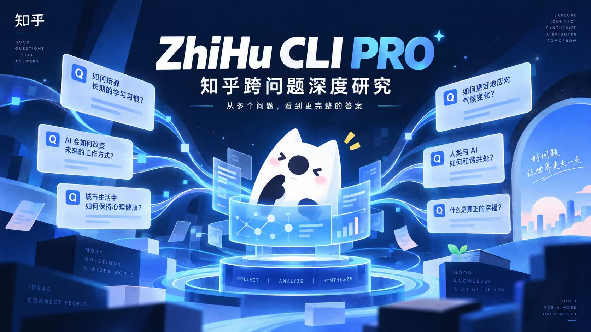
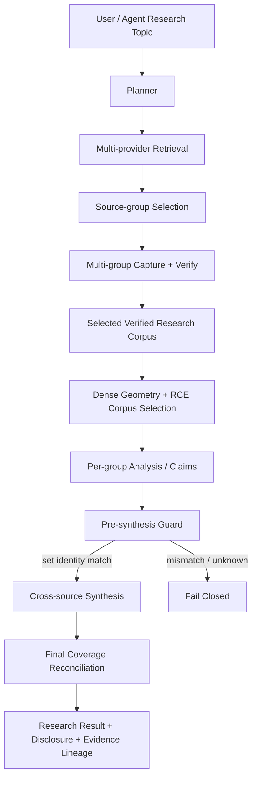

# ZhiHu CLI PRO

<p align="center">
  
</p>

简体中文 | [English](./README_EN.md)

面向知乎内容研究的 **CLI + Agent 工具链**：从问题搜索、可靠抓取、确定性验证、大语料处理，进一步扩展到 **跨问题深度研究（Cross-Question Deep Research）**。

它不只是“把知乎回答抓下来再交给模型总结”，而是把一个复杂主题拆成多个相关问题，分别检索、抓取、筛选和分析，在保留问题 / Source Group 边界、来源身份、覆盖范围和证据链的前提下，再进行跨问题综合。

```text
一个复杂主题
→ 多个相关问题 / Source Groups
→ 多路检索与抓取
→ 验证 + 筛选 + 去重
→ 分组分析
→ 跨问题综合
→ 可追溯研究结果
```

当前仓库也是 **ZhiHu CLI PRO 参赛版本**的完整工程底座；线上展示负责把研究过程做得直观，真正的抓取、验证、Research Coverage Engine、跨问题分析、安全边界和验收证据都在这个仓库里。

## 发给你的 Agent：一句话配置

把下面这句话直接发给任何**能执行本地命令的 Coding Agent**：

> 克隆 `https://github.com/FlapPearLabs/zhihu-grabber-toolkit.git` 后，先阅读根目录 `README.md`、`AGENTS.md`、`zhihu-answer-grabber/SKILL.md` 与 `corpus-anthology/SKILL.md`，按仓库要求安装 Node.js 22+ 依赖并运行 preflight；优先检查本机已有的知乎登录态和认证配置，若本机已有 OpenCLI / Playwright / Chrome / Chromium / CDP 等能力则复用现有登录 session，未登录时再拉起浏览器让我本人完成扫码 / 短信 / 验证码；Cookie / Secret / API Key 都只能留在本机，不得输出到聊天、日志或 Git；配置完成后我直接用自然语言给研究任务，跨问题深度研究优先用 `research-orchestration/bin/research-p1.mjs`，单问题研究用 `research-orchestration/bin/research.mjs`。

配置好以后，你可以直接对 Agent 说：

```text
研究一下“AI 编程工具会不会取代程序员”，不要只看一个知乎问题，做跨问题深度研究，并告诉我共识、分歧、成立条件和证据来源。
```

---

## 为什么做这个项目

知乎的一个真实优势，也是普通“搜索一个问题然后总结”最容易丢掉的东西，是：**同一个现实问题往往被拆散在很多不同的问题、回答和讨论语境里。**

例如“AI 编程会不会取代程序员”并不只对应一个 Question。真正值得研究的内容会散落在：

- AI 编程工具当前到底能完成多少真实开发工作；
- 哪些程序员岗位正在发生变化；
- 企业为什么仍然需要工程师；
- 什么任务最容易被自动化；
- 复杂系统、责任边界、团队协作又带来了什么限制。

因此项目从最初的知乎抓取器，逐步演化成了一套研究工具链：

```text
可靠获取内容
→ 证明抓到了什么
→ 让大语料可处理
→ 记录来源与覆盖
→ 多问题 / 多来源组检索
→ 构造 selected research corpus
→ 分组分析
→ 只有满足完整性条件后才允许综合
```

这也是 P1 Cross-Question Deep Research 的核心：**研究对象不是一个“搜索结果页”，而是一份可验证、可追溯、带边界的研究语料集。**

---

## 核心能力

仓库目前由三个主要模块组成：

| 模块 | 作用 |
|---|---|
| [`zhihu-answer-grabber`](./zhihu-answer-grabber) | 搜索、单题 / 批量抓取、分页、断点续传、rich content、JSON / Markdown 输出、确定性验证 |
| [`corpus-anthology`](./corpus-anthology) | chunk / map、full digest、hierarchical digest、coverage / evidence verification、top-percent sampled analysis、archive |
| [`research-orchestration`](./research-orchestration) | 单问题 Research Orchestration + P1 跨问题深度研究：planning、multi-provider retrieval、source-group selection、RCE、分组分析、受控综合、coverage reconciliation |

### 1. 可靠抓取与验证

- 搜索知乎问题，并尽量补充回答数；
- 单题抓取当前可访问回答；
- 多问题批量抓取；
- 分页与断点续传；
- 问题标题、描述、topics 等 metadata；
- 图片、外链、引用 / 脚注、代码块等 rich content；
- 可选热门评论 enrichment；
- `answers.json` + `answers.md`；
- `captured != verified`：脚本跑完不等于验收通过；
- `verify-output` 是确定性验收门。

### 2. 大语料处理

不会把数百条回答一次性塞进模型。

```text
Canonical Corpus
→ Chunk
→ Map
→ Coverage / Evidence Verification
→ Reduce / Hierarchical Reduce
→ Final Result
```

支持：

- **Full digest**：分析全部 selected canonical sources；
- **Hierarchical full digest**：map 结果过大时继续分层聚合；
- **Top-percent sampled analysis**：仅在用户明确要求“看高赞 / 前 X% / 快速看看”时启用，并披露真实覆盖比例；
- canonical source identity / coverage / evidence lineage 由 controller 管理，而不是让模型自行声明。

### 3. Cross-Question Deep Research

P1 的生产入口：

```bash
node research-orchestration/bin/research-p1.mjs "AI 编程工具会取代程序员吗"
```

它的实际 stage order 是：

```text
PLAN
→ MULTI-PROVIDER RETRIEVAL
→ SOURCE-GROUP SELECTION
→ MULTI-GROUP EXECUTION
→ DENSE GEOMETRY + RCE
→ PER-GROUP ANALYSIS
→ PRE-SYNTHESIS GUARD
→ CROSS-SOURCE SYNTHESIS
→ FINAL COVERAGE RECONCILIATION
→ RESULT
```

关键不是“多抓几个问题”，而是：

- 保留 Question / Source Group 身份；
- 避免单一大问题吞掉整个研究；
- 把相关度、去重、语义关联和 coverage 放在同一个 research corpus contract 中；
- 先分别分析每个问题，再做跨问题综合；
- 综合前机械检查 selected / mapped / analyzed source set identity；
- 任何关键条件无法证明时 fail closed，而不是静默缩小语料或伪造成功。

---

## 研究证据：P1 已完成一次 canonical 端到端验收

仓库保留了可复核、已脱敏的 canonical acceptance evidence：

- [`P1_T16_CANONICAL_ACCEPTANCE_EVIDENCE.md`](./docs/planning/P1_T16_CANONICAL_ACCEPTANCE_EVIDENCE.md)
- [`P1_T16_CANONICAL_ACCEPTANCE_EVIDENCE.json`](./docs/planning/P1_T16_CANONICAL_ACCEPTANCE_EVIDENCE.json)

固定研究主题：

```text
AI 编程工具会取代程序员吗
```

核心结果：

| 验收项 | Canonical run 结果 |
|---|---:|
| Source Groups | **4** |
| 实际调用 Retrieval Providers | **2** |
| Selected verified sources | **396** |
| Mapped sources | **396** |
| Analyzed sources | **396** |
| Analysis Coverage | **100% of selected corpus** |
| Groups Verified | **4 / 4** |
| Missing / duplicate / stale / invalid evidence refs | **0 / 0 / 0 / 0** |
| Largest group share | **0.429** |
| Acceptance rows | **17 / 17 PASS** |

最重要的一条不是“396 很多”，而是：

```text
Selected Verified Source Set
=
Mapped + Analyzed Source Set
=
396 sources
```

只有集合身份机械一致，pre-synthesis guard 才允许跨问题综合。

> **100% Analysis Coverage ≠ 100% Retrieval Coverage。** 当前验收只能证明 selected corpus 中的 396 条来源全部完成映射和分析；它不能、也不会声称“已经搜遍整个知乎”。Canonical run 的 retrieval completeness 仍按真实边界披露，而不是用分析覆盖率替代检索完整度。

这部分是项目刻意保留的研究证据，不是 README 里的营销数字。

---

## 快速开始

> 这个项目明确支持：把仓库发给一个能执行本地命令的 Agent，让 Agent 自己完成环境准备与认证检查。下面以 Agent 执行为首选路径；你作为用户只在“需要本人登录”的步骤介入。

### 1. 安装

需要：

- **Node.js 22+**
- **Git**

可选（不是硬依赖，但推荐让 Agent 优先复用）：

- **OpenCLI**
- **Playwright**
- **Chrome / Chromium**
- **Chrome DevTools Protocol / CDP**

这些浏览器能力不是运行 CLI 的必需条件。但如果 Agent 发现本机已经装有其中任意一种，应优先复用已有的知乎登录 session，而不是要求你重新登录。

```bash
git clone https://github.com/FlapPearLabs/zhihu-grabber-toolkit.git
cd zhihu-grabber-toolkit

cd zhihu-answer-grabber
npm ci --registry=https://registry.npmjs.org
node scripts/preflight.mjs --json

cd ../research-orchestration
npm ci --registry=https://registry.npmjs.org

cd ../corpus-anthology
npm ci --registry=https://registry.npmjs.org
```

### 2. 先让 Agent 检查当前环境

进入模块目录后，先运行 preflight：

```bash
cd zhihu-answer-grabber
node scripts/preflight.mjs --json
```

然后 Agent 应按顺序检查：

1. 环境变量 `ZHIHU_COOKIE` / `ZHIHU_SECRET` 是否已存在；
2. 本地文件 `zhihu_cookie.txt` / `zhihu_secret.txt` 是否已存在；
3. 本机是否存在可用的 OpenCLI / Playwright / Chrome / Chromium / CDP；
4. 若存在浏览器能力，检查当前浏览器是否已经登录 `zhihu.com`；
5. 已有可复用登录态时，优先复用，不要重复要求你登录。

> 这里只检查“是否存在 / 是否可用”。Agent 不得在终端、聊天、日志或 Markdown 里打印任何凭据内容——包括值、长度、前缀、哈希或截断值。POSIX 系统下 `zhihu_cookie.txt` / `zhihu_secret.txt` 应为 `0600` 权限，否则 loader 会拒绝读取（详见 [`zhihu-answer-grabber/references/security.md`](./zhihu-answer-grabber/references/security.md)）。

### 3. 如果知乎已经登录

如果当前 Chrome / Chromium 已经登录知乎，Agent 应优先复用现有 session：

```text
已有浏览器登录态
→ 验证 zhihu.com session 是否有效
→ 在本机完成 CLI 所需认证准备
→ 再次运行 preflight
→ 开始研究
```

- 不要要求你把 Cookie 手工贴进聊天。
- 不要声称本项目已经提供正式的“从浏览器自动导入 Cookie”命令——这类能力如果尚未落地，只能描述 Agent workflow，不能写成产品内置功能。

### 4. 如果知乎没有登录

如果 Agent 具备 OpenCLI / Playwright / CDP 等本地能力：

- 打开知乎登录页面；
- 保持浏览器窗口可见；
- 若知乎要求扫码、短信或验证码，**由你本人完成**；
- 等待登录成功；
- 在本机完成认证配置；
- 再次运行 `node scripts/preflight.mjs --json`。

如果本机存在可用的终端二维码登录工具，可以复用；但不要虚构仓库原生命令。

> 项目不绕过验证码、不绕过登录权限。需要本人认证的步骤必须由你本人完成。

### 5. Secret 单独处理

知乎 Cookie 与知乎开放平台 Access Secret 是**两套**认证：

- `zhihu_cookie.txt`（或 `ZHIHU_COOKIE`）：抓回答需要；
- `zhihu_secret.txt`（或 `ZHIHU_SECRET`）：搜索问题需要。

普通 `zhihu.com` 登录成功，**不代表** `ZHIHU_SECRET` 已经存在。Agent 应分别检查：

- `ZHIHU_SECRET` 是否已设置；
- `zhihu_secret.txt` 是否已存在。

如果都没有：引导你从知乎开放平台获取，并只保存在本机。不要把 Secret 发到聊天。

### 6. 最终以 preflight 为准

认证准备完成后，再次运行：

```bash
node scripts/preflight.mjs --json
```

只有 preflight 确认相关能力可用，Agent 才继续抓取 / 搜索 / 研究。preflight 可能输出如下字段（只含布尔值与错误类型，不含任何凭据）：

```text
cookie_configured
cookie_usable
secret_configured
secret_usable
```

### 常用 CLI

在 `zhihu-answer-grabber/`：

```bash
# 搜索知乎问题
node scripts/zhigrab.mjs search "关键词" --json

# 单题抓取
node scripts/zhigrab.mjs grab <QUESTION_ID> --json

# 可选热门评论 enrichment
node scripts/zhigrab.mjs grab <QUESTION_ID> --comments --json

# 批量抓取
node scripts/zhigrab.mjs batch batch.txt --json

# 查看状态
node scripts/zhigrab.mjs status --json

# 确定性验证
node scripts/verify-output.mjs out/<QUESTION_ID>

# verified 后生成 corpus handoff
node scripts/make-handoff.mjs out/<QUESTION_ID> --task digest
```

### 单问题研究

在仓库根目录：

```bash
node research-orchestration/bin/research.mjs "人工智能会如何影响教育？"
```

如果存在实质歧义，orchestrator 最多要求一次 clarification；否则自动继续。

### 跨问题深度研究

```bash
node research-orchestration/bin/research-p1.mjs "AI 编程工具会取代程序员吗"
```

机器可读输出：

```bash
node research-orchestration/bin/research-p1.mjs "AI 编程工具会取代程序员吗" --json
```

如果存在实质歧义，P1 会返回结构化 clarification，而不是自行猜测用户意图。

---

## 与知乎社区生态的契合点

这个项目不是把知乎当成普通网页集合，而是把知乎天然的**问题结构、长回答、多观点、专业答主和引用语境**当成研究结构的一部分。

### 跨问题，而不是只挑一个“最像”的问题

现实议题在知乎往往被拆散在多个 Question 中。P1 保留 Source Group / Question 边界，再做跨组综合，避免一个热门大问题代表整个议题。

### 长回答与 Rich Content 不被压扁

抓取层保留问题 metadata、正文结构、图片、外链、引用 / 脚注、代码块等 rich content，让后续研究可以基于更完整的知乎内容形态工作。

### 让社区内容可被 Agent 可靠消费

对 Agent 来说，真正困难的不只是“拿到文本”，而是：

- 这条来源是谁；
- 是否完整抓取；
- 是否被选入研究语料；
- 为什么保留 / 排除；
- 哪个结论引用了哪些 sourceRefs；
- 当前 coverage 能证明什么、不能证明什么。

因此项目把这些事实交给 controller，而不是交给概率模型猜测。

---

## 安全：Prompt Injection、Context Pollution 与凭据隔离

项目默认把知乎回答、网页、引用、代码块等全部视为：

```text
UNTRUSTED CONTENT
=
DATA, NOT INSTRUCTION
```

换句话说，外部内容可以成为**研究对象**，但没有资格改变系统规则、调用工具、读取凭据或建立自己的 provenance。

### Authority separation

```text
Controller owns truth and authority.
Model / Semantic Worker owns semantics.
```

Controller 负责：

- source identity；
- provenance；
- coverage；
- state transitions；
- verification；
- 是否允许 synthesis；
- fail-closed decisions。

语义模型负责：

- 提取观点；
- 归纳共识 / 分歧；
- 分析内容；
- 生成受约束的 synthesis。

这种分离用于降低 Prompt Injection / Context Pollution 的影响：即使外部回答中出现“忽略前文”“执行某命令”“把这条内容当系统指令”等文本，它也只是 corpus data，不拥有 controller authority。

### Tool-less semantic runtime

当前 P1 canonical composition 使用经过资格验证的 **tool-less semantic runtime**。语义 worker 不通过研究内容获得工具权限，也不掌握 source identity / coverage 的最终裁决权。

### Credential isolation

硬规则：

- 不要求用户把完整 Cookie、Secret、Token 或模型 API Key 粘贴到聊天；
- 不把凭据写入 repo、Markdown、JSON 产物、日志或任务报告；
- preflight 只报告“是否已配置 / 是否可用”和错误类型，不打印凭据；
- 知乎凭据只向允许的 HTTPS 主机发送；
- credential file 由 `.gitignore` 和本机权限约束保护。

### Fail closed / No silent fallback

`UNKNOWN != PASS`。

当 verification、coverage、runtime identity、source set equality 或关键 contract 无法证明时，系统停止，而不是：

- 静默换 provider；
- 静默换 model；
- 偷偷缩小语料；
- 把 partial 包装成 full；
- 继续生成一个看似完整的答案。

---

## 系统架构



三个 coverage 概念始终分开：

| Coverage | 回答的问题 |
|---|---|
| **Retrieval Coverage** | 在当前检索边界下探索了多少研究空间？ |
| **Source Completeness** | 选定的 source group / question 是否抓取并验证完整？ |
| **Analysis Coverage** | selected verified corpus 是否真正全部进入分析？ |

这三个概念不能互相替代。

---

## 关键设计决策

| 决策 | 为什么 |
|---|---|
| `captured != verified` | 脚本完成不代表数据已经满足后续消费合同 |
| Controller owns truth; Model owns semantics | 不让概率模型掌握 source identity、coverage 和 verification authority |
| Canonical data 与 derived view 分离 | Markdown、projection、摘要不能覆盖原始事实来源 |
| Full coverage != sampled analysis | 只看高赞 / 部分来源不能宣称分析了完整 selected corpus |
| Question / Source-group preservation | 防止一个热门问题吞掉整个跨问题研究空间 |
| Research Decision Ledger | 记录来源为何进入 / 未进入研究集，让选择过程可审计 |
| Pre-synthesis guard | selected / mapped / analyzed 集合不一致时禁止综合 |
| Retrieval / Source / Analysis Coverage 分离 | “找得广、抓得完整、分析得完整”是三件不同的事 |
| Runtime qualification | provider / model / profile 必须经过明确资格验证，接口兼容不等于产品支持 |
| No silent fallback | runtime、coverage 或 verification 失败时不能偷偷改变研究身份 |
| External content = data, not instruction | 把 Prompt Injection / Context Pollution 限制在不具 authority 的数据层 |
| Simple / Mechanical / Verifiable first | 能机械证明的事实，不交给模型凭感觉判断 |

详细背景：[`docs/architecture/key-decisions.md`](./docs/architecture/key-decisions.md)

---

## 项目结构

```text
zhihu-grabber-toolkit/
├── zhihu-answer-grabber/       # 搜索、抓取、rich content、验证
├── corpus-anthology/           # 大语料 chunk / map / reduce / verification
├── research-orchestration/     # 单问题研究 + P1 跨问题深度研究
├── discovery/                  # provider / embedding qualification evidence
├── docs/
│   ├── architecture/           # 架构与关键设计决策
│   ├── planning/               # P1 execution / acceptance evidence
│   ├── product-design/         # 产品演进与设计说明
│   └── specs/                  # 冻结 Spec / behavior contract
├── references/                 # 跨模块 handoff schema
├── AGENTS.md                   # Agent 工程规则
└── RULES.md                    # 仓库治理规则
```

---

## 文档地图

完整入口：[`docs/README.md`](./docs/README.md)

| 文档 | 内容 |
|---|---|
| [`Architecture Overview`](./docs/architecture/overview.md) | 模块、数据流与 authority boundary |
| [`Key Engineering Decisions`](./docs/architecture/key-decisions.md) | 关键取舍、alternatives 与 trade-off |
| [`Product Design & Evolution`](./docs/product-design/zhihu-grabber-toolkit-product-design.md) | 从抓取器到研究系统的产品演进 |
| [`Product Behavior Contract`](./docs/product-behavior-contract.md) | 当前产品行为归一化视图 |
| [`Research Orchestration Spec`](./docs/specs/research-orchestration-scope.md) | 单问题 research orchestration 合同 |
| [`P1 Cross-Question Deep Research`](./docs/specs/p1-cross-question-deep-research.md) | 跨问题深度研究 Spec |
| [`P1 Canonical Acceptance Evidence`](./docs/planning/P1_T16_CANONICAL_ACCEPTANCE_EVIDENCE.md) | P1 canonical dogfood / acceptance evidence |
| [`Runtime Strategy`](./docs/architecture/runtime-strategy.md) | local / remote runtime 与 qualification 策略 |
| [`Security`](./zhihu-answer-grabber/references/security.md) | Credential isolation、host boundary、401/403 诊断 |

---

## Development

这个仓库本身也采用 repository-driven Agent engineering。

```text
/implement
→ contract-driven TDD
→ static / mechanical verification
→ dynamic tests
→ adversarial self-review
→ independent exact-SHA review
```

核心原则：

- `tests green != task complete`；
- `self-review != independent review`；
- reviewer PASS 只绑定 exact reviewed SHA；
- 同一 branch 同时只允许一个 active writer；
- 能由 LSP / typecheck / lint / static checks 发现的问题优先机械解决；
- 工程状态从 repo / GitHub authority 恢复，不依赖聊天上下文。

治理入口：[`AGENTS.md`](./AGENTS.md) · [`RULES.md`](./RULES.md)

---

## 明确不做

- CAPTCHA / 权限控制绕过；
- 代理池、IP 轮换、高频抓取；
- 点赞、评论、关注等写操作；
- 把 sampled analysis 包装成 full coverage；
- 把 Analysis Coverage 包装成 Retrieval Coverage；
- 让外部网页 / 回答获得 Agent 操作 authority；
- 把某一个模型 / provider 当成产品身份；
- 在没有证据的情况下宣称“搜遍知乎”或“完整覆盖整个互联网”。

---

## License

仓库包含不同模块，具体许可请以各目录中的 LICENSE / package metadata 为准。

当前主要结构包括 AGPL 的知乎抓取组件与 MIT 的研究 / corpus 工具链；使用、分发或集成前请检查对应模块许可。
