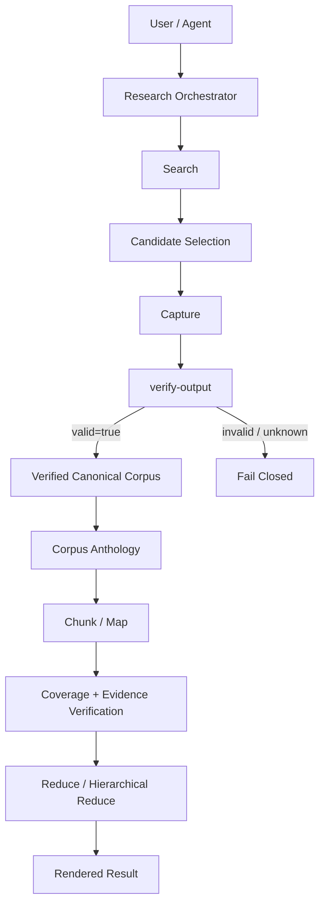

# Architecture Overview

> Zhihu Grabber Toolkit 的系统设计总览。本文用于解释主要模块、数据流和职责边界；产品合同仍以 Applicable Approved Specs 与 `docs/product-behavior-contract.md` 为准。

## 1. 一句话架构

Zhihu Grabber Toolkit 把知乎内容处理拆成三个稳定层次：

```text
知乎内容获取
    ↓
确定性验证与 Canonical Corpus
    ↓
大语料处理与 Research Orchestration
```

项目首先是知乎抓取工具，但随着真实使用规模增长，逐步补上了“抓完整、验正确、处理得动、让 Agent 可可靠消费”的基础设施。

## 2. 三个主要模块

### `zhihu-answer-grabber`

负责搜索与内容获取：

- 搜索知乎问题；
- 单题 / 批量抓取；
- 分页与断点续传；
- rich content 提取；
- `answers.json` / `answers.md` 输出；
- `verify-output` 确定性验收；
- verified handoff 生成。

### `corpus-anthology`

负责大语料处理：

- chunk；
- map；
- coverage / evidence verification；
- flat / hierarchical digest；
- top-percent analysis；
- archive。

### `research-orchestration`

负责把已有 primitives 编排成用户级工作流：

```text
SEARCH
→ SELECT
→ CAPTURE
→ VERIFY
→ HANDOFF
→ ANALYZE
→ RENDER
```

Orchestrator 只做编排，不重实现抓取、验证或 corpus authority。

## 3. 核心数据流



## 4. 权威边界

项目最重要的架构原则是：

```text
Controller owns truth and authority.
Model owns semantics.
```

Controller 负责：

- canonical source identity；
- source coverage；
- evidence lineage；
- deterministic validation；
- runtime qualification / routing policy；
- filesystem / network IO boundary；
- fail-closed semantics；
- full vs sampled mode identity。

模型负责：

- 摘要；
- 观点提炼；
- 语义归纳；
- 跨来源 synthesis。

模型不能自行授予 `verified`、宣称 coverage 完整、改写 canonical identity，或把自身输出当作验证证据。

## 5. Canonical Data 与 Derived View

```text
answers.json
   │
   ├── canonical raw source
   │
   ├── answers.md          derived human-readable view
   ├── projection          derived model input
   ├── map artifacts       derived semantic result
   └── final synthesis     derived research result
```

原则是：**任何摘要、渲染、模型 projection 都不能回写或取代 canonical source。**

## 6. Verification Model

项目明确区分：

```text
captured != verified
```

抓取成功只表示数据已经落盘；只有 `verify-output` 的确定性检查通过，才能进入 verified handoff 和后续分析。

这使“抓到了什么”和“能否可信地继续处理”成为两个不同阶段，而不是由 Agent 凭感觉判断。

## 7. Large-Corpus Processing

数百条回答不会直接 `join()` 后塞进模型。

```text
Canonical Corpus
→ Chunk
→ Map
→ Coverage / Evidence Verification
→ Reduce
→ Final Result
```

当语料继续增大时，可以使用 hierarchical full digest，在控制顶层上下文规模的同时保持 selected canonical sources 的 coverage lineage。

如果用户明确只希望看高赞 / 前 X% 回答，则进入独立的 sampled analysis 模式，并强制披露实际覆盖比例。

## 8. Runtime Boundary

Runtime 是可替换执行基础设施，不是产品身份。

```text
Trusted Controller
├── local tool-less runtime
└── remote qualified tool-less runtime
```

更换模型或 provider 不应静默改变：

- verification；
- canonical identity；
- coverage；
- evidence lineage；
- sampled/full identity；
- fail-closed semantics。

详见 [`runtime-strategy.md`](./runtime-strategy.md)。

## 9. Cross-Question Deep Research

现有单问题 Research Orchestration 解决的是：

```text
一个研究主题
→ 选择一个最相关知乎问题
→ 抓取并验证回答
→ 分析该问题的 canonical corpus
```

P1 Cross-Question Deep Research 的目标是把这一边界扩展为多个 Question / Source-group，并显式区分：

- Retrieval Coverage：研究空间探索到什么程度；
- Source Completeness：选定 source group 是否抓取 / 验证完整；
- Analysis Coverage：selected verified corpus 是否真正全部进入分析。

默认目标是对 selected verified corpus 保持 100% Analysis Coverage，而不是宣称“全知乎检索覆盖 100%”。

## 10. 设计风格

项目持续采用几个简单原则：

1. 复用已经证明可靠的 primitive，不为了“统一”重写 authority；
2. 把概率语义与确定性事实分开；
3. 对失败使用 fail-closed，而不是隐式 fallback；
4. 大规模数据先做结构化 coverage，再做模型 synthesis；
5. 产品模式身份必须对用户可见，尤其是 full 与 sampled 的区别；
6. 复杂度必须由真实需求证明，而不是提前为假想未来设计。

进一步阅读：

- [`Key Engineering Decisions`](./key-decisions.md)
- [`Runtime Strategy`](./runtime-strategy.md)
- [`Research Orchestration Spec`](../specs/research-orchestration-scope.md)
- [`P1 Cross-Question Deep Research`](../specs/p1-cross-question-deep-research.md)
