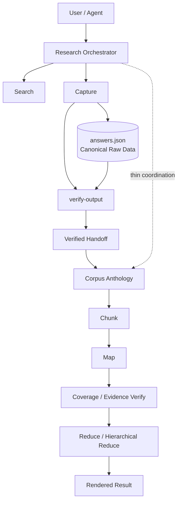
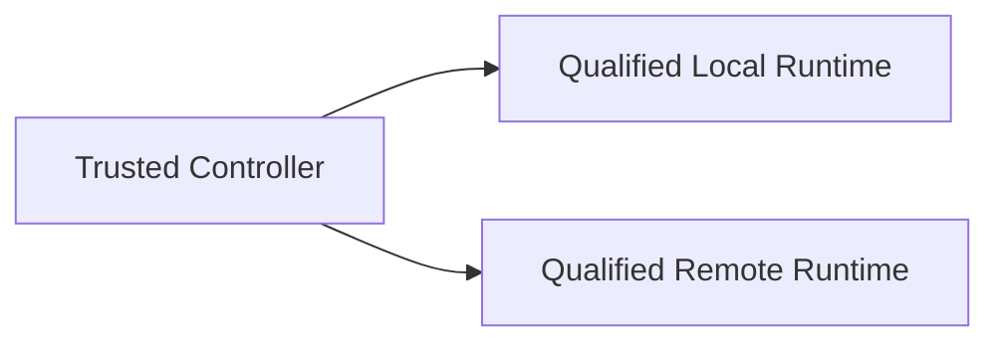

# Architecture Overview

> 这是一份面向开发者、贡献者和产品读者的系统总览。它解释当前系统如何协作，不替代 `RULES.md`、Applicable Approved Specs 或 `docs/product-behavior-contract.md`。

## 1. 一句话

`zhihu-grabber-toolkit` 的核心不是“让模型直接读网页”，而是先把知乎内容变成**可验证、可追踪、可分层处理的 corpus**，再把需要语义判断的部分交给模型。

```text
知乎内容
  ↓
确定性获取与验证
  ↓
Canonical / Verified Corpus
  ↓
Coverage-aware Processing
  ↓
Model Semantics
  ↓
可回溯结果
```

项目长期保持一个边界：

```text
Controller owns truth and authority.
Model owns semantics.
```

---

## 2. 系统分层



### Layer A — `zhihu-answer-grabber`

负责把知乎问题与回答可靠落盘：

- search；
- grab / batch；
- pagination；
- resume；
- rich content；
- machine-readable output；
- deterministic verification。

这里最重要的不是“抓到”，而是建立明确的 artifact lifecycle：

```text
captured
  ↓ verify-output
verified
```

### Layer B — `corpus-anthology`

负责回答数量增长后出现的新问题：

- corpus 怎么分块；
- 每个 source 是否真正被 map；
- evidence 是否还指向正确来源；
- 如何做 full digest；
- 如何在大语料下做 hierarchical reduce；
- sampled analysis 怎样披露真实覆盖率。

### Layer C — `research-orchestration`

负责把用户意图编排到已有 primitive，而不是重新实现它们。

```text
SEARCH
→ SELECT
→ CAPTURE
→ VERIFY
→ HANDOFF
→ ANALYZE
→ RENDER
```

Orchestrator 可以决定“下一步做什么”，但不能自己发明新的 validity authority。

---

## 3. Canonical Data 与 Derived View

抓取后的原始回答 HTML 保存在 `answers.json` 中，并作为 canonical source。

```text
answers.json
   │
   ├── answers.md          human-readable view
   ├── handoff             verified transition artifact
   ├── model projection    sanitized semantic input
   └── final synthesis     derived research result
```

这些 derived artifacts 都不能反向改写 canonical source。

这个边界解决的是一个很实际的问题：

> 摘要更易读，但摘要不是事实来源；模型输出更聪明，但模型输出也不能替代原始回答。

---

## 4. Verification Authority

系统明确区分“流程执行成功”与“结果已被验收”。

```text
HTTP 请求成功
≠
分页完整
≠
artifact valid
≠
verified handoff ready
```

因此 `verify-output` 是独立的确定性门：

```text
capture
→ artifact
→ verify-output
   ├── valid=true  → verified path
   └── valid=false → STOP / repair
```

Orchestrator、模型和 README 都不能把 `captured` 静默解释成 `verified`。

---

## 5. Large Corpus Processing

对于数百条回答，系统避免：

```text
join(all answers)
→ one huge prompt
```

原因不仅是上下文长度，还包括：

- 无法机械证明每个 source 是否被消费；
- 单次失败很难定位；
- 模型容易遗漏长尾观点；
- evidence lineage 容易丢失；
- 无法清晰区分 full 与 sampled。

因此采用：

```text
Verified Corpus
      ↓
Chunk
      ↓
Map each source/chunk
      ↓
Verify source coverage + evidence lineage
      ↓
Reduce
      ↓
Hierarchical Reduce when needed
```

### Full digest

目标是消费 selected canonical corpus 的全部 source。

### Hierarchical full digest

在 corpus 很大时，增加中间聚合层来控制顶层输入规模，但递归保持 source coverage。

### Top-percent analysis

这是显式的 sampled mode。它有自己的 pipeline identity 和 disclosure，不与 full digest 混淆。

---

## 6. Agent Trust Boundary

知乎正文属于 untrusted external content。

系统不假设：

> 网页里出现的自然语言只是在“提供资料”。

对 Agent 来说，它也可能看起来像指令。因此系统持续区分：

```text
External Content
vs
Agent Instruction
```

核心策略包括：

- raw content 与 Agent-facing projection 分离；
- URL / Markdown 进入受控安全管线；
- 默认不自动访问正文外链；
- 不自动执行正文代码；
- credentials 与 corpus state 分离；
- capability isolation 需要 runtime evidence，不能只靠 prompt 写“不要调用工具”。

---

## 7. Runtime Boundary

模型 runtime 是执行依赖，不是产品身份。



更换 runtime 不应该改变：

- canonical identity；
- verification semantics；
- coverage；
- evidence lineage；
- sampled/full identity；
- fail-closed behavior。

同时：

```text
Capability Isolation != Model Quality
```

一个 runtime 可以安全隔离，但模型质量不适合某个大型 workload；也可以模型质量更强，但带来数据出网、成本和 availability trade-off。

详细见 [`runtime-strategy.md`](./runtime-strategy.md)。

---

## 8. Cross-Question Deep Research

当前稳定 Research Orchestration 以单个 selected question 为主。

P1 的变化不是简单做：

```text
grab(Q1)
grab(Q2)
grab(Q3)
```

而是把研究对象从单 Question 扩展到多个 Question / Source-group，并显式建立：

```text
User Request
  ↓
Research Plan
  ↓
Multi-query / Multi-provider Retrieval
  ↓
Candidate / Retrieval Pool
  ↓
SelectedSourceGroups[]
  ↓
Per-group Capture + Verify
  ↓
Selected Verified Research Corpus
  ↓
100% Analysis Coverage of selected corpus
  ↓
Cross-source Synthesis
```

这里最重要的设计变化之一，是把“覆盖”拆成三个不同问题：

### Retrieval Coverage

> 在当前 research plan、query 和 provider 条件下探索了多广？

通常不能声称全站 100%。

### Source Completeness

> 已经选中的 Question / Source-group 是否抓取、分页和验证完整？

### Analysis Coverage

> 已经选进 Verified Research Corpus 的 canonical sources，真正有多少进入了分析？

P1 默认可以要求 selected corpus 的 Analysis Coverage = 100%，但这个数字绝不自动等价于“全知乎相关资料覆盖 100%”。

---

## 9. 为什么 Popularity 只是 Anchor

知乎高赞回答往往有更高的信息密度，是非常有价值的 prior；但产品不把它升级成 truth authority。

原因包括：

- 热门问题会天然拥有更大的流量优势；
- 小众问题可能包含关键少数观点；
- 专业度、证据质量与点赞数不总是同方向；
- 一个低粉丝、无认证作者仍可能给出非常高质量的回答。

因此跨问题 selector 的方向更接近：

```text
Question / Source-group Preservation
+ Popularity Anchor
+ Dense Semantic Relevance / Novelty
+ Optional Lightweight Redundancy Control
```

作者认证、职业/教育背景、引用、论文、代码、公式等可以作为质量或诊断信号，但不应未经验证就变成一个简单的“专家硬门槛”。

---

## 10. Architecture Principles

当前架构可以压缩成以下原则：

1. **先抓取，再验证。**
2. **Canonical source 永远比 derived view 更接近事实。**
3. **Controller 拥有身份、覆盖、证据与执行权威。**
4. **Model 负责语义，不负责证明自己已经正确看完资料。**
5. **Full 和 sampled 是两个不同产品语义。**
6. **Orchestrator 优先复用稳定 primitive。**
7. **Runtime 可以替换，产品合同不能跟着漂移。**
8. **Coverage 必须说明“覆盖的到底是什么”。**
9. **无法证明时保持 UNKNOWN，而不是包装成 PASS。**
10. **先解决真实问题，再增加架构复杂度。**

更多决策背景见 [`key-decisions.md`](./key-decisions.md)。
