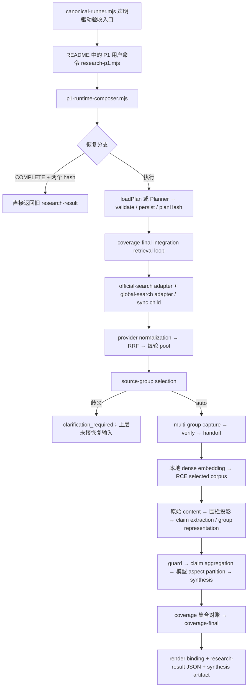

> 发布说明：本文保留 2026-09-18 审计时态；随后用户明确授权上传证据，现发布于独立审计分支。文中“未创建分支/commit”指原只读审计阶段，不描述本次发布动作。

# Zhihu Research：独立对抗性系统与架构审计

日期：2026-09-18。性质：READ-ONLY / PRE-CHANGE AUDIT。所有实验均在临时目录，未修复产品。

## 1. EXECUTIVE VERDICT

**REPAIR_BEFORE_NEW_DESIGN。真实生产链路已经接通，但 checkpoint、跨组语义关系和语料投影存在可复现缺陷，尚不适合把新增研究算法或完整 #79 平台作为第一优先级。**

#79 有价值，尤其适合揭示“集合覆盖完整、研究结论仍错误”的问题；但不能代替已知 correctness 修复。推荐顺序：限定修复与独立复验 → 最小离线观测证据包 → 有限跨领域/隐藏目标试验 → 依据缺陷证据决定 #53/#54。没有证据支持立即推进 P2/P3 或 #55。

本次没有确认 P0。确认 4 项 P1、3 项 P2、1 项 P3。这里的严重度是本次审计判断，不是此前验收者的结论。合成反例证明确定性错误路径存在，不证明历史真实 run 已触发每一个错误。

## 2. EXACT STATE

```text
AUDITED_EXACT_SHA = 4bea7b30b3842a876e383977686a0abc0d68302f
AUDITED_SHA = 4bea7b30b3842a876e383977686a0abc0d68302f
KNOWN_MASTER_AT_PROMPT_TIME = 4bea7b30b3842a876e383977686a0abc0d68302f
REMOTE_MASTER = 4bea7b30b3842a876e383977686a0abc0d68302f
REMOTE_MASTER_VERIFIED = YES (git fetch origin + git ls-remote，结束前复核)
MASTER_DRIFT = NONE
OPEN_ISSUES = #1, #53, #54, #55, #79
OPEN_ISSUE_SET_DRIFT = NONE
CI_STATUS = SUCCESS / run 35095524359 / macOS + Ubuntu + Windows / Node 22
P1_ACCEPTED_PRODUCT_SHA = 9444a33b3ca24a53f8da4b9e2cb03a241925f47f
P1_REVIEWED_EVIDENCE_SHA = a6fd4bd66e9d1c4b073d3fb13e82c8885fe37eea
P1_STATUS = HISTORICALLY_ACCEPTED; CURRENT_SEMANTIC_REVALIDATION_REQUIRED
WORKTREE_CLEAN = YES (实际目标仓库 checkout，前后 status 均为空)
WORKTREE_STATUS = UNCHANGED
```

[本次 CI](https://github.com/FlapPearLabs/zhihu-grabber-toolkit/actions/runs/35095524359)；[P1 #48 验收与关闭记录](https://github.com/FlapPearLabs/zhihu-grabber-toolkit/issues/48)；[Tracker #32 收口记录](https://github.com/FlapPearLabs/zhihu-grabber-toolkit/issues/32)。远端 JSON 原文保存在 `evidence/`。

当前 Codex 工作目录另有既存未跟踪 `.DS_Store`、`research/`、`research-evidence/`；该目录没有目标 origin，不能声称它 clean。本次原样保留。目标仓库通过已有 checkout fetch，再将 exact SHA archive 到临时 snapshot。未创建目标仓库分支、commit、PR、Issue，未修改 tracker、参数、规则、Spec 或代码。

Authority 分类：RULES/Applicable Specs 为 CURRENT AUTHORITY；项目 memory 是导航且需对照代码；#48/#32 最新 receipts 为 CURRENT EXECUTION STATE；T16 JSON 为 HISTORICAL EVIDENCE；snapshot 为 CURRENT IMPLEMENTATION；#53/#54/#55/#79 为 BACKLOG IDEA。P1 Spec 的 conditional header 不能只凭 “CANDIDATE” 字样判其未生效；本次结合 tracker/实施合同读取，未重演最初全部 approval gate。

## 3. CURRENT SYSTEM MAP



当前 P1 正常执行分支不是死实现：`bin/research-p1.mjs:107` 调 composer；composer `416–518` 调唯一 composition owner；异步 T13/T14 被 await。`bin/research.mjs` 的 v0.3 单问题路径仍独立，不是 P1 fallback。最终 CLI 输出是机器结果/披露与文件引用，综合内容在 `cross-source-synthesis.json`，不能把 README 展示等同新 Web 产品已发布。

明确发现：**BYPASSED_LAYER** = COMPLETE 恢复绕过依赖有效性校验；**TEST_ONLY_REACHABILITY** = T08 clarification resolver 有测试/底层入口，但生产 composer/CLI 没有接入。未发现正常 P1 整条链被旧入口替换的证据。

### 关键 seam / authority 表

| Seam | Producer → consumer；owner | 合同与合法/非法状态 | 持久化/重试与生产/测试差异 |
|---|---|---|---|
| Plan | Planner → T06/T08；模型提案，controller identity | schema/hash 有效；pre-retrieval groupKey=null、constraints=[]；无模型 IO 权 | plan-contract 写盘；Planner 传输策略；restart 错复用见 F01 |
| Provider → RRF | 两 search adapter → retrieval/rrf；adapter provenance，T06 融合 | provider/capability/auth class/rank 必须可信；malformed 不可混为 empty | 每轮 pool；部分 provider 失败有记录，全失败停止；D2 去重遵循显式 rank，不是数组顺序 |
| Selection → capture | T08 → T09；controller selected groups | ambiguity 应停后可一次合法解析；captured 不能冒充 verified | decision + per-group state；capture/verify/handoff owner 分立；生产解析缺口 F05 |
| Verified → RCE | verifier/T09 manifest → provenance/input adapter/T12 | hashes、group/source identity；无第二 canonical content store | answers.json 是 canonical；manifest 派生，dense fail closed |
| RCE → T13 | selected corpus + content loader → extraction；T13 唯一 analyzed-set writer | 选中源全进分析；token→canonical 由 controller；外部 corpus 必须安全投影 | per-group claims；实际投影不满足继承合同 F04；usage 不完整 |
| T13 → T14 | group representations → aggregation/partition | identity guard + 完整 claim partition；语义方向不能由 group-local kind 偷换 | synthesis artifact；async adapter 有 CI；关系错误 F03、空 cluster F06 |
| T14 → T15 | synthesis + ledger → final reconciliation | planHash 一致、guard PASS、集合相等；不得以 partial 声称 complete | coverage-final/result/state；完成态恢复只验两个文件 F02 |

最近 35 提交热点集中在 provider、planner、composer、integration harness 与其测试。深度问题不是“文件多”：caller 仍需知道多个独立 hash/阶段顺序/恢复语义，composer 的 interface 暴露隐含状态假设。删除 composition owner 会把复杂度摊回 callers，不能简单删掉。安全投影已有成熟实现但新路径未复用；恢复校验和语义关系是值得集中 locality 的候选，不支持全仓重构。

## 4. CONFIRMED FINDINGS

以下代码位置均绑定 AUDITED_EXACT_SHA；文件前缀 `research-orchestration/lib/`。完整反例脚本及 JSON 见 `evidence/`。

### F01 — P1 / CONFIRMED：换题 restart 仍沿用旧 ResearchPlan

- **EVIDENCE**：`p1-runtime-composer.mjs:323,360,387–393`。restart 只跳过旧 state；随后 loadPlan 无新 topic/run 绑定。`canonical-runner.mjs:127–133` 总传 restart，但默认复用同一 work 路径。
- **WHY / AFFECTED SURFACE**：新问题使用旧问题的检索计划；新 state topic 无法保证实际研究对象正确。影响直接 P1 与 canonical 重用工作目录。
- **COUNTEREXAMPLE / EXPECTED**：先完成 AI 题，再同目录 restart 儿童近视题；应重新规划或在旧计划被使用前拒绝。
- **OBSERVED**：state.topic 已是儿童近视，Planner fetchCalls=0，实际 query 仍为 AI；离线 provider 故意失败后返回 retrieval_failed。本次没有声称错误新题已完整完成。
- **CURRENT TEST COVERAGE**：既有 topic mismatch 测试检查非 restart 状态；未拦住该路径，完整套件仍绿。
- **DIRECTION**：明确 restart 与 plan reuse 的依赖绑定/失效语义，先验证同目录跨题、同题配置变化。不是调参问题。
- **FIX_NOW?** BEFORE_NEW_FEATURE。**CONFIDENCE** HIGH。**Authority** P1 Spec §4.3、§10.2。

### F02 — P1 / CONFIRMED：完成态恢复允许 plan / canonical source 缺失

- **EVIDENCE**：`p1-runtime-composer.mjs:328–348` 只校验 result/coverage-final hash；即使 state 记录 researchPlan hash，也不校验它。该分支直接返回成功。
- **WHY / AFFECTED SURFACE**：用户得到可复用 COMPLETE，但引用的证据链已不完整；不能再机械审计 claims。影响完成态 resume，不等于证明最初 run 未读源。
- **COUNTEREXAMPLE / EXPECTED**：真实 composer 离线依赖生成成功态后，分别删除 research-plan.json、一个 answers.json；应标 stale / 不可复用。
- **OBSERVED**：两次均 ok=true、reused=true、complete=true；删除 canonical answers 后仍 isFullCoverage=true。仅删除 scratch 合成文件。
- **CURRENT TEST COVERAGE**：已有 result/hash 篡改门，未覆盖依赖闭包缺失。脚本 `architecture-counterexamples.mjs`。
- **DIRECTION**：复用必须验证所声明依赖或明确仅返回不具当前有效性的历史快照；不能让历史字节完整代替当前 lineage 完整。
- **FIX_NOW?** BEFORE_NEW_FEATURE。**CONFIDENCE** HIGH。**Authority** P1 §10.2 / parent resume contract。

### F03 — P1 / CONFIRMED：把 group-local main/contradictory 当成跨组命题关系

- **EVIDENCE**：`cross-group-aggregation.mjs:88–103` 将每条组内 contradictory 自动挂到每条 main；`cross-source-synthesis.mjs:178–183,350–360` 合并所有 support，两个来源组就 widely-shared；runtime 只输出 aspect partition，无法输出成对立场关系。
- **WHY / AFFECTED SURFACE**：同一议题的相反主张可变成“广泛共识”；无关议题可获得伪反证。影响最终研究解释，不是格式问题。
- **COUNTEREXAMPLE / EXPECTED**：A 组 main“同负载缓存降低延迟”，B 组 main“增加延迟”；模型合法地归为同 aspect。应保留冲突/方向，不能把两者当共同支持。
- **OBSERVED**：ok=true，category=widely-shared，oppose=[]，两组均 support。另加入无关“磁盘随保留天数增长” main，也收到原组 contradictory 的反对引用。
- **CURRENT TEST COVERAGE**：focused T13/T14 95 pass；已有结构/异步/分区测试，未检验上述语义关系。`spec-counterexamples.mjs` 可复现。
- **DIRECTION**：先澄清 proposition/stance 与 aspect/group-local kind 的区别，在 controller-owned identity 前提下验证语义关系；不能靠增加 prompt 字句假装修好表达能力。
- **FIX_NOW?** BEFORE_NEW_FEATURE。**CONFIDENCE** HIGH。**Authority** P1 §8.2“聚合相同/相反 claims”、§8.3。

### F04 — P1 / CONFIRMED：P1 T13 投影绕过继承的安全内容投影

- **EVIDENCE**：`rce-provenance-adapter.mjs:305–319` 返回 raw entry.content；`per-group-claim-extraction.mjs:139–150` 仅加围栏，157–165 只检查 canonical ID 泄漏。真实 DeepSeek adapter 接受该 projection。
- **WHY / AFFECTED SURFACE**：代码正文、完整外部图片 URL 等违反 Agent View 合同地进入模型上下文，扩大上下文污染面；不等于已发生代码执行、凭据窃取或 prompt injection 成功。
- **COUNTEREXAMPLE / EXPECTED**：synthetic HTML 带 code canary、external image URL、file URI；代码正文应省略，外图只保留 inert 分类/host。
- **OBSERVED**：真实 extraction→runtime adapter→fake fetch 请求包含原始 HTML 全文、代码和完整 URL；tools 字段不存在。未联网，synthetic credential 无真实值。
- **CURRENT TEST COVERAGE**：focused 73 pass；旧 corpus projection 测试不覆盖这条新 T13 调用路径。loader 链由源码核对，probe 在 loader seam 注入同形 raw content。
- **DIRECTION**：复用符合 V2 的 deterministic projection，在真实 caller seam 加验证；若确需代码语义能力，须显式处理 Spec amendment，而不是静默绕过。
- **FIX_NOW?** BEFORE_NEW_FEATURE。**CONFIDENCE** HIGH。**Authority** V2 §9.2.4–5、P1 §2.4/§10.1。未按 P0 定级，因为未证实工具执行/秘密外泄。

### F05 — P2 / CONFIRMED：生产歧义停止后没有澄清恢复入口

- **EVIDENCE**：`coverage-final-integration.mjs:463` 接受 clarification；composer `288–302,441–458` 未接受/传递；`bin/research-p1.mjs:72–87` 也没有相应参数。
- **WHY / AFFECTED SURFACE**：歧义请求会停止且用户无法通过承诺的“一次澄清”继续。改写题目/新目录有 workaround，但不等价于继续原决策。
- **COUNTEREXAMPLE / EXPECTED**：产生两个候选选项后传合法 forceGroupIds，应继续同 run。
- **OBSERVED**：两次均 clarification_required，state 留 SELECT；额外参数被 composer 忽略。底层 resolver 可用不代表生产可达。
- **TEST COVERAGE**：T08 单测覆盖合法解析；生产 wiring 用例只证明能停，不证明能恢复。
- **DIRECTION**：连接一次澄清的用户输入与冻结 selection decision，避免重新检索偷偷改变候选。
- **FIX_NOW?** BEFORE_NEW_FEATURE。**CONFIDENCE** HIGH。**Authority** P1 §7.1–2。

### F06 — P2 / CONFIRMED：空 aspect cluster 被接受为无证据 minority claim

- **EVIDENCE**：`cross-source-synthesis.mjs:449–470` 验整体分区但未拒绝每项空 claimIds；`178–180` 空数组 every(minority) 为 true。
- **WHY / AFFECTED SURFACE**：合法模型结果可额外产生没有 sourceClaimIds/support/oppose 的综合项，污染产物和诊断。
- **COUNTEREXAMPLE / EXPECTED**：保留所有真实 claims 的完整分区，再附 `{aspect:空的伪造观点, claimIds:[]}`；应拒绝空 cluster。
- **OBSERVED**：ok=true，新增 category=minority、sourceClaimIds=[]。不需要伪造输入 lineage。
- **TEST COVERAGE**：已有全输入 zero claims 拒绝，漏了非空整体中的空 cluster。
- **DIRECTION**：在模型输出分区 seam 验证非空与证据归属；确认最终 artifact 同样拒绝无依据 claim。
- **FIX_NOW?** BEFORE_NEW_FEATURE。**CONFIDENCE** HIGH。**Authority** P1 §8/§10.2。

### F07 — P2 / CONFIRMED：核心研究测试未被当前 CI 持续覆盖

- **EVIDENCE**：`.github/workflows/ci.yml` 对 research 仅运行 planner、preflight、T14 async、T14/T15/composer focused suites；未运行全部 T06/T07/T09/T10/T11/T12/T13/RRF/provider/seam/claim-prompt suites。
- **WHY / SURFACE**：三平台绿不能说明这些合同没有回归。新 prompt fixture test 本身也不在 CI。
- **COUNTEREXAMPLE**：直接比对 CI run steps 与完整 `test/*.test.mjs`；实际缺席。没有人为改坏产品来演示逃逸。
- **TEST COVERAGE**：本次本地全研究套件 840 total / 831 pass / 0 fail / 9 skip；CI coverage 是另一维度。
- **DIRECTION**：把离线核心合同纳入明确的 CI 执行清单；真实模型/私有 artifacts 门另列，不把 skip 计作验收。
- **FIX_NOW?** BEFORE_NEW_FEATURE。**CONFIDENCE** HIGH。

### F08 — P3 / CONFIRMED：持久 memory 仍描述已被 D2 替代的 duplicate fatality

- **EVIDENCE**：`docs/project-memory.md:239` 附近仍写同 channel 重复触发 FUSION_DUPLICATE_IN_CHANNEL 整体 fail；当前 `rrf.mjs:997` 确定性取最低 rank，equal-best 冲突才 fail。`retrieval.mjs:32` 和 rrf 部分旧注释也过时。
- **WHY / SURFACE**：后续审计/维护可能从旧导航得出错误合同；current implementation/test 已清楚反转。
- **COUNTEREXAMPLE**：D2-CE1/2/5/8 本次全套通过，证明合法重复被折叠。
- **TEST COVERAGE**：runtime 已测，文档一致性未机械覆盖。
- **DIRECTION**：经单独文档授权整理 historical/current；本次不改。
- **FIX_NOW?** LATER。**CONFIDENCE** HIGH。

## 5. UNPROVEN RISKS / BLIND SPOTS

1. **HYPOTHESIS：断电/kill 的 durability。** composer 产物多次 writeFileSync，无完整事务；CLI `research-p1.mjs:125` 成功 console.log 后 process.exit。较大管道输出截断、写盘中断窗口尚未本轮实测（NOT_EXECUTED）；Windows bridge 旧缺陷已修，不能据此宣称其它路径同样 crash。
2. **HYPOTHESIS：配置/执行身份不足。** runIdentityHash 实参只有 topic/mode/percent/runtime；没有 provider-route/config/prompt 版本。稳定任务 identity 可保留，但不能冒充唯一 execution occurrence。F01/F02 以外的配置 drift 没有本轮端到端复现。
3. **内部 seam 鲁棒性，非生产 exploit：** 直接把外国 sourceRef 塞入合法形状 seam C，保留相等 identity 字符串，T14 可 PASS。真实 T13 producer 是否可产生这种对象尚未证实；不得将该注入当 P0。
4. **长语料/上下文上限：** 一组内容集中投影；T16 最大组 170 源只能证明该次成功，不证明任意大组。没有极限数据/真实模型压力实验。
5. **真实质量：** T16 14 claims、2 synthesis claims、contradictory=0 不是“没有反面观点”的事实，只是历史抽取结果。未检查原始 corpus，不能宣称其丢失了具体观点。
6. **跨平台：** 本地 macOS Node v25.8.0；CI Node22 三平台。没有本轮 Windows/Linux 新反例实跑、磁盘掉电或 WorkBuddy sandbox 复现。
7. **安全：** tool-less 请求结构可验证；不证明模型永远忽略恶意语料。无真实凭据读取/联网语料发送，也未进行主动 prompt attack。

## 6. TEST / CI COVERAGE GAPS

本次完整研究套件执行 `node --test --test-reporter=tap test/*.test.mjs`：**840 tests、831 pass、0 fail、9 skip**，日志 `evidence/research-final.tap`。初次 archive 无 `.git` 导致四文件失败，已明确修正审计环境后复跑；不是把产品失败静默丢弃。测试自身在 OS temp 创建的 fixture Git 分支不属于目标仓库分支。

| Contract | 现有 evidence | 限制 |
|---|---|---|
| Planner schema/profile | 本地 + CI | 不证明模型对新任务必遵从 |
| async synthesis / stage order / selected-analyzed equality | 本地 + CI | 身份相等不证明观点相反关系正确 |
| RRF rank/dedup/provider fail semantics | 本地全套 | 不在研究 CI 全集；网络 timeout 用替身 |
| T09 verification、T12 geometry/selection、T13 identity | 本地单测/部分组合 | 对抗真实 caller 才暴露投影/恢复漏洞 |
| A seam producer | 本地 5 tests 中一部分 | 从历史 pinned T09 SHA archive，不等于 current 完整 producer chain |
| B/C/D real corpus seams | 9 skipped | 原始真实产物/模型缺席；UNKNOWN，不是 PASS |
| 新 evidence-rich prompt A–H | 静态文本与 fixture 自洽 | 文档明示 LIVE_MODEL_OBSERVATION=NOT_RUN |
| 本次 reviewer counterexamples | deterministic reproduction | 注入依赖，未重跑 canonical live |

本次新增验证只落 scratch：`architecture-counterexamples.mjs`（4 条）；`spec-counterexamples.mjs`（3 条确认缺陷 + 1 内部 seam 风险）；`standards-projection.mjs`（真实 runtime request spy）。主审已重新运行三个脚本核对。它们故意断言“错误当前存在”，不是已合入的防回归测试。

## 7. P1 REGRESSION JUDGMENT

```text
P1_ACCEPTANCE_STILL_VALID = PARTIAL
CURRENT_SEMANTIC_ACCEPTANCE = REVALIDATION_REQUIRED
P1_ACCEPTANCE_EVIDENCE_STILL_APPLIES = historical exact run only
```

从 accepted product `9444a33…` 到 `4bea7b3…` 共 5 commits：T16 evidence、三次 README/封面、claim extraction prompt/comment/test/doc。生产代码 delta 只有 `deepseek-research-runtime.mjs` 的 evidence-rich 规则。机械链路大部分未改，不能说这次 prompt 引入了 F01–F06；这些问题存在于 accepted code 范围，但历史验收没有测试这些反例。

blast radius：prompt → expertEvidenceRichTokens → per-group evidence-rich refs → cross-group support/diagnostics。结构测试仍绿；真实 semantic precision/recall、新 prompt 对旧 corpus 的输出未重验。旧 run 的 evidence-rich 计数不能自动转移到当前 prompt。历史 #48 acceptance receipt 保持事实有效，不撤写；“当前系统无这些缺陷”的泛化不成立。

### Standards（独立轴）

post-P1 diff 未证实新增的硬标准违约；prompt 对候选/专家/verified 的区分有益，文档正确标注 NOT_RUN。repo-wide 发现 F04 安全投影硬违约、F08 导航陈旧。baseline smell 只作 judgement：composer 的恢复依赖知识散落，值得集中 locality；没有据此要求大重构。Standards 子代理因用量限制在最终报告前中断，主审通过其落盘脚本和真实源码复核；不声称取得该子代理最终 PASS。

### Spec（独立轴）

post-P1 diff 没有证明新的 missing/incorrect implementation，新增规则的在线有效性仍未知。全系统 §4.3/§10.2 对照得到 F01/F02；§8.2/8.3 得到 F03/F06；§7 得到 F05。F04 同时触及继承安全要求，但不把两个轴分数相加伪造更多独立缺陷。

双轴汇总：delta confirmed findings = Standards 0、Spec 0；repo-wide Standards 2（最重 F04/P1），Spec 5（最重 F01/F02/F03/P1）。CI 缺口 F07 单列，不拿单轴通过掩盖另一轴。

## 8. OPEN ISSUE AUDIT

已 fresh-read 5 个正文；#48/#32 另读 comments。各 open issue 的完整历史评论未逐条取回，故以下 empirical evidence 判断限于当前正文及本次仓库证据。

| Issue | 真实问题 / empirical evidence | 现有实现与类别 | 处置 / 过设计风险 / promotion evidence |
|---|---|---|---|
| [#1](https://github.com/FlapPearLabs/zhihu-grabber-toolkit/issues/1) | Windows sandbox switch/merge 后 tracked 文件消失；正文记录4次自然事件及完整 Git 对象 | infra issue；无本轮复现。不是研究算法缺陷，有 restore workaround | KEEP，独立 infra lane；不要因此重构 pipeline。需普通 shell vs sandbox 可重复对照、文件操作 trace，组件因果仍 UNKNOWN |
| [#53](https://github.com/FlapPearLabs/zhihu-grabber-toolkit/issues/53) | gap→targeted query；当前没有多领域增益证据 | enhancement/design candidate；已有 CoverageState、query loop，但没有 claim-gap 驱动反馈 | DEFER；先修关系/测量再做 bounded 对照。需可靠 gap、额外发现的决策价值、成本及无退化证据 |
| [#54](https://github.com/FlapPearLabs/zhihu-grabber-toolkit/issues/54) | saturation 可能只是局部搜索；本次仅历史一轮 query_budget_exhausted | enhancement/research candidate；controller stop 已有，escape 未有 | DEFER；不能把 budget-stop 误当 saturation failure。需停止点 counterfactual probe 有稳定材料增益，含失败/成本样本 |
| [#55](https://github.com/FlapPearLabs/zhihu-grabber-toolkit/issues/55) | 高级检索/排序/图模型候选篮子 | research backlog；没有逐项当前缺陷→简单法失败证据 | KEEP AS DEFERRED；保留收纳，单项满足证据门再拆，当前不批量施工 |
| [#79](https://github.com/FlapPearLabs/zhihu-grabber-toolkit/issues/79) | correctness≠quality；当前一题验收、静态prompt测试和本次反例说明测量不足 | measurement enhancement；已有部分 coverage/diagnostics，不是从零 | REWRITE scope→PROMOTE DESIGN ONLY AFTER REPAIR；先原始run证据包和小样本，完整 shadow 平台过早。需可审计 inputs、UNKNOWN 口径、低成本真实信号和独立 adjudication |

所有处置仅建议，未改 GitHub 状态。

## 9. IS #79 ACTUALLY THE NEXT PRIORITY?

| 假设 | leverage / 风险 / 当前证据 / 成本与 churn | 本次判断 |
|---|---|---|
| H1 先修 hidden defect | 直接防错题、失效证据、伪共识；已有确定反例；范围可限定 | 第一优先 |
| H2 #79 | 可防长期盲调；已有产物复用空间；完整平台证据不足 | 修复后先最小 A，B 设门 |
| H3 #53 | 可能提高 recall，但 gap 目前可能来自错误语义关系 | 证据不足，延后 |
| H4 #54 | 可能探测局部陷阱；未证明当前 stop 的实际损失 | 延后；与 #53 不预设胜负 |
| H5 P2 | 新作者/个人研究范围、identity/privacy 成本更高 | 无当前需求/验收证据支持抢先 |
| H6 P3 | 历史/增量/时间状态放大现有恢复缺陷 | 更不应抢先 |
| H7 暂不动产品、补证据 | 对未知质量合理；不能用来回避已证实缺陷 | 修复期间可准备证据，但不替代修复 |

**#79 不是此刻无条件最优 next investment；它是完成 correctness gate 后最合理的受限测量投资。** 顺序：F01–F06 限定处理 + F07 防回归 → A 原始证据与指标口径 → 小型真实跨领域/隐藏 probe → 有实证才考虑 B、#53/#54；#55/P2/P3 继续等待独立产品依据。F08 随独立文档授权处理。

## 10. #79 DESIGN CRITIQUE

### 强项与缺口

- **WHAT IS STRONG**：拒绝万能总分；shadow-only group 只是待裁决线索；hidden target 不是 exhaustive truth；观测器不改同 run 参数；分阶段提案。
- **WHAT IS WEAK**：不少指标名没有可计算定义；group 身份既可能指 questionId 又可能指语义议题簇，不能直接集合相减。claim support 的“有引用”与“引用蕴含”必须分离。
- **WHAT IS MISSING**：run occurrence 与稳定任务 identity 分离、code/prompt/config/model provenance、依赖 bytes 可用性、missingness、evaluator 误差、争议裁决、预算和停止条件。
- **WHAT IS OVER-DESIGNED**：若一次性做全 domain matrix + online shadow + rotation + traffic audit，会在测量对象尚未修好时增加第二套复杂控制系统。
- **WHAT NEEDS EVIDENCE**：模型 A–H 实测、可绑定原始 run、跨领域重复缺陷、质量增益/成本、何种 disagreement 真能改变决策。

### 控制系统定义

PLANT = 固定版本/config/prompt/provider 的 ResearchPlan→selected corpus→claims→synthesis 执行；OBSERVABLE STATE = 绑定 exact execution 的产物、events、失败、缺失；EXTERNAL REFERENCE = 独立保管 known target/原始证据/专家裁决，非绝对真理；ERROR SIGNAL = 具定位证据的遗漏、失真、回归及不确定性；FEEDBACK PATH = evidence→hypothesis→bounded experiment→independent review→approved change→新观测。评测器没有生产参数写权限。

`NO OBSERVABLE MATERIAL DEFECT => NO PARAMETER TUNING` 适合阻止拍脑袋线上调参，但须修订解释：**未观察到不等于不存在；数据缺失应补测。** 可预注册离线探索成本/质量 tradeoff，不以发现缺陷为唯一可提出假设的资格；只有可重复净收益、无 material regression 才申请改生产默认。

### 现有 artifacts 的指标可用性

AVAILABLE_NOW 指在已检查的 T16 summary 或现有 producer 所生成的实际结构中能机械计算；若原始 bytes 本轮缺席，明确注明，不能以 schema 存在冒充已测量。

| 指标 | 分类 | 证据/限制 |
|---|---|---|
| retrieval rounds、stop、candidate/group count | AVAILABLE_NOW（历史摘要） | T16=1轮、query_budget_exhausted、36 candidates/4 groups |
| provider 调用与总返回量 | AVAILABLE_NOW（历史摘要） | 16 channels，54/80 items；不是有效独有贡献率 |
| 每轮新候选曲线/有效 provider overlap | AVAILABLE_NOW（有原始 pool 时） | `coverage-final-integration.mjs:386–412` events；`rrf.mjs:1053` ranks。原 T16 pool NOT_SEEN，合成产物 SEEN |
| selected-content concentration | AVAILABLE_NOW（历史摘要） | 396 sources，4 groups；largestGroupShare=170/396≈0.4293 |
| selected/analyzed 计数与 identity equality | AVAILABLE_NOW（摘要声明）；独立集合复算需原始 | 396/396/396；不能把摘要 hash 当 bytes 验证 |
| exact duplicate ratio（provider 原始项） | AVAILABLE_WITH_SMALL_INSTRUMENTATION | 融合 ranks 留 winner，不能从 winner 重建被折叠次数；需明确定义前后分母 |
| near-duplicate ratio（全文语义） | REQUIRES_NEW_PIPELINE | 必须另定相似度/阈值；selector exclusion不是全语料重复真值 |
| refs 数、引用可解析率 | AVAILABLE_NOW（原始claims齐备时） | 机械关联可做；T16 summary只有数量，不能独立检查每条 |
| claim entailment / unsupported claim rate | REQUIRES_NEW_PIPELINE | 需引用原文 + 有不确定性的语义/人工裁决 |
| contradiction count/preservation | 结构计数 AVAILABLE_NOW；真实preservation REQUIRES_NEW_PIPELINE | F03 使当前分类不可靠；零count不代表零冲突 |
| new_* rates、claim_source_diversity | AVAILABLE_NOW，语义受限 | T14无 prior 时把全体当new；diversity=distinct refs / reference slots，不是专家/领域多样性 |
| 作者集中度/内容类型分布 | UNKNOWN（当前真实run） | coverage默认值不能当测量；需核原始作者元数据/写入者 |
| Planner token/ms | AVAILABLE_NOW（历史摘要） | usage 1条，1230 tokens/8131ms，仅Planner |
| 全程 token/成本/阶段 latency | AVAILABLE_WITH_SMALL_INSTRUMENTATION | T13/T14 adapter 未接 usageSink；不得拿Planner计数报价整个任务 |
| upstream 未发现证据 recall | REQUIRES_NEW_PIPELINE | 已有 artifacts 无法自证未知世界；需probe/shadow/人审 |

### evaluator 与挑战集

Shadow Researcher、LLM judge、人审、hidden target 都不是 ground truth。分别记录 evidence channel overlap、模型族、引用可追溯性、blindness、disagreement 与 UNKNOWN；不以多模型多数票当正确。先双人/双路径独立判严重分歧，再人工 adjudication，保留少数意见。来源同站转载不算独立证据。

Hidden target 分 known-item（特定来源）、known-group（明确 qid 或预注册语义组）、known-claim（命题证据）；逐项记录可发现性、存在时间、是否在允许渠道内。目标缺失/删帖/权限改变标 unavailable，不能机械扣 recall。隐藏答案不进入生产上下文；曝光后从 hidden 转 regression。

Metamorphic：纯数据顺序置换/等价重复应保持 canonical identity 和已声明确定性结果；新增冲突应改变冲突披露，不能强求不变。paraphrase/中英文会改变检索分布，不能要求相同 source set。core evidence、claim、source-group、conclusion 四类分别比较，预注册“material divergence”，允许新证据修正结论。

跨任务分层：factual重事实/引用；contested重立场与反证；frontier重时间/证据强度；long-tail重低热度已知项召回；temporal/current重as-of与过期。不同领域 × 任务类分别报告样本与未知，禁止汇成万能总分。

## 11. DESIGN OPTION A — Minimum Viable Observatory

**状态：DESIGN DRAFT，修复 gate 后再考虑，不冻结 schema/interface。**

- **Scope**：离线只读 EvidencePacket + mechanical vector + 小型 stable cases；首步甚至是手工审计包，不先做 dashboard。
- **Modules / interface 草图**：一个 deep evaluation module，概念 `inspect(frozenBundle, rubricVersion) → findings+metrics+unknowns`。interface 包括版本绑定、缺失语义、读取权限和成本约束；不是新增产品 API 承诺。
- **Data flow**：冻结源产物→验证 execution/topic/plan/config/hash/依赖→提取结构指标→逐案独立判断→可读报告和机器证据。与生产只读 artifact seam。
- **Authority**：controller 仍是运行身份/validity owner；观测器不授予 COMPLETE、不改 ResearchPlan、不自动访问 corpus URL。观测结论是审计结果，不能覆写 canonical source。
- **Artifact contract**：packet version、exact code/prompt/config identities、stable task id+execution occurrence、artifact refs/hashes、bytes available、metric numerator/denominator、missing reason、case expectation、observer/rubric、limitations。脱敏映射不破坏内部证据绑定；公开报告不携 secrets/宿主路径。
- **Metrics**：优先轮数/贡献/集中度/引用可解析/依赖完整性；质量判断分栏。缺数据 UNKNOWN，非零/非PASS。hidden probes 单独标注已知项召回分母。
- **Tests**：真实 interface 输入缺失/篡改/错题/旧配置/空cluster/冲突案例；本次反例成为修复后的回归材料。A 不靠关键词规则自动解决 F03 语义问题。
- **Cost**：已有产物线性扫描，无新增模型成本；原始语料搬运、匿名化、样本裁决仍有人工成本。“低成本”不是零成本断言。
- **Limitations**：看不到完全漏掉的未知材料，不自动证明 entailment/专家身份；单题不是 benchmark。
- **Promotion gate**：F01–F06修复与fresh review，原始 run 可绑定，指标口径对照人工复算，至少覆盖不同任务类；具体样本数/预算由下一设计 gate 依据目标定，不在本轮编造验收阈值。

before：每次 owner 跨多个 JSON/摘要推断有效性。after：一个只读 module 集中验证与 UNKNOWN 处理，提升 locality/leverage。删除测试：删除它会让证据拼接散回 caller，因此有 depth；仅有文件 adapter 时不预建通用 adapter 框架。

## 12. DESIGN OPTION B — Stronger Independent Observatory

- **Scope**：在 A 上增加抽样 blind shadow research、rotating hidden challenges、metamorphic suite、domain matrix、有限人审。不是默认每 run 在线双跑。
- **Module / interface 草图**：`evaluate(frozenRun, independentCase, boundedPolicy) → evidenceVerdict`；封装证据独立性/争议/成本/停机，其 interface 必须暴露未知与分歧，不能只给PASS或分数。
- **Data flow**：生产冻结 run；shadow 只看到原始用户任务与允许范围，不看生产 selected corpus/结论；独立封存后比较 propositions/组/来源；裁决后才形成缺陷假设。
- **Seams / authority**：只读生产 artifacts seam；独立 retrieval adapter 仅在获授权的外部渠道中运行；真实两种 adapter 后才抽象公共 seam。评测输出到独立记录，无 production mutation 权。
- **Artifact contract**：继承 A，加 shadow evidence lineage、source/channel overlap、模型族、hidden exposure状态、任务as-of、两路独立判定、adjudicator理由、预算消耗、停止原因。
- **Metrics**：分任务类 known item/group/claim recall、经裁决 shadow-only blind spots、material conclusion divergence、引用蕴含抽样、质量-成本区间；不输出万能总分。
- **Tests**：刻意给shadow错误材料、同源复制、多模型同错、目标失效、隐藏集泄漏、预算耗尽、判断分歧；系统应显式UNKNOWN/停止，不多数票洗成PASS。
- **Cost**：额外retrieval/LLM/专家工时；必须预注册抽样上限、费用上限和停止规则。本次没有基于真实全程usage的数值估算。
- **Limitations**：渠道差异影响可比性，同模型失败可能相关；专家也不穷尽真值，隐藏集合也可能被优化污染。
- **Promotion gate**：A 已稳定，重复案例显示仅靠机械向量无法诊断重要问题；小规模 shadow 能提供经裁决的新信息且成本可接受，才扩到B。否则维持A。

## 13. DESIGN COMPARISON

| 维度 | A | B |
|---|---|---|
| VALUE | 防证据缺失/误读，低成本复查 | 探测已发现语料之外的盲点 |
| COMPLEXITY | 单只读module，少interface | 多独立来源/裁决/预算seams |
| OBSERVABILITY GAIN | 运行结构和有限已知probe | 外部召回、稳定性、语义质量 |
| FALSE-CONFIDENCE RISK | 把机械通过当质量通过 | 把shadow/多数票当ground truth |
| COST | 文件扫描+有限人工 | 额外模型/检索+领域专家 |
| IMPLEMENTATION RISK | UNKNOWN/hash绑定错误 | 相关失败、泄漏、任务不可比 |
| FUTURE EXTENSIBILITY | packet可复用，不预建平台 | 有真实第二adapter再泛化 |

DESIGN IT TWICE 使用三个独立草案：最小interface、强独立评测、面向owner的手工投资决策包。第三个是A的更小切片，不另造C方向。推荐A；B保留门控候选。架构先处理已证实seam错误，不以“模块deepening”名义重排全部源码。

## 14. RECOMMENDED NEXT GATE

```text
NEXT_GATE = SCOPED_REPAIR_GATE
IMPLEMENTATION_AUTHORIZATION = NONE_IN_THIS_AUDIT
FOLLOWING_CANDIDATE = OBSERVATORY_DESIGN_EVIDENCE_GATE
```

进入条件：owner 确认限定问题范围；fresh exact SHA；把 F01–F06 每个 expected 行为变成真实 production caller seam 的反例；尤其 F03 如需修改已冻结语义合同先完成 contract decision，不能把设计猜测直接写代码。修复后以同 exact SHA 独立复验、CI coverage、依赖失效/重新运行、投影安全和受影响语义测试验收，再讨论A。这里不给实施 ticket，不替 owner 自动批准修复。

## 15. WHAT NOT TO DO NEXT

1. 因 #79 方向正确就先造完整平台，绕过已证实的错题/伪共识/投影问题。
2. 因 831 pass 或三平台 CI 绿就把 selected/analyzed equality 升级成研究质量保证。
3. 用 #53/#54 或调阈值治疗尚未验证的 recall 问题，特别把 query_budget_exhausted 当成已证实 premature saturation。
4. 用 shadow/LLM投票或默认0诊断值制造新真值；把静态A–H fixture 当实测8/8。
5. 直接进入 P2/P3、RL/LTR/DPP/KG/在线自改参数，放大现有 identity/恢复问题。

## WHAT I ACTUALLY INSPECTED

| 类别 | 状态 | 实际范围 |
|---|---|---|
| CODE | SEEN/PARTIAL | 生产P1入口/composer、composition owner、claims/provenance/synthesis、provider/RRF/controller重点路径；非逐行全仓安全认证 |
| TESTS | SEEN | research全套840、focused 73/95、reviewer scripts；9 real gates skipped |
| SPECS | SEEN/PARTIAL | AGENTS/RULES/CONTEXT、P1 spec、relevant V2/parent/product contract、seam/规划、project-memory、key-decisions；大文档按相关段落读取，非全文所有历史条款独立认证 |
| ISSUES | SEEN/PARTIAL | 5 open正文、#48/#32正文与comments；其余历史评论未全遍历 |
| CI | SEEN | 当前YAML+exact SHA run jobs/steps；不是重跑远端CI |
| RUNTIME ARTIFACTS | PARTIAL | committed sanitized T16 JSON/MD；本次合成产物；原T16 raw work directory NOT_SEEN |
| GIT HISTORY | SEEN | fresh refs、最近35提交、P1 accepted→current diff/commits |
| ACCEPTANCE EVIDENCE | SEEN/PARTIAL | #48 owner receipt、#32 closeout、a6fd4bd evidence；未重跑canonical live、未独立hash原始run全部bytes |
| EXTERNAL REFERENCES | NOT_SEEN / NOT_USED | 没有外部最佳实践材料；GitHub本仓库是primary project evidence |

### 方法、复核与边界

使用 improve-codebase-architecture、code-review；审计结论形成后使用 codebase-design/DESIGN IT TWICE；GitHub skill 用于只读状态查询。web-access 仅查看路由指导，实际采用Git/gh，无浏览器操作。三个审查子代理（Standards/Spec/Architecture）并行取证，三个设计子代理独立出稿；Standards最终回复因额度中断，主审接手核验。未调用Claude Code写代码，因为本轮是独立审计而非低风险批量实现。

Codex最终验收：确认上列可复现路径与明确局限，**不授予产品PASS**。未做修复；未更新规则/门禁/文档/记忆。后续建议文档沉淀：YES（独立授权后）；本次允许写入的仅临时审计报告、HTML和实验资料。
