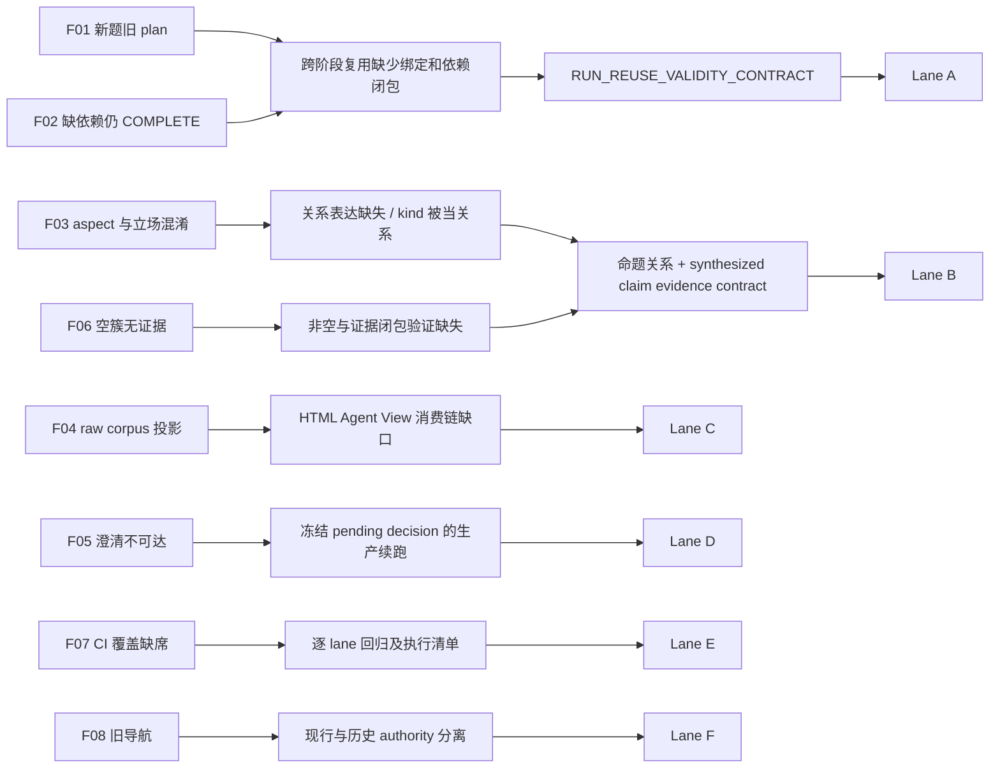
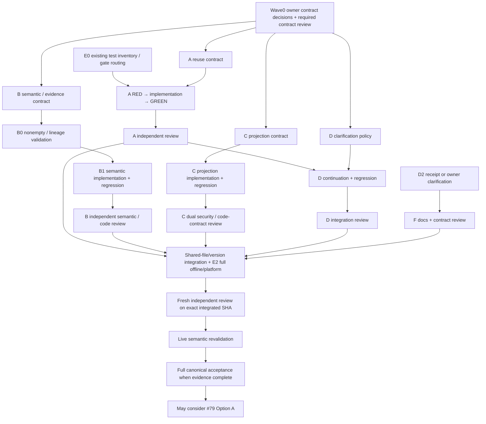

# SCOPED REPAIR PLAN — POST 2026-09-18 ADVERSARIAL AUDIT

日期：2026-09-19。Repository：`FlapPearLabs/zhihu-grabber-toolkit`。性质：限定范围的修复规划提案（F-RP-01 窄修订）；不是 Approved Spec、实现授权或修复验收。全文的“目标／必须”是待审查的修复约束，不表示已改变仓库权威。当前行为与建议决策分开记录；未裁决项不得交由实现者自行选择。

## 1. EXECUTIVE DECISION

**按六条 lane 组织：A 复用有效性（F01/F02）、B 命题关系与证据闭包（F03/F06）、C 安全投影（F04）、D 澄清续跑（F05）、E 回归与 CI（F07）、F 现行文档校准（F08）；最关键决策是将“同议题”与“对同一有方向命题的支持／反对”分开，禁止从组内标签推导跨组语义关系。**

```text
REPAIR_PLAN_STATUS = READY_FOR_FINDING_SCOPED_REVIEW
F-RP-01 = CLOSED (executor self-review; external re-review pending)
READY_TO_DECOMPOSE_REPAIR_TICKETS = NO
OWNER_DECISIONS = PROPOSED / PENDING OWNER DECISION
IMPLEMENTATION_AUTHORIZATION = NONE
NEXT_LEGAL_ACTION = FINDING_SCOPED_EXTERNAL_REVIEW
POST_REPAIR_NEXT_CANDIDATE = #79 Minimum Observatory / Option A
```

六条 lane 是责任边界，不是六张已创建的票。A/B/C 是高风险核心；D 是依赖 A 的窄生产接线；E 从第一条修复的 RED regression 开始，不是收尾才补测试；F 可独立推进。F06 是可独立验证的非空/lineage 缺口，纳入 B 管理但不必等复杂语义实现才先拒绝空簇。

**待 owner 决策表（全部仅提案）**：

| ID | 精确问题 | 推荐，及另一可行选项 | 阻塞范围 |
|---|---|---|---|
| CD-B1 | 选择哪个语义关系 contract？ | S1 单锚点命题族与显式立场；S2 完整成对关系矩阵是替代，不同时实施 | B 语义实现 |
| CD-B2 | 无法判定的关系能否伴随完整报告？ | 保留逐 claim 的独立 UNRESOLVED record（singleton 展示，不是 family），relationStatus=UNRESOLVED、supportBreadth=null；只声明来源内观点、关系未知；若 owner 要求所有关系已解决，则 fail closed，不能偷偷归类 | B schema、输出解释、live acceptance |
| CD-B3 | 从单 category 变为正交 canonical dimensions、定向 claim identity 如何迁移？ | 必须 semantic contract version bump；SEAM D required shape/observable semantics 变化须 major bump、更新 validator/fixtures 并下游 re-review。旧产物仅 historical artifact；有原始 lineage 时按新合同 re-synthesis / re-evaluation，不从 category 猜 relation/breadth | A/B、T15 consumer、frozen validator |
| CD-B4 | cross-source synthesis 的 canonical semantic state 如何避免维度折叠？ | proposition relation/conflict、跨 source-group 的 support breadth、group-local salience 相互正交；relationStatus 与 supportBreadth 分字段，组内 kind 仅保留在 source-claim lineage；legacy category 仅单向派生展示，不是语义权威（§5.3） | B 输出、diagnostics、兼容视图与语义验收 |
| CD-A1 | restart 是否重跑同题的全部研究阶段？ | 是：新执行，旧 derived stages 不复用；保留 canonical 原文件，既有 capture primitive 行为不改。若希望显式 reuse-plan，须单独授权新操作 | A restart |
| CD-A2 | COMPLETE 依赖失效是否自动联网补跑？ | 默认拒绝当前复用并给出最早失效边界；用户显式 restart/后续授权恢复。另一选项是受批准预算内自动恢复；本计划不擅自启用 | A stale COMPLETE |
| CD-A3 | legacy checkpoint 缺语义/配置版本怎么办？ | 不可直接复用，保留历史字节，显式新执行；允许迁移则必须有可证明的 provenance，不能猜历史版本 | A migration |
| CD-C1 | 投影后只剩 code/image metadata 的来源如何计 analyzed？ | 仍提交合规投影给 T13，成功响应且明确无可提取 claim 后才记 analyzed；不得跳过模型并冒充 analyzed，不要求凭 metadata 发明观点；全体无 claims 继续现有 fail closed | C/T13 accounting |
| CD-C2 | 是否需要把代码正文给模型？ | 本修复不需要，遵守 DEFAULT OMIT；如 owner 要求代码正文，则 SPEC / PRODUCT DECISION REQUIRED，另过安全与契约门 | C 的产品能力边界 |
| CD-D1 | 一次 clarification 的计数单位是什么？ | 一次提问/一次成功解析；非法提交不消耗成功次数，但不再生成新问题，原 pending 不变；相同成功提交可幂等重试。替代为一次提交即终结，需明确告知用户 | D 非法输入及重试 |
| CD-F1 | D2 原始裁决 receipt 尚未找到时如何校准 memory？ | 先补回可核验 receipt；找不到则 owner 明确确认窄行为描述并走文档 review，不用 merge/tests 自行追认 Approved authority | F 文档发布 |

独立 reviewer 可以先审查本草稿与上述选项；全部相关决定经 owner 及必要 quorum 固定以后，才可称 execution-ready。此处不要求用户即时逐题答复，也不越过本轮计划包修订与外部复核的停止条件。

## 2. CURRENT VERIFIED STATE

本节保留原计划起草时态；本次窄修订 fresh fetch 的三个 refs 与指定 SHA 均一致，记录见 supporting/f-rp-01-self-review.md。本节历史 probe/完整测试声明不代表本轮重跑。

```text
CURRENT_REMOTE_MASTER = 4bea7b30b3842a876e383977686a0abc0d68302f
MASTER_SHA = 4bea7b30b3842a876e383977686a0abc0d68302f
AUDIT_PRODUCT_SHA = 4bea7b30b3842a876e383977686a0abc0d68302f
AUDIT_SHA = 4bea7b30b3842a876e383977686a0abc0d68302f
AUDIT_PUBLICATION_SHA = eb02a660cdb3ada07ee08f742e2987bb7da8b9e8
MASTER_DRIFT_SINCE_AUDIT = NONE
MASTER_DRIFT = NONE
FINDINGS_REVALIDATED = F01-F06 deterministic probes + source; F07/F08 source/authority inspection
```

本轮先 `git fetch origin`，再 `git rev-parse origin/master origin/codex/audit-evidence-20260918`；audit→master diff 为空。首次 fetch 因 worktree 的 Git 元数据在受限目录被 sandbox 拒绝，经正常权限提升后成功。没有绕过权限，也没有更新远端。读取的 publication 工作树仅比 master 多审计目录，故产品源码与本轮 master 相同。

Fresh-read：审计 README、AUDIT_REPORT、PROCESS、三个 observed JSON、三个可执行 probe；AGENTS、RULES、CONTEXT、project-memory、product-behavior-contract、P1/parent/V2/V0.3 相关条款、key-decisions/runtime-strategy、P1 frozen seam 合同、现行 workflow 和下列源码。大文档按相关条款阅读，不声称全仓重新审计。无 CodeGraph 索引，不新建索引。

本轮 Node v25.8.0：三个原 probe `node --check` 通过，执行退出码均 0，结果见 `evidence/architecture-counterexamples.json`、`spec-counterexamples.json`、`standards-projection.json`。这里 **exit 0 = 已观察到原坏行为**。831 pass / 0 fail / 9 skip 是前轮完整套件证据，本轮没有重跑 840 tests、真实模型或 canonical live。

主要精确源码锚点（均绑定 MASTER_SHA；下文 `lib/` 默认 research-orchestration/lib/）：

| 证据 | 路径与行 |
|---|---|
| restart/loadPlan；COMPLETE捷径；生产选择 | `lib/p1-runtime-composer.mjs:316,323,328,360,387,438,485,492` |
| 组级复用已有 owner | `lib/multi-group-execution.mjs:967` |
| clarification 接口/验证 | `lib/coverage-final-integration.mjs:463`；`lib/source-group-selection.mjs:914,979,1025,1165` |
| 错误组内 opposition | `lib/cross-group-aggregation.mjs:88` |
| category/union/空分区 | `lib/cross-source-synthesis.mjs:178,350,454` |
| 模型只能输出 aspect partition | `lib/deepseek-research-runtime.mjs:69,172` |
| 输入 guard 不等于 lineage 全验证 | `lib/pre-synthesis-guard.mjs:133,170,191` |
| raw loader 与 fence | `lib/rce-provenance-adapter.mjs:305`；`lib/per-group-claim-extraction.mjs:139,157` |
| 现有投影的实际范围 | `corpus-anthology/lib/lmstudio-projection.mjs:57,80,87`；`corpus-anthology/lib/text.mjs:36` |
| CI 路由 | `.github/workflows/ci.yml:3,14,46,73,76` |
| 陈旧重复项说明与实际 D2 | `docs/project-memory.md:246`；`lib/rrf.mjs:49,997`；`test/rrf.test.mjs:1286` |

Authority 解释：P1 header 为条件生效模板，不能只凭 CANDIDATE 字样否认已有实施合同，也不能从实现倒推任意新语义已获批准。以已发布审计的历史 acceptance 为本轮背景；本轮不重新认证其所有历史 quorum。新决定必须走当前 AGENTS §5；Spec 优先于实现与测试，memory 仅为低层导航。F08 的 D2 receipt 另见 §11。

## 3. FINDING DISPOSITION

| Finding | 当前事实/验证状态 | 修复处置 | 风险排序 |
|---|---|---|---|
| F01 | CONFIRMED / STILL_REPRODUCIBLE：新题发旧查询 | SAME_ROOT_CAUSE A；REQUIRES_CONTRACT_DECISION | 高：错题研究 |
| F02 | CONFIRMED / STILL_REPRODUCIBLE：缺 plan/source 仍 COMPLETE | SAME_ROOT_CAUSE A；REQUIRES_CONTRACT_DECISION | 高：依赖失效仍宣称可复用 |
| F03 | CONFIRMED / STILL_REPRODUCIBLE：相反主张共同 support；无关观点伪 oppose | REQUIRES_CONTRACT_DECISION B | 最高语义风险：伪共识/伪冲突 |
| F04 | CONFIRMED / STILL_REPRODUCIBLE：真实 adapter 请求含 raw HTML/code/URL | 独立 C；继承合同恢复，空语义政策需决定 | 高安全风险；未证执行代码/窃取凭据，不升级 P0 |
| F05 | CONFIRMED / STILL_REPRODUCIBLE：合法输入仍再次 STOP | D；窄接线，但必须冻结 pool/一次性政策 | 中：生产功能不可达 |
| F06 | CONFIRMED / STILL_REPRODUCIBLE：空簇生成 minority | NARROW_FIX；与 B 共享产物证据闭包，不等于与 F03 完全同根因 | 中：无来源结论 |
| F07 | CONFIRMED / source-confirmed：已有六个 research 文件入 CI，但核心集合缺席 | E 持续 gate，非统一拖后补测 | 中：回归逃逸 |
| F08 | CONFIRMED / source-confirmed：current memory/comments 与 D2 不符 | DOC_ONLY F；不改 runtime | 低：维护者误读 authority |

不重新争论 deterministic probe 已证明的事实；严重度是本次修复排序，不是对历史验收记录的改写。

## 4. ROOT-CAUSE MAP



A 集中复用判定、B 集中关系解释、C 集中安全投影，均让 production caller 与 tests 穿过同一个 interface。它们的 depth 来自封装必须一致的判定，不来自新建框架或增加 wrapper。D 复用 T08 adapter seam，不能复制选择算法。

## 5. F03 SEMANTIC CONTRACT DECISION

### 5.1 缺失的层与术语

| 概念 | 最小定义 | 不能等同于 |
|---|---|---|
| Source group | controller 确定的来源组（当前通常 questionId），是出处组织维度 | 一种命题或立场 |
| Aspect | 讨论维度，如“缓存对请求延迟的影响” | 一个具有真值/方向的命题 |
| Proposition | 有方向、可判断且带必要范围限定的断言，如“在同负载、同指标、同时间窗口下缓存降低延迟” | 只有话题的短语 |
| Proposition family | 同一比较问题与相同适用条件下，可直接比较方向的命题实例集合；只是当前 run 的局部分组 | 全局 ontology 或等价命题集合 |
| Claim | 从某 source 抽出的具体断言实例；有原 statement、controller claimId、source refs | 全球通用事实或模型生成的 canonical ID |
| Stance | 某 claim 对指定 anchor proposition 的 ASSERTS / OPPOSES / UNRESOLVED 关系 | 组内 main/minority/contradictory 标签 |
| Support | 该 claim 在可比条件下明确支持 anchor；source refs 是该 claim 的出处 | 人气、author“专家”印象、相同 aspect |
| Opposition | 明确否定或给出互不相容方向；相对于具体 anchor 且范围匹配 | 任意不同意见、不同条件下的结果 |
| Contradiction | 至少一对 claims 在同一条件下无法同时成立的关系判断 | 某条孤立 claim 的永久属性 |
| Main / minority | T13 的组内代表性/较少见标记，继续保留为出处上下文 | 全语料多数票或全局真假 |

**缓存例子**：A“缓存降低延迟”、B“缓存增加延迟”属于 same aspect；它们是不同的定向 propositions，不能说 same proposition=true。若明确相同负载、基线、指标、时间与范围，则属于同一 proposition family，stance 相反，不能共同算某一条定向 synthesis claim 的 support。增加与降低是相互排斥的方向，但不一定是逻辑上的穷尽互补（可能不变）；不从 OPPOSES 推断任意第三种命题。若 A 是热缓存 P50、B 是冷缓存 P99，则条件不同，应 separate families 或 UNRESOLVED，不能制造 conflict。

### 5.2 推荐最小 S1 contract（待 CD-B1/B2/B3/B4 批准）

保留 T13 原 claim 与 kind，不重构抽取体系。T14 模型一次提出 aspect 下的局部 proposition families：选一个已有 claim token 作为 anchor，并对每个 member 提出 ASSERTS / OPPOSES；无法归属的 claims 单列 UNRESOLVED。采用唯一响应contract：非空的已解析 families（数组可为空）与显式 unresolved claim-token列表，两者并集是全部输入，交集为空；不接受第二套内嵌UNRESOLVED格式。anchor 的原 statement 是明确的定向命题；不要再让模型发明自由文本“综合结论”来改变被支持对象。每个输入 claim 在接收后的“已解析 families + 独立 unresolved records”中恰好出现一次。每个 family 非空；UNRESOLVED 不属于已解析 family，controller不自动修补格式错误的关系提案。不支持复合 claim 任意拆成若干新事实，无法建立原子关系时保留 unresolved。全体 unresolved 时无已解析 family，是否允许报告仍由 CD-B2 决定。

**IDENTITY**：输入 claimId/source/group/author 由 T13/controller 产生并解析；模型只选择给定 opaque tokens。familyKey 由 controller 根据 contract version、anchor identity、已验证成员及关系规范序列确定。它是 run-scoped artifact identity，**hash 不证明 semantic equivalence**，不跨 run 自动拼接。完整 synthesis hash 包含 contract version、方向、anchor/statement、关系、relationStatus、supportBreadth 与完整 lineage（含 source-claim kind）；关系改变必须改变 artifact identity，不能继续仅 hash 无方向 sourceClaimIds。

**语义完整性义务**：已能判定在同一条件下等价或相反的输入claims必须归入同一family；不能把全部claims拆成singleton来绕过冲突披露。不同条件/不同命题才分开，无法判断才UNRESOLVED。模型漏合并或错合并都是live semantic revalidation要检出的失败；结构完整分区本身不能证明该义务。

**RELATION**：ASSERTS 表示与 anchor 的定向断言一致；OPPOSES 需有同条件不相容判断；UNRESOLVED 不贡献支持/反对，也不贡献 cross-group consensus。不存在仅由 kind/main 或 aspect 相同推导的默认关系。不得传播“反对反对即支持”；不得从 model relation 自造 source refs。

**OWNER**：T13 仍是 analyzed identity 唯一写者；T14 是关系提案验证、正交 canonical state、引用装配及 synthesis identity owner，另单向派生 legacy 展示视图；T15 比较与终态对账，不重新生成第二套关系。模型的语义判断是可错的提案，controller 拥有接受/拒绝和可审计结构。

**VALIDATION**：controller 能证明已知唯一 claim IDs、已解析非空 families 与独立 unresolved records 合起来构成完整分区、anchor 属于该已解析 family 且自关系 ASSERTS、枚举有效、同一 member 没有互斥关系、所有 source refs 由对应 sourceClaimIds 私有映射导出、selected/analyzed 归属、版本与hash一致。controller **不能**仅靠 schema/hash 确定“热缓存”和“冷缓存”是否语义相同；该部分依赖模型质量与独立 semantic revalidation，不能声称 deterministic semantic proof。

**MODEL AUTHORITY**：允许提出 aspect、family membership、anchor 选择、相对立场及范围比较的语义理由；不允许授予 validity、完整覆盖、来源/作者身份、运行身份、IO 权限、模型路由、数值权重。statement 及语义理由视为不可信数据，经 C 的适用文本安全边界进入下一模型/渲染。

**CONTROLLER AUTHORITY**：模型响应缺字段/重复/未知 ID/空簇 → 现有 fail-closed 类，不自动修正或 fallback 到旧 aspect union。结构合法但关系不明 → 按 CD-B2；推荐按提案中独立 unresolved 列表保留有原始 statement 与 lineage 的 unresolved record（singleton展示，不是family；无anchor自关系和support/oppose关系），仍保留 analysis accounting，单独披露 semantic relation 未确定。此为待批准的 reporting policy，不能把它当已允许的 semantic downgrade。

### 5.3 输出与正交语义约束（CD-B4 提案）

针对 anchor，support 只从 ASSERTS members 的 source refs 产生，oppose 只从 OPPOSES members 产生；所有贡献 retain sourceClaimId→sourceRef→groupId→authorRef 链。`sourceClaimIds` 必须包含两侧所用 claims；旧支持/反对数组可以保留为兼容视图，但新关系 provenance 不可丢失。

若同一 source 的两个不同 claims 分别支持/反对，允许两侧保留同 sourceRef 并披露不同 claim lineage；不能全局去重掉一侧或伪装成两个独立来源。作者不明仍 null；expertEvidenceRichSupport 只取支持侧真实标记，不把反对侧或 metadata 当支持。crossGroupSupport 从 ASSERTS 的 distinct groups 算，表示出处分布，不是证据独立性或真实性。

**Canonical state**：保留 proposition family / anchor、逐 claim 的 ASSERTS / OPPOSES 关系与完整 lineage；无法归属者仍为独立 UNRESOLVED records。新增两个正交字段，不新增 synthesis-level `groupSalience`，也不把整个命题标成全局 minority：

| 维度/字段 | 最小定义与有效值 | 不允许的解释 |
|---|---|---|
| proposition relation / `relationStatus` | 已解析 family 内，已验证 ASSERTS 非空且 OPPOSES 非空 → `CONFLICTING`；ASSERTS 非空且 OPPOSES 为空 → `SUPPORT_ONLY`。两侧须针对同一 anchor 且 scope 可比。独立未知记录 → `UNRESOLVED` | 不从 main/minority/contradictory 推断；SUPPORT_ONLY 仅指该 family 的已解析 evidence，没有“外界无人反对”的含义 |
| support breadth / `supportBreadth` | 只计已验证 ASSERTS claims 所属的 distinct source groups：1 → `SINGLE_GROUP`，≥2 → `MULTI_GROUP`；独立 UNRESOLVED record 无支持关系 → `null`（不适用，不是单组或零支持结论） | 不计 OPPOSES/UNRESOLVED，不是 truth、confidence、evidence independence 或 consensus；MULTI_GROUP 只表示多个来源组有支持 evidence |
| group-local salience / source-claim metadata | 原 main/minority/contradictory kind 连同 sourceClaimId、statement、sourceRef、groupId、authorRef 保留在可解析 lineage 中；其中 contradictory 仍只是原组标签 | 不新增全局少数/多数属性，不让原组标签决定跨源 stance、conflict 或 breadth |

relationStatus 与 supportBreadth 均由 controller 从已接受的 claim-relation/lineage 表分别重算，不接受模型或 legacy category 直接授值；持久化字段与重算值不一致必须拒绝，不能用其中一维覆盖另一维。

已解析 family 必有 anchor 自 ASSERTS，故支持组数不可能为 0；违反则拒绝，不补成 SINGLE_GROUP。独立 UNRESOLVED record 无 anchor 自关系、无 support/oppose，保留原出处及 `relationStatus=UNRESOLVED, supportBreadth=null`；它不能因兼容展示变成 group-specific、minority 或 SUPPORT_ONLY。整个 run 是否允许仅有这些记录仍由 CD-B2 决定；已解析 family 的状态不能覆盖 run 中另外的 unresolved records。以上“已验证”包括 controller 的结构接受与 scope 可比的语义提案要求，不把 deterministic check 当作语义真值证明。

**必须可同时表达的例子**（A–D/F 的 scope 均已确认可比）：

| Case | evidence / lineage | relationStatus | supportBreadth | 必须保留 |
|---|---|---|---|---|
| A | A/B/C 支持 P，无反对 | SUPPORT_ONLY | MULTI_GROUP | 三个支持组 |
| B | A/B/C 支持 P，D/E 反对 P | CONFLICTING | MULTI_GROUP | 支持 breadth 与反对 evidence 同时存在，不能二选一 |
| C | 仅 A 支持 P，无反对 | SUPPORT_ONLY | SINGLE_GROUP | 单组出处，不宣称全局共识 |
| D | A 与 B 各有一条 minority claim 支持 P，无反对 | SUPPORT_ONLY | MULTI_GROUP | 两条原 claim 的组内 minority metadata，不提升为命题 minority |
| E | 单条 claim 无法可靠确定关系 | UNRESOLVED | null | 独立记录、原 statement/出处；不产生伪 support |
| F | A 内同一 source 的 c1 支持 P、c2 反对 P | CONFLICTING | SINGLE_GROUP | c1/c2 各自 stance/lineage；同 sourceRef 同时在两侧，不当成独立来源 |

**Legacy category = LEGACY_DERIVED_VIEW**：现有四枚举保留用于 compatibility / historical rendering，不能成为新版 canonical semantic authority。新版本的已解析 family 可单向投影：CONFLICTING → `conflicting`；否则 MULTI_GROUP → `widely-shared`；否则 SINGLE_GROUP → `group-specific`。这个有损展示映射不定义 canonical state；必须同时展示/携带 canonical relationStatus 与 supportBreadth，Case B 即使 legacy label 为 conflicting 也不得丢失 MULTI_GROUP。`minority` 仅保留给旧产物历史渲染，新 synthesis 不生成该全局类别；组内 minority 在 lineage 展示。独立 UNRESOLVED record 不输出 legacy category，旧四枚举必填接口不能表达它，必须报告版本不兼容，不能填任一旧值交差。

所有新语义消费者（含 diagnostics）必须读取 canonical 字段与 lineage，不得读取 legacy category 推断关系、支持/反对、breadth 或全局少数；不得 `legacy category → reconstruct canonical relation/breadth`。篡改/删除 legacy 视图只可导致视图重算或不一致拒绝，不可改变 canonical state/identity、support/oppose 或 diagnostics。canonical synthesis 的身份按 §5.2 计算；若兼容视图作为文件另有 bytes hash，变化仅影响其文件完整性，不反向影响 canonical semantics。

**已核对的 consumer 与必要后续合同同步**（绑定 §2 MASTER_SHA，本轮只读源码）：

- `research-orchestration/lib/cross-source-synthesis.mjs:95–96,178–183,350–365` 定义枚举、分配 category 并输出 artifact；`:521` 通过 category 计算 `new_contradiction_rate`。新版分子必须改为 canonical `relationStatus=CONFLICTING` 的 family 数，分母为全部输出记录数（resolved families + unresolved records），延续全记录分母与空集为 0 的机械口径；unresolved 单独披露，比例不证明无冲突或共识。不从 legacy label 计算任何新语义诊断。
- `research-orchestration/lib/coverage-state.mjs:153–154,278` 保存/披露该 diagnostic；`coverage-final-integration.mjs:696–725,818–845` 消费 T14 产物及 ledger/guard，不能在 T15 重建另一套 relation。未来须随新版合同校验版本与正交状态传播，不改 coverage authority 或新建 evaluator。
- `research-orchestration/test/helpers/p1-seam-contracts.mjs:33,429–430` 要求旧四类；`test/fixtures/p1-seams/seam-d/` 存在旧 category artifacts；`test/p1-t14-cross-group-synthesis.test.mjs:248–274,631–639` 固定旧分类与诊断计算。按 CD-B3 更新新版 validator/fixtures/断言并保留版本隔离的历史渲染；不能用旧断言批准新语义。
- P1 Spec §8.1 的组内 metadata 与 §8.3 的报告区分继续可见，但新版 canonical shape、legacy 降权及诊断读取规则必须先获得所需契约批准。当前 Spec/frozen seam 不在本轮修改范围，待批准提案不冒充现行产品行为。

额外 invariant：每个 synthesized claim 至少一个 source claim；每个 sourceClaimId 指向当前有效 analyzed claim；每个 family 非空；support/oppose 不得引用 sourceClaim lineage 之外的 ref；全输入无 claim 保持当前 T14_EMPTY_VERIFIED_INPUT；模型不能用空项满足“完整分区”。F06 本身是 narrow validation bug，同时说明最终产物证据闭包不足。无需用新语义算法才证明非空约束。

## 6. F03 DESIGN OPTIONS

| 维度 | S1：anchor family + relative stance（推荐） | S2：完整 pairwise relation proposal |
|---|---|---|
| 表达 | 一次归属 + 相对既有 anchor 的立场；controller 独立派生 relationStatus / supportBreadth，组内 kind 留在 lineage | 每对 claims 判 EQUIVALENT / INCOMPATIBLE / RELATED_DIFFERENT / UNRELATED / UNKNOWN |
| semantic correctness | 清晰修复 aspect≠proposition；anchor 选择错误仍可能误判 | 能直接表示局部非传递/方向条件，信息更细，但两两错误也更多 |
| implementation complexity | T14 新 runtime contract + controller validation/assembly；约线性输出 | 完整 O(n²) 关系与覆盖检查；等价 closure 和矛盾 cycles 需拒绝/隔离 |
| model dependence | 依赖 family/stance 判断；controller只保结构 | 依赖每一对判断，不能把 consistency 当语义真值 |
| determinism | 固定 proposal→稳定输出；不同模型 proposal 仍可不同 | 固定 matrix→稳定；输出顺序可规范化，但不允许任意 graph completion |
| false consensus | 禁止 kind/aspect union 后显著封住已知路径；误 ASSERTS 仍可能 | 误 EQUIVALENT 或错误传递 closure 可扩大错误 |
| false conflict | 要求 scope 对齐，UNKNOWN不当反对 | 误 INCOMPATIBLE 或不完整 pair matrix 可能制造冲突 |
| testability | 小型显式正/反/未知与lineage table即可 | 需要重复/缺失pair、自关系、互斥、equivalence consistency、graph边界 |
| compatibility | T13 可不变；T14 runtime/SEAM D+消费者版本化 | T13可不变，但需新增pair证据、导出聚合解释、更多消费者迁移 |
| migration cost | 旧T14产物不能被默认为新关系；重新综合 | 旧产物无pair记录，必须重跑；更大prompt/输出成本 |

S2 若选用：必须在 bounded input 上提出全部无序 pairs，UNKNOWN显式保留；不得把未提及边默认成 SAME。只有明示且通过结构一致性审查的 EQUIVALENT 类才可合并；不相容/未知关系禁止 controller 通过多数票补全。无需引入 KG/NLI 服务，但复杂度对目前八个 finding 不合算。

推荐 S1 是最小 current defect repair；不同时加入两套算法/自动 fallback。若后续独立反例证明 S1 无法表达必需复合命题，再另行裁决，而不是预建全 claim graph。若改变既有字段语义或 required observable shape，遵守 P1_SEAM_CONTRACTS_V1:45–53 的 major/version/re-review 规则；加字段并不自动证明兼容。CD-B3/B4 先批准 contract 与版本，再更新 frozen fixtures，不许 fixture 倒逼语义。从 single category 改为正交 canonical dimensions 必须 semantic contract version bump 与 SEAM D major bump，不能把 legacy 字段仍存在当成 V1 语义兼容。旧产物仅 historical artifact，不猜补 relation/breadth；若原始 sourceClaim lineage 可取回并重新验证，可按新合同重新判断关系、重新综合（re-synthesis / re-evaluation）并生成新版本 identity，不能称 migration by assumption。raw lineage 缺失则不可转换。

## 7. STATE / RESUME CONTRACT

`RUN_REUSE_VALIDITY_CONTRACT`：某 stage 可以复用，当且仅当当前请求/有效配置绑定、该 stage 的 contract version、被记录输入与输出及所有传递依赖仍可验证。一个 P1 controller owner（composer 内集中判定）做跨阶段决定；T09、plan、T13、T14 等既有 owners 提供各自验证，CLI 不另判 stale。

稳定研究 identity 与执行 occurrence 分开；沿用 Spec §4.3 的 request+stable config，不把 stochastic plan 输出揉进 runId。新 occurrence 必须能与旧 derived checkpoint 区分，采用现有工作目录/最小执行记录即可，不建全局 run registry。effective config 包括 mode、runtime policy、provider routes、selector/retrieval配置及版本；secret及其哈希均不得入身份。

| 变化 | 分类 | 恢复边界/允许复用 |
|---|---|---|
| 新 normalized topic | MUST_INVALIDATE | PLAN 起全部研究派生产物；未 restart 则 identity conflict |
| 同题同配置、依赖闭包完好 | MAY_REUSE | 对已判可复用的阶段零 planner/retrieval/model 重算；完整有效 COMPLETE 零外部调用；尚未完成阶段按合同正常执行 |
| plan缺失/损坏/hash变更/不属于本run | MUST_INVALIDATE | PLAN/RETRIEVAL 起；不能只重写plan后保留旧下游 |
| 有效plan bytes相同，但显式restart | MUST_REVALIDATE | restart政策优先；推荐仍新执行，不以hash巧合取消用户意图 |
| provider-route/selector/retrieval budget或effective defaults变更 | MUST_INVALIDATE original resume | 新run/显式批准的迁移；不能将旧pool算新配置产物 |
| approved requested model、prompt/profile/projection/semantic version变更 | MUST_INVALIDATE affected semantics | planner变化影响PLAN起；T13变化影响claims起；只T14变化影响synthesis起；未变canonical根可验证后留用 |
| provider实际served-model字符串变化 | MAY_REUSE observation only | 当前ruling是observability，不新增精确相等拒绝门 |
| canonical source missing/hash/content version变更 | MUST_INVALIDATE affected group + tail | T09验证该组；valid无依赖sibling可复用；manifest/corpus/analysis/final失效 |
| handoff缺失或改变 | MUST_REVALIDATE then invalidate dependent closure | 只保留仍有效answers；不得在handoff重建前授予COMPLETE |
| selected corpus refs/identity变更 | MUST_INVALIDATE | T13/T14/final；集合count相同不够 |
| analyzed set/claims hash变更 | MUST_INVALIDATE | 失效T14与final；恢复者不再写第二套analyzed identity |
| synthesis/result/coverage-final缺失或hash变更 | MUST_INVALIDATE affected tail | 不能把hash记录重算为新文件后就接受；producer重新生成/验证 |
| 日志、展示格式、无行为注释、凭据轮换 | MAY_REUSE | 不触发无关语义重算；轮换仍不能进入identity |
| legacy缺配置/prompt/contract版本 | UNKNOWN / POLICY DECISION | CD-A3前拒绝当前复用，不猜旧版本 |
| 不可见的模型内部升级、线上源后来变化 | UNKNOWN | 不引入联网freshness检查；只声明冻结本地证据与已记录model request |

**restart/new run 操作表**：resume=同绑定下继续；restart=显式新 occurrence（CD-A1）；new topic=新研究，绝不读旧 ResearchPlan/CoverageState/SelectionDecision/CorpusManifest/Claims/Synthesis 作为当前结果；same topic new run=新occurrence；same topic changed config=不接受为原run resume；same topic changed model=只限已批准路由，当前固定runtime不因本修复扩容。旧 canonical 不删除，不能借 restart 改 grab 的既有 resume-merge 行为。

**COMPLETE** 保持一个持久 stage，表示历史曾完成；`CURRENTLY_REUSABLE_COMPLETE` 是每次调用的验证结论，不另建两套状态机。`REUSED_COMPLETE=TRUE` 需以下闭包：

```text
request/effective config/contract versions
→ bound persisted plan
→ frozen retrieval pool + selection
→ T09 valid group state / answers / handoff / derived manifest
→ selected source refs + content hashes / corpus identity
→ T13 claims + mapped/analyzed identity
→ T14 relation/synthesis/guard
→ T15 coverage-final + result bytes / run-plan bindings
```

resultHash和coverageFinalHash是最后两项，不替代其余依赖。当前 SEAM B 返回对象未完整持久化（coverage-final-integration:640–656），不得虚构已有 corpus.json；若现有ledger/refs无法重建证明，添加最小 dependency record（ref/hash/version/identity，无第二canonical内容）。已存在的 hash authority 能复用就复用，不能新建 competing manifest truth。

stale COMPLETE 按 CD-A2 推荐明确拒绝 current reuse，保留历史；ordinary interrupted resume 应按最早无效阶段恢复并保留valid siblings，不能一律全量重抓。检查本身不得偷偷网络IO或改写canonical。对单次读取使用固定快照/已有TOCTOU防护，不宣称修复整个文件系统并发/断电事务性。

## 8. SAFE PROJECTION CONTRACT

F04 修复目标是恢复继承的 V2 §9.2.4–5，而非新发明 sanitizer。现有 `buildProjection` 的输入是 stripHtml 后纯文本，`sanitizeProjectionText` 中和URL/path/控制字符，**不负责移除代码正文或保留 HTML 结构**。现有 `text.stripHtml` 保留 pre/code 内容，V2:437 已明确 stripHtml-only 不足；Human Markdown renderer 有 parse5/白名单能力，但 Human View 保留代码/链接，不能直接给模型。

推荐：复用现有解析/分类能力、文本reference sanitizer、逐source `assertProjection`；补齐一个最小 deterministic HTML Agent projection 入口，供 T13 真正消费。不要第二套URL正则或parser，不放宽单source断言以适配group。模块位置需明确依赖/许可方向，避免 MIT corpus 包未经审查反向依赖 AGPL Human renderer；可在 P1 消费侧使用已安装 parser 与既有底层规则，不迁移所有旧消费者。

输入：verified canonical source 的原HTML + controller短token及必要非敏感元信息。输出：保留标题/段落/列表/blockquote的 inert 文本；code body DEFAULT OMIT，保留受限language/line/count metadata；图片/外链保留 bounded host/classification/reference信息，完整外部图片URL/file URI不得进入请求；不自动open/load/OCR/download/execute。逐source验证，再由controller组装group framing；目标要求正文不能伪造额外source/BEGIN/END标记，现有framing并未证明这一点，须明确转义/中和并用对抗输入验证，不靠提示词承诺。原 canonical bytes、hash、source identity 不变；token映射仍controller私有。

凭据：不读取新的credential files；API authorization只留controller transport header，不进入projection/log/artifact。现有sanitizer不是全局secret识别/DLP，不承诺识别任意正文里的裸secret。仅metadata来源按 CD-C1 处理，不能默默丢source；空claims与analyzed accounting不同，不能为保覆盖率强造claim。当前evidence-rich prompt提及代码，只能依据投影实际保留的文字证据作候选；若依赖代码正文必须走 CD-C2，不以prompt覆盖Spec。

验收必须从真实 canonical loader→T13→生产runtime adapter（fake fetch）捕获 body，不能仅测试孤立函数。拒绝无效投影前零fetch，原HTML不变、每个selected source accounting保留、各字段符合安全边界。

## 9. CLARIFICATION CONTRACT

生产链目标：`ambiguity → 持久化同一 frozen decision/pool → STOP → 用户明确选择 → 验证binding → T08合法解析 → CAPTURE`。

唯一输入authority是用户明确传入的已有T08 `forceGroupIds`，CLI只解析并传递；不是自由文本重写plan，也不是绕过T08构造selected set。生产结果必须足够表达 requiredGroups、remainingSlots、boundary options 和 pending binding，不能只展示模糊ID清单让用户猜合法集合。

pending绑定：run/occurrence、planHash、**pool bytes identity**、selector effective config/version、pending decision hash与coverage ledger。现有 `poolPlanHash` 只绑定plan，不证明候选集合没变。STOP前持久化失败必须fail，不能承诺可恢复。恢复时不得重新planner或retrieval；同plan不同pool、pending缺失、config变更均拒绝旧clarification。

T08继续验证 canonical/unique IDs、eligible membership、全部required groupKeys与精确剩余slots；无material ambiguity不接受force-selection。一次成功resolution（CD-D1待裁决）；非法输入固定错误、零capture/model/provider、pending不变，不再问第二个问题；第二个不同成功选择拒绝。同一答案重试可复用已验证resolved decision，resume从已完成阶段继续，不重复capture。不能把每次CLI进程重启当clarification次数重置。

F05与A共享run绑定，但独立于B语义推理；A完成共享composer后D再接线。T08选择算法、阈值、重检索、聊天系统均不在scope。

## 10. REGRESSION / CI CONTRACT

每条修复自带基于正确期望的 RED→GREEN regression；审计脚本的“泄漏=true/错共识才exit0”不能原样作为权威绿灯测试。固定生产interface、异步fake runtime与真实adapter路径，避免测试只覆盖底层未接入函数。

| 审计case | authoritative期望 | 正控制/新增反例 |
|---|---|---|
| restart_different_topic | 新题不发旧query、不复用旧derived stages | 同题有效COMPLETE复用零外部调用；同题restart/config drift |
| complete_missing_research_plan | 拒绝reused complete | 完整闭包允许；错hash/错run拒绝 |
| complete_missing_canonical_answers | 缺source拒绝当前complete | sibling仍可用；同count不同content拒绝 |
| cross_group_opposite_claims | 同条件相反方向不能共同support | 同方向同条件可支持；冷/热/P50/P99不同不误冲突 |
| multi_group_support_plus_opposition | A/B/C ASSERTS、D/E OPPOSES 同一 anchor → relationStatus=CONFLICTING 且 supportBreadth=MULTI_GROUP | 只有 legacy conflicting 或丢 breadth 即失败；不计反对组为支持组 |
| multi_group_minority_support | A/B 两条组内 minority 均 ASSERTS → SUPPORT_ONLY + MULTI_GROUP，各自 metadata 保留 | 不输出 synthesis-level minority；只改 kind 不得改变 relation/breadth |
| unresolved_not_group_specific | 独立 record 保留 relationStatus=UNRESOLVED、supportBreadth=null，无 support/oppose | 不输出 legacy category；旧必填接口明确不兼容，不能改 canonical truth |
| legacy_category_is_derived_only | 改/删 legacy category 不改变 canonical relation/breadth、support/oppose、identity 或 diagnostics | 重算或拒绝不一致视图；category-only 旧产物不可猜补新字段 |
| same_source_both_sides | 同 sourceRef 的 c1 ASSERTS、c2 OPPOSES 均保留 claim lineage → CONFLICTING + SINGLE_GROUP | 不跨两侧去重；加入第二支持组后 breadth=MULTI_GROUP，关系仍 CONFLICTING |
| unrelated_in_group_opposition | 不凭kind自动挂反对引用 | 同group明确相反可冲突；unresolved不强判 |
| empty_cluster | 非空输入中的任意空family拒绝 | 一个合法singleton；全空输入继续现有fail |
| unsafe_projection | 请求无raw HTML/code body/full外图URL/file URI，必要metadata在 | 中文相邻路径/编码/伪造围栏；正常正文与lineage保留 |
| clarification_resume | 合法选择继续原pool且retrieval计数不增 | live provider候选变化不影响冻结选择；改磁盘pool拒绝 |

伪造sourceRef probe只证明内部seam健壮性缺口；作为B相同lineage contract负例可纳入，不提升为已证生产攻击。已有 `p1-t14-cross-group-synthesis.test.mjs:235` 断言旧“contradictory反对所有main”行为，必须在获批语义合同后更新，不能用旧测试当冻结authority。

Gate evidence包含exact SHA、执行文件清单、Node/OS、pass/fail/skip及原因；核心合同比较不能被新skip掩盖。`SKIP != PASS`。先静态/语法，再动态，再独立审查；不虚构未配置lint/typecheck。

## 11. DOCUMENT AUTHORITY CLEANUP

权威顺序：Applicable Approved Specs/明确生效决策→产品行为contract→实施与测试作为行为证据→project-memory/current comments导航；原历史记录保持历史。测试不批准新产品语义，merge也不自动证明review quorum。

F08 current stale范围：`docs/project-memory.md:246`、`lib/rrf.mjs:49–52`、`lib/retrieval.mjs:32–34`、`lib/global-search-provider.mjs:97–102,114–117,169`。只改“同channel重复必fatal”的当前含义；adapter原样透传、不自行去重仍正确。

当前D2实现：同channel/question取最低explicit rank一次贡献；equal-best且投影字段等价折叠，equal-best冲突为FUSION_DUPLICATE_CONFLICT；非法rank仍fail，跨channel各自贡献。证据：rrf:997–1023、rrf.test:1286–1459；commit 85103af→72a47ed→5d66b5c。

本轮fresh读取 [PR #83](https://github.com/FlapPearLabs/zhihu-grabber-toolkit/pull/83)（MERGED，merge SHA 5d66b5c7a43cfe58f686b6be594e9059cb075199）与 [Issue #38](https://github.com/FlapPearLabs/zhihu-grabber-toolkit/issues/38)。PR仅Closes #38、无comments；当前取到的review是旧SHA自动review，未找到D2原始owner/quorum receipt。因此 `D2_CURRENT_IMPLEMENTATION = VERIFIED`，`D2_ORIGINAL_APPROVAL_RECEIPT = NOT_LOCATED`。CD-F1不得被省略。

保留：历史审计报告/probes/哈希、旧review/失败记录、历史commit、兼容错误常量。禁止重写整个memory、改回runtime fatal行为、清理旧兼容导出。未来memory校准须窄DOCUMENT review；本轮不编辑这些文件。

## 12. SAME-CLASS SEARCH RESULTS

限定搜索P1 composer/state/T08/T09、T13/T14/guard/runtime、已有projection消费者、CI清单与D2相关文字；没有全仓新审计。

| 分类 | 观察 | 当前scope处理 |
|---|---|---|
| SAME_ROOT_CAUSE A | composer:316只传topic/mode/percent/runtime；缺effective provider/config；普通resume重新从SEARCH跑 | 纳入统一reuse合同，避免F01/F02补两个if |
| SAME_ROOT_CAUSE B | category、expertEvidenceRichSupport、crossGroupSupport、diagnostics共用错误的union/kind解释 | 由同一关系表分别派生正交 canonical state 和 diagnostics；legacy category 只作单向展示，不建第二算法 |
| SAME_ROOT_CAUSE B | empty/unknown/duplicate claim ID 与lineage closure必须在同一T14输入/输出接缝验证 | 纳入证据闭包；伪造seam不宣称生产exploit |
| SAME_ROOT_CAUSE C | loader正确提供raw canonical，但T13全部生产caller均直用fence | 一个投影owner修复所有该路径caller |
| SAME_ROOT_CAUSE D | poolPlanHash不是pool内容hash；selection持久化返回值未由integration处理 | 作为合法pending续跑的必要绑定/落盘条件纳入 |
| SAME_ROOT_CAUSE E/F | T13/prompt等tests漏CI；多个current注释仍写fatal duplicate | E清单、F限定句子 |
| ADJACENT | v0.3 validateArtifactCheckpoint缺expectedHash可退化存在性检查（state:145,174；orchestrator:628） | 源码观察，未端到端复现；不顺手修改legacy路径 |
| ADJACENT | legacy chunk→stripHtml→buildProjection保留code且压平结构 | 单列缺口；C可复用底层primitive，不自动迁移legacy消费者 |
| ADJACENT | historical/private seam fixtures与当前runtime不能互代 | 标清验收范围；不重写全部历史fixture |
| OUT_OF_SCOPE | 断电事务性、live corpus质量、Windows文件消失、全局DLP、#53/#54/#55 | 本轮不施工，不发新票 |

T14 statement已有sanitizeProjectionText，hierarchy有安全文本投影，未在限定范围发现同样raw入口；Planner属USER_REQUEST，不机械套corpus sanitizer。T09已有plan/selection/group/answers/handoff校验及sibling reuse，是复用能力，不重写。

## 13. REPAIR LANES

以下字段是未来执行边界，文件名表示可能受影响的范围，不是允许任意修改整个文件。精确allowlist在相关决策批准后拆票时固定。

### LANE A — State / Resume Correctness

- **FINDINGS**：F01、F02。
- **ROOT CAUSE / CURRENT CONTRACT / BROKEN BEHAVIOR**：Spec §4.3/§6.2要求绑定与依赖失效；实际restart只忽略state、COMPLETE只验末端两hash。
- **TARGET CONTRACT**：§7 RUN_REUSE_VALIDITY_CONTRACT；当前有效判定集中于P1 controller，stage owner保留。
- **SCOPE**：topic/config/occurrence与plan绑定；闭包验证；restart隔离；普通resume有效阶段与sibling复用；最小version/dependency record。
- **OUT OF SCOPE**：通用状态引擎、canonical清空、新模型路由、在线freshness、legacy全改、断电事务框架。
- **LIKELY FILES**：p1-runtime-composer、coverage-final-integration、必要P1专用checkpoint辅助；state helper只限P1适用面；canonical-runner参数接缝与回归。
- **PRODUCTION CALLER / TEST CALLER**：research-p1→composeP1Research；canonical-runner；runtime-composition-wiring与新增P1 checkpoint合同用例，调用同interface。
- **TESTS / COUNTEREXAMPLES**：§10前三项；missing每类依赖、same-size篡改、config drift、legacy版本缺失、有效 COMPLETE 零网络、普通resume仅复用阶段零额外调用、valid sibling不重抓。
- **EXPECTED REGRESSIONS**：旧checkpoint不再自动复用、restart可能增加工作；docs-only变化不应全失效；不能破坏v0.3路径或capture resume-merge。
- **DEPENDENCIES / PARALLELISM**：CD-A1/A2/A3及B/C版本协议；A内F01/F02同一owner串行，不并发改composer；与B/C主体可并行，最终版本整合必须串行。
- **IMPLEMENTATION MODEL**：GPT-6，high/xhigh；复杂闭包裁决可Ultra。理由是持久状态与跨stage权威，非全任务都用Ultra。
- **REVIEWERS**：独立CODE_REVIEWER兼state/contract能力，自己构造新missing/drift反例；若修改Approved contract，另按Contract+Consistency quorum。
- **ACCEPTANCE**：exact SHA的正/边/负及CI证据；新题旧query零调用；依赖不全拒绝reuse；合法组不重复；独立review receipt。

### LANE B — Semantic Relation / Evidence Closure

- **FINDINGS**：F03、F06。
- **ROOT CAUSE / CURRENT CONTRACT / BROKEN BEHAVIOR**：Spec §8.2要求相同/相反claims且保留引用；runtime仅aspect partition，controller错误从kind推关系；空簇仍可通过。
- **TARGET CONTRACT**：§5–6中获批方案；定向命题+显式关系+正交 relationStatus/supportBreadth+非空完整 lineage；组内 salience 留原 claim，legacy category 无语义权威，controller结构确定性不冒充自然语义证明。
- **SCOPE**：T14模型提案schema/prompt、aggregation、正交状态/strength/diagnostics派生与单向 legacy 视图、必要input/output验证与relation provenance；T15必要消费/版本对照，T13 identity单写者不变。
- **OUT OF SCOPE**：KG/NLI服务、trained judge、全局ontology、改检索/selector、重构T13所有claim抽取、模型自行发明canonical refs。
- **LIKELY FILES**：cross-group-aggregation、cross-source-synthesis、pre-synthesis-guard、deepseek-research-runtime；必要coverage-final-integration、frozen seam fixtures/validator；获独立授权后窄契约文档。
- **PRODUCTION CALLER / TEST CALLER**：composer→produceSynthesisWithCoverage→produceCrossSourceSynthesis；T14 synthesis/async与T15 wiring。
- **TESTS / COUNTEREXAMPLES**：opposite claims、unrelated opposition、empty cluster；scope不同、未变化、UNKNOWN、duplicate/foreign ID、同source不同立场、模型输出重排、方向改变identity、无关minority不制造全局少数；§5.3 A–F 与§10新增五项回归，尤其 conflict 与 MULTI_GROUP 同时保留。
- **EXPECTED REGRESSIONS**：旧错误类别断言必须按批准合同更新；旧无关系产物不能迁移成新共识或猜补 breadth；新版 diagnostics 不读 legacy category；不能丢原statement/出处/author unknown/组内 kind。
- **DEPENDENCIES / PARALLELISM**：CD-B1/B2/B3/B4；B0非空/lineage invariant可先于S1实现，仍同owner串行；与A/C模块工作可并行，runtime prompt与C交接、T15版本整合串行。
- **IMPLEMENTATION MODEL**：GPT-6 Ultra用于contract/core semantic推导；实现high/xhigh；固定fixture录入可Sol medium，不能让它裁决关系定义。
- **REVIEWERS**：独立semantic CONTRACT/ADVERSARIAL reviewer，自造条件变化/无关反对案例；代码review可同一独立人兼任；批准Spec/seam权威变更按Contract+Consistency两context。
- **ACCEPTANCE**：结构和反例fixture全通过+语义live revalidation；两者分别记录。CI绿不足以授予当前P1 semantic acceptance。

### LANE C — Safe Corpus Projection

- **FINDINGS**：F04。
- **ROOT CAUSE / CURRENT CONTRACT / BROKEN BEHAVIOR**：继承V2 Agent View未在新T13 raw消费路径落地；围栏不等于安全projection。
- **TARGET CONTRACT**：§8 canonical不变、deterministic inert逐source投影、metadata保真与代码默认省略。
- **SCOPE**：T13投影owner、最小HTML Agent转换、复用sanitizer/parser/断言、必要projection version与请求安全回归。
- **OUT OF SCOPE**：全局DLP、联网图片/OCR、第二sanitizer、保留code正文的暗改、legacy整体迁移、model/provider切换。
- **LIKELY FILES**：per-group-claim-extraction及最小Agent projection模块；现有lmstudio-projection/tool-less primitive仅必要兼容扩展；模块位置先做依赖/许可检查；raw canonical loader不改语义。
- **PRODUCTION CALLER / TEST CALLER**：composer→analyzeSelectedCorpus→T13→runtime.analyze；真实loader+fake-fetch生产adapter组合，T13及wiring suites。
- **TESTS / COUNTEREXAMPLES**：嵌套pre/code、完整外图URL、file/编码/CJK路径、伪造SOURCE/围栏、metadata-only源、错误前zero fetch；canonical前后bytes/hash一致。
- **EXPECTED REGRESSIONS**：代码类语料可见信息降低须披露；不得误删正常段落/列表、静默drop source或伪造analyzed。
- **DEPENDENCIES / PARALLELISM**：CD-C1/C2，projection version与A及B live验证对齐；主体与A/B可并行，同runtime prompt文件交接串行。
- **IMPLEMENTATION MODEL**：GPT-6 high/xhigh，安全消费链判断；Sol medium仅固定fixture/证据整理。
- **REVIEWERS**：SECURITY_REVIEWER + CODE_OR_CONTRACT_REVIEWER，同exact SHA；独立新编码/围栏反例。若扩大code可见性还须Spec Contract+Consistency。
- **ACCEPTANCE**：实际请求body安全、正向内容保留、lineage/accounting不变、相关回归、双review；tool-less结构不等于prompt injection永不成功。

### LANE D — Clarification Production Reachability

- **FINDINGS**：F05。
- **ROOT CAUSE / CURRENT CONTRACT / BROKEN BEHAVIOR**：Spec §7一次澄清存在，T08可解析，但CLI/composer不可达且无可靠frozen continuation。
- **TARGET CONTRACT**：§9的pending绑定、一次合法解析、同pool续跑。
- **SCOPE**：CLI用户输入、composer恢复分支、既有T08调用、pending持久化返回值与幂等计数；完整合法选项展示。
- **OUT OF SCOPE**：聊天系统、自由文本改plan、重新retrieval、选择算法/数值改动。
- **LIKELY FILES**：bin/research-p1、p1-runtime-composer、coverage-final-integration；source-group-selection persistence仅必要接缝。
- **PRODUCTION CALLER / TEST CALLER**：CLI→composer→applySourceGroupSelection→selectSourceGroups；CLI/parser或子进程、真实composer与既有T08测试。
- **TESTS / COUNTEREXAMPLES**：合法pending→capture；等待期间provider变动仍用旧pool；磁盘pool篡改/缺失、非法/重复ID/不足required、二次不同选择、幂等重试、持久化失败。
- **EXPECTED REGRESSIONS**：不得把force选择变为普通clear-best覆盖；不能额外检索或重复capture；失败码保持区别。
- **DEPENDENCIES / PARALLELISM**：CD-D1和A完成共享composer；T08用例设计可提前，composer写入不与A并发。
- **IMPLEMENTATION MODEL**：GPT-5.6 Sol high；state共享契约由GPT-6审查，不另定一套reuse政策。
- **REVIEWERS**：独立CODE/INTEGRATION reviewer，自造同plan不同pool与CLI重试反例；无需额外三层review。
- **ACCEPTANCE**：真实production入口合法继续、零新retrieval、原binding完整、一次性/错误路径证据，exact SHA CI与review。

### LANE E — Regression / CI

- **FINDINGS**：F07；A–D测试仍归各lane owner。
- **ROOT CAUSE / CURRENT CONTRACT / BROKEN BEHAVIOR**：focused路由未随核心contract扩展；已有CI绿不能证明缺席suites。
- **TARGET CONTRACT**：每个修复invariant有权威测试和PR路由，full offline/platform/live-private各自报告。
- **SCOPE**：ci.yml、最小显式清单/必要runner、历史Git对象准备、skip分类、窄过时CI注释。
- **OUT OF SCOPE**：新CI平台、重写全部tests、自动付费模型、#79评测器、action全面升级。
- **LIKELY FILES**：.github/workflows/ci.yml；必要最小test manifest；各lane测试文件由对应owner新增。
- **PRODUCTION CALLER / TEST CALLER**：无产品caller；GitHub PR/push→Node runner，原产品interface测试。
- **TESTS / COUNTEREXAMPLES**：未知skip不能PASS；缺historical Git对象不能skip；新核心测试未归路由要显式失败/审查阻塞。
- **EXPECTED REGRESSIONS**：增加CI耗时、Node22/Windows fixture差异；不得删除已有保护以求快。
- **DEPENDENCIES / PARALLELISM**：E0清单和已有tests路由先做；E1随每lane接入；E2最终组合。ci.yml单owner串行。
- **IMPLEMENTATION MODEL**：GPT-5.6 Sol medium；机械清单Terra medium；平台疑难high。
- **REVIEWERS**：独立CI/INTEGRATION reviewer，核实际运行文件与skip；纯CI不强加安全双审。
- **ACCEPTANCE**：exact SHA remote CI terminal、所有预期文件实际执行、fail0、已分类skip/NOT_RUN、PR/master触发与平台证据。

### LANE F — Documentation / Authority Hygiene

- **FINDINGS**：F08。
- **ROOT CAUSE / CURRENT CONTRACT / BROKEN BEHAVIOR**：已合并D2行为与current导航脱节；不是需再改RRF算法。
- **TARGET CONTRACT**：§11 current描述准确，history不改，批准出处可核验或显式未知。
- **SCOPE**：五个现行文件中明确陈旧句/注释；必要authority链接。
- **OUT OF SCOPE**：runtime代码、Spec追认、AGENTS/RULES重写、删除兼容常量、全memory整理。
- **LIKELY FILES**：project-memory、rrf/retrieval/global-search-provider对应注释；不越过这组主题。
- **PRODUCTION CALLER / TEST CALLER**：运行时caller无变化；D2 rrf/retrieval/global-search-provider现有测试作行为对照。
- **TESTS / COUNTEREXAMPLES**：不同rank重复、equal-best等价、equal-best冲突、跨channel；只需核已有测试结果与文案，不为改注释新写镜像测试。
- **EXPECTED REGRESSIONS**：误把所有duplicate说成可接受或错改历史记录。
- **DEPENDENCIES / PARALLELISM**：CD-F1→窄doc review；可与其余lane并行。
- **IMPLEMENTATION MODEL**：GPT-5.6 Terra medium或Sol medium；固定文案整理，契约判断独立审查。
- **REVIEWERS**：独立CONTRACT_REVIEWER；若真的改authority而非描述，停止并升级quorum。
- **ACCEPTANCE**：diff仅对应文案/注释、无runtime语句变化、bounded search区分current/historical、receipt或owner决定齐全。

模型建议仅是风险分工，不是实测排行榜；无需为本计划联网研究模型性能。用户列出的DeepSeek V4 Pro/Flash、GLM 5.3 Flash、Mimo V2.5、Hunyuan3、GPT Luna可用于已固定合同下低风险文案/fixture准备，但本次不在未测工具能力时把高风险owner交给它们。未来实现路由与产品SemanticRuntime是两回事，本计划不改变后者。

## 14. DEPENDENCY DAG



每条lane都有RED→implementation→GREEN，图中E0不是测试作者。E1逐lane路由不需等I；B/C的contract版本定义先给A，实际新版本与产物在I重新验证。A中F01/F02共享判断，不拆两个并发writer；B0可以先做纯非空约束，但不能先发明 stance/正交状态/legacy 视图定义。F独立，不成为B实现的语义前置。集成master按现有serial exact-SHA规则，图不构成merge授权。

## 15. EXECUTION WAVES

| Wave | 内容 | 并行及停止条件 |
|---|---|---|
| 0 | owner决定CD表；冻结B关系/正交状态/版本（含CD-B4）、A复用、C空语义、D次数；必要Approved amendment双审；E0测试清单；F找receipt | 不实施产品。未决contract对应lane停；普通固定测试策略无需重开产品方向 |
| 1 | A state；B0非空再B1语义；C投影；F窄文档；各自RED/GREEN及E1路由 | A/B/C主体可并行，但runtime prompt单writer，T15/identity接口先固定；C改T13/B改T14，别同时编辑共享adapter |
| 2 | A审查后D接composer；A/B/C版本与T15消费者整合；E2完整offline/平台 | composer/coverage-final-integration统一整合owner，逐个合入，不并发改同branch；失败回原lane |
| 3 | 对最终组合SHA independent review；live semantic revalidation；必要完整canonical acceptance | 不用单lane旧PASS冒充组合PASS；真实模型缺席标NOT_RUN；不自动进入#79 |

固定文件冲突面：A/D `p1-runtime-composer`；A/B/D `coverage-final-integration`；B/C可能同 `deepseek-research-runtime` prompt；A需要消费B/C版本；E独占workflow，F只改注释且不得混入功能diff。并行的收益是分开源码调查/模块实现，不是跨未冻结seam同时猜。

## 16. TEST / CI PLAN

| Gate | 触发/平台 | 内容/退出标准 |
|---|---|---|
| PR FAST CONTRACT | 每PR，Node22，Ubuntu/macOS/Windows | 保留已有grabber/anthology/root与六个research gate；新增A–D关键合同及plan/coverage/selection/T13/T12/current entry，显式文件清单；核心零skip，fail0 |
| FULL OFFLINE RESEARCH | 每个repair PR + master，Ubuntu Node22；可复用nightly/manual | 所有网络独立research suites含provider/RRF/retrieval/geometry/cache/current producer；不每OS重复全部840；test count动态记录不钉840 |
| Historical compatibility | 上述offline单独步骤 | historical producer需要4789382等pinned Git对象及git archive/tar；checkout足够历史或精确fetch；缺对象失败，旧producer不替代当前producer |
| Platform extensions | 三平台FAST已覆盖不再重复；重型全研究三平台nightly/manual候选 | 路径/hash/文件恢复/CLI/bridge重点；先证明runner可用。若平台缺必需能力明确UNKNOWN，不说跨平台完成 |
| LIVE MODEL SEMANTIC | 授权后manual，或已有预算内受控运行 | 当前批准model/prompt/projection/contract版本；§17预注册counterexamples与原始返回；不在普通PR注入凭据/自动付费 |
| PRIVATE / CANONICAL | 授权、语料和凭据齐备时manual | real seam与canonical链；缺artifact/model记NOT_RUN/UNAVAILABLE+原因，skip不可给acceptance |

当前workflow对research只列六个文件；不能说完全没CI。完整offline与private/live混合时必须单独列skip项目和offline执行范围；长期推荐显式清单分开。任意新增核心test需登记gate，不能路径过滤后required job没跑却给PASS。Windows避免目录/glob歧义；历史fixtures不可因浅clone缺git对象被伪装为产品失败或跳过。

每lane独立review至少一个新counterexample，不能只复跑开发者例子。F04按安全双quorum；其余普通code一个合适独立reviewer可覆盖代码/契约/集成，不堆无效审查层。Spec/governance amendment仍需两context Contract+Consistency，同exact SHA。

## 17. POST-REPAIR REVALIDATION

**DETERMINISTIC CONTRACT REVALIDATION**：A–D真实生产interface的正/边/负fixtures、C实际请求body、完整offline、必要platform、旧产物invalid/新产物reusable、B关系/正交状态改变的identity传播、legacy单向派生与组内metadata保留、D冻结pool与count。保存exact SHA与所有版本、命令、原输出及skip。证明controller按proposal正确装配；不证明模型自然语言关系判断正确。

**LIVE MODEL SEMANTIC REVALIDATION（需要）**：因为B改变关系表达、C改变模型可见语料，fake runtime不足。使用当前批准public runtime，固定公开/合成可出网材料与cost上限，先固定期望，再执行至少以下case族：同条件同向改写、同条件相反、不同条件/P50-P99、无关组内contradictory、未变化/多方向、明确unknown、嵌套代码被省略且正文证据保留、metadata-only来源。每族记录实际输入安全projection、proposal、controller关系、synthesis及引用；人工独立逐例核对，重大伪共识/伪冲突/无引用为FAIL，UNKNOWN不可伪报命中。重复次数/预算在执行前owner接受，至少每族一个独立holdout变体，禁止看输出后改期望。**正向命中同样是阻断门**：预注册为明确同条件同向的golden必须同family且ASSERTS，至少两个支持groups时必须 supportBreadth=MULTI_GROUP；明确同条件反向的golden必须保留OPPOSES并披露 relationStatus=CONFLICTING。必须加入同一 P 的 A/B/C 三个支持组 + D/E 两个反对组 golden，期望同一条输出同时为 CONFLICTING + MULTI_GROUP（即 MULTI_GROUP_SUPPORT）；若只能输出 legacy conflicting 并丢失 breadth，semantic revalidation FAIL。另核对两组 minority 支持仍 MULTI_GROUP 且保留逐 claim metadata、UNRESOLVED 不伪装为 group-specific、同 source 两侧 lineage 不丢失。此类明确golden若输出全singleton、拆family或全UNRESOLVED，即使无伪共识且结构全绿，仍FAIL。只有预注册为信息不足/条件无法比较的case才允许UNKNOWN作为期望通过；不得看输出后重标ambiguous。额外加入all-singleton、family-splitting、all-unresolved负控制证明验收器会拒绝漏判。若owner要允许明确案例abstention率，须在运行前另行批准阈值/分母，默认本轮明确golden要求全部命中。样本通过只证明该范围，不能承诺一般语义正确率。

**FULL CANONICAL ACCEPTANCE**：上述通过后，按当前canonical-runner声明的pipeline/runtime及最新合同运行真实retrieval→capture→verify→handoff→dense→T13→T14→T15；原始依赖bytes可取回并独立复算绑定；selected/analyzed全等、引用方向与反面保留经审查、无silent fallback、费用/模型/语料授权齐备，exact组合SHA独立验收。若语料不同，不要求复现历史396/14/2等数值；历史T16数字不是目标。

可重新声明“当前P1在本次canonical场景语义验收通过”的必要证据是三层均满足且无unresolved material finding，范围与UNKNOWN明确，owner接受该receipt。仅 deterministic PASS → 只能声明合同修复通过；live未跑 → CURRENT_SEMANTIC_REVALIDATION_REQUIRED；canonical未跑 → 不宣称FULL_CANONICAL_ACCEPTANCE。历史#48 acceptance不撤写、不自动转移。

## 18. #79 HANDOFF

```text
POST_REPAIR_NEXT_CANDIDATE = #79 Minimum Observatory / Option A
```

后续可消费：已批准的run/config/contract versions与依赖验证结果、relation proposal及claim/source lineage、安全投影版本、明确的复用拒绝原因/恢复边界、frozen clarification decision、逐gate测试与真实run证据。这些信息仅当证明本修复正确性需要才保存。

仍不可得：未知来源召回真值、自动entailment ground truth、多领域可靠benchmark、完整成本（除实际记录范围）、外部独立证据。现在不得建设dashboard、shadow researcher、judge平台、通用metrics管线、自动参数反馈。#79 future convenience不能成为新增日志/字段理由。

## 19. RISKS OF THE REPAIR PLAN

| 风险 | 限定/验收 |
|---|---|
| over-invalidation | 不用全git SHA作所有stage版本；局部失效、valid sibling保留；docs/log/credential rotation正控制 |
| under-invalidation | 检查transitive closure及effective defaults；legacy缺版本不可猜；同count改内容负例 |
| semantic overclassification | aspect不当proposition；scope差异/UNKNOWN不归冲突/共识；独立live holdout |
| synthesis dimension collapse | relation/conflict ≠ support breadth ≠ group-local salience ≠ global consensus；Case B/D 阻断检查，minority 只保留原 claim metadata |
| legacy reverse authority | canonical → legacy 单向展示；diagnostics/消费者不得读 category 推断语义；UNRESOLVED 不填旧类别，旧必填接口拒绝不兼容；版本隔离并 re-synthesis，不猜迁移 |
| model over-authority | 只提语义，controller处理ID/partition/lineage；明示语义不能被hash证明 |
| new provenance break | 关系两侧都追溯sourceClaim；无第二analyzed writer/canonical store；方向变化identity变化 |
| performance regression | S1线性relation输出；闭包hash可一次读取共享依赖；测实际耗时/内存，不加未经证实cache跳过验证 |
| scope creep | 六lane文件/接口边界；legacy adjacent另报；不建设#79/新state engine/完整ontology |
| projection semantic loss | metadata保真、code默认省略披露、CD-C1冻结；安全修复不伪称能力不受影响 |
| false acceptance | SKIP≠PASS；原probe成功≠修复成功；历史验收≠当前语义验收；每个PASS绑定exact SHA |
| migration/authority | required schema或identity语义变化先amendment；D2 receipt缺席明示，不让实现/测试替owner批准 |

## 20. NEXT LEGAL ACTION

```text
F-RP-01 = CLOSED (executor self-review; external re-review pending)
REPAIR_PLAN_STATUS = READY_FOR_FINDING_SCOPED_REVIEW
READY_TO_DECOMPOSE_REPAIR_TICKETS = NO
OWNER_DECISIONS = PROPOSED / PENDING OWNER DECISION
NEXT_LEGAL_ACTION = FINDING_SCOPED_EXTERNAL_REVIEW
```

将本次窄修订的远端 branch / exact candidate SHA 交给外部 reviewer，仅复核 F-RP-01：relation/conflict、support breadth、group-local salience 不折叠，UNRESOLVED 不被旧类别替代，legacy category 不反向驱动语义。执行者的 CLOSED / SELF_REVIEW 不代替外部独立结论；先前 supporting/contract-review.md 与 contract-rereview.md 仅绑定其历史主稿哈希，不覆盖本候选，也不改写原 receipt。

外部定向复核后，仍需 owner 裁决 §1 的 CD-B1/B2/B3/B4 等候选并完成必要契约 review；只有决策记录、版本规则、accepted expected behaviors 齐备且获得下一阶段授权，才可进入票据拆分。当前不创建票、不实现、不改 product/tests/Spec/AGENTS/RULES/project-memory/Issues/CI，不创建 PR、不 merge。此次授权仅允许从 565647b7f6cbb5abb8aaccff3d3c3ef5e7e1296e 新建窄分支、提交/推送计划包和更新 SHA256SUMS，不覆盖原 evidence branch。

本轮修订与 finding-scoped 自检见 [supporting/f-rp-01-self-review.md](supporting/f-rp-01-self-review.md)。原 §2–4 的审计状态、probe 结果与 supporting 历史调查保持原时态；本轮没有重跑原 probes、产品 tests 或 live semantic validation，不将计划条款写成已实现证据。
