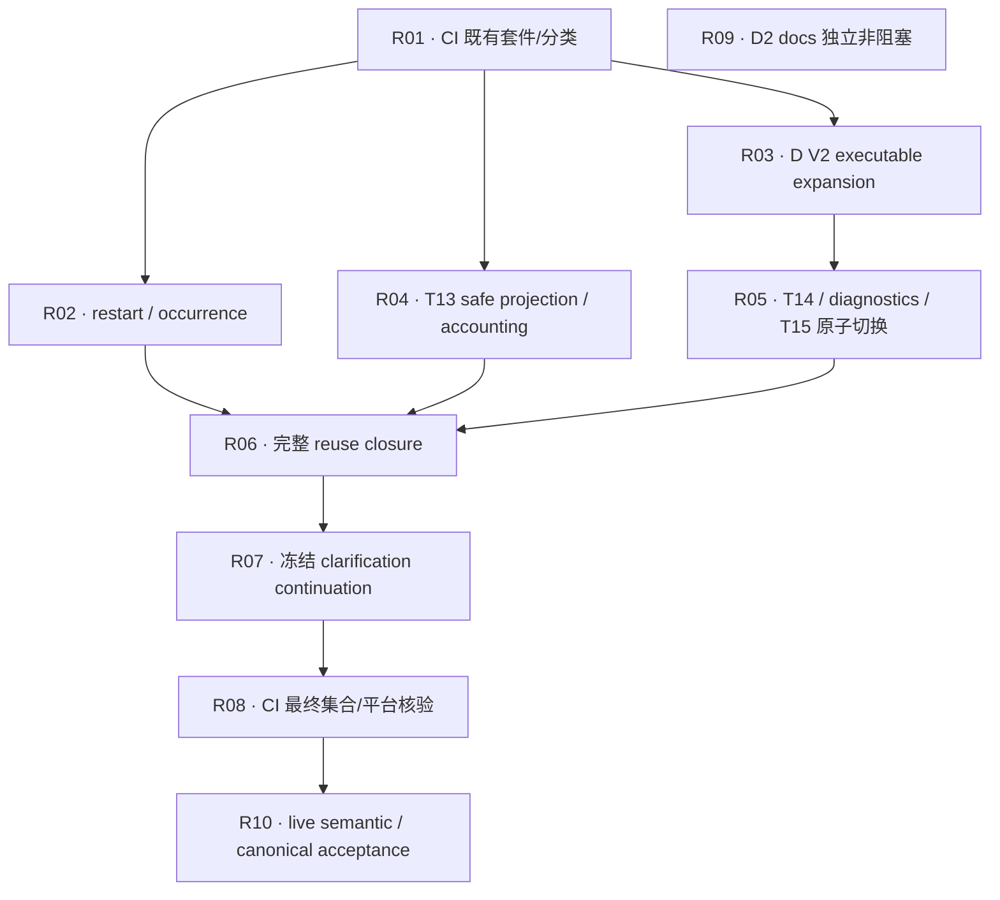

# P1 Repair Ticket Graph V1 — 直接依赖与串行集成候选

```text
DOCUMENT_ID = P1_REPAIR_TICKET_GRAPH_V1
STATUS = REVIEW_PENDING
AUTHORITY_CLASS = NON_AUTHORITATIVE_PLANNING_CANDIDATE
BASE_MASTER_SHA = e7a9a9e4a3be0ef4d3b07c37c9446d9a6b1512ab
BRANCH = planning/p1-repair-ticket-decomposition-v1
TICKET_COUNT = 10
IMPLEMENTATION_AUTHORIZATION = NONE
ISSUE_CREATION_AUTHORIZATION = NONE
MASTER_INTEGRATION = SERIAL
NEXT_LEGAL_ACTION = INDEPENDENT_REPAIR_TICKET_GRAPH_REVIEW
```

详细合同及 provenance 见 [Decomposition](P1_REPAIR_TICKET_DECOMPOSITION_V1.md)。
本图是 POST-AUDIT REPAIR PROGRAM，不修改原 P1-T01–T18 图，不创建 Issue，也不激活任何实现。

## 1. Authority 和历史证据

CURRENT AUTHORITY = BASE master 的 RULES/AGENTS、effective P1 Spec、A/B/C V1 与 D V2 Seam 及继承
Approved Specs。P1 amendment / D V2 生效是已完成前提，不作为新的 ticket 或 wave。

HISTORICAL EXACT-SHA REPAIR EVIDENCE = master P1 §0.2 引用的
`2387b9a9261b9830522e0da888b12ed990ee8b49` 下 Repair Plan/Owner Decisions；审计 publication =
`eb02a660cdb3ada07ee08f742e2987bb7da8b9e8`（审计产品 SHA=`4bea7b30b3842a876e383977686a0abc0d68302f`）。
它们可远端读取但 audit 目录不在 master，不宣称 sibling branch 已合并。历史 NO/PENDING lifecycle
不导入；若语义冲突，current effective Spec/Seam 胜出。exact 链接与 activation 证据来源见 companion §1。

## 2. DAG 与直接边语义

```text
BLOCKED_BY / BLOCKS = DIRECT EDGES ONLY
A BLOCKS B iff B BLOCKED_BY A
TRANSITIVE_AFFECTS = prose only, never mixed into direct edges
```



| Ticket | BLOCKED_BY | BLOCKS | Lane | 直接依赖交付物 |
|---|---|---|---|---|
| P1-R01 | — | P1-R02, P1-R03, P1-R04 | E | 无；只基于现有 suites 建连续执行/遗漏检查 |
| P1-R02 | P1-R01 | P1-R06 | A | 已工作的分类/CI 登记路径，自己的行为测试自己交付 |
| P1-R03 | P1-R01 | P1-R05 | B | 同上；可独立验证 V2 编码，V1 历史通道保持明确 |
| P1-R04 | P1-R01 | P1-R06 | C | 同上；不依赖未来 V2 producer 完成安全修复 |
| P1-R05 | P1-R03 | P1-R06 | B | versioned validators/fixtures；一次 merge 完成 producer+consumer 切换 |
| P1-R06 | P1-R02, P1-R04, P1-R05 | P1-R07 | A | 实际 occurrence、projection/prompt version、D V2 产物/validator；不猜未来 identity |
| P1-R07 | P1-R06 | P1-R08 | D | 同 occurrence 的真实 resume/有效性判断，pending 与 resolved 由本票新增 |
| P1-R08 | P1-R07 | P1-R10 | E | 已实际集成全部 A–D 的代码/tests；逐票回归早已完成 |
| P1-R09 | — | — | F | 无；仅当前 D2 文案事实 |
| P1-R10 | P1-R08 | — | A/B/C/D/E | 最终组合 CI/offline/平台 evidence；外部条件见 §7 |

边理由必须可检验：

- R01→R02/R03/R04 是 RP §14 的 E0→修复执行顺序：后续票须在已有持续 gate 机制中登记自己的回归；
  R01 的 AC 不得反过来要求这些未来测试已存在。不以 CI 票代写产品测试。
- R03→R05 是 executable seam ready，不是按文件层拆票。R03 能单独验证新版编码与历史隔离；R05 不能
  在只有 V1 validator 时发布 V2 producer。此直接边不意味着 R03 已证明真实 V2 生产可达。
- R02/R04/R05→R06 解决实际闭包的隐含依赖。R06 必须验证新版成功 COMPLETE 正控制及其真实语义/投影版本，
  因而不能在这些产物尚不存在时仅凭 stub 宣称完成。R04 与 R05 的实现彼此没有语义前置。
- R06→R07 是 occurrence/resume 实际接缝，避免 D 复制第二套恢复语义。R07 本身负责冻结 pending、用户输入
  和成功计数，不把自己的验收倒挂到 R06。
- R07→R08 使 final inventory 面向已经存在的完整修复集合；R02–R06 均是传递祖先，不重复列 direct edges。
- R08→R10 汇入 final exact integrated evidence，不表示 CI 自动授权 live/费用/私有出网。

`TRANSITIVE_AFFECTS`：R01 影响 R05/R06/R07/R08/R10；R03 影响 R06/R07/R08/R10；
R02/R04/R05 经 R06 影响 R07/R08/R10。R09 无路径到任何核心票。

## 3. 机器可读图（仅此一个直接边数据块）

以下 metadata 与 companion 的逐票字段必须一致，由 supporting validator 同时读取两份文档。
它不是生产 schema，不是 Issue 创建 payload，不含授权。

```json
{
  "ticket_count": 10,
  "tickets": [
    {"id":"P1-R01","lane":"E","type":"CODE/CI","findings":["F07"],"blocked_by":[],"blocks":["P1-R02","P1-R03","P1-R04"]},
    {"id":"P1-R02","lane":"A","type":"CODE","findings":["F01"],"blocked_by":["P1-R01"],"blocks":["P1-R06"]},
    {"id":"P1-R03","lane":"B","type":"CODE/TEST_INFRA","findings":["F03","F06"],"blocked_by":["P1-R01"],"blocks":["P1-R05"]},
    {"id":"P1-R04","lane":"C","type":"SECURITY/CODE","findings":["F04"],"blocked_by":["P1-R01"],"blocks":["P1-R06"]},
    {"id":"P1-R05","lane":"B","type":"CODE","findings":["F03","F06"],"blocked_by":["P1-R03"],"blocks":["P1-R06"]},
    {"id":"P1-R06","lane":"A","type":"CODE","findings":["F02"],"blocked_by":["P1-R02","P1-R04","P1-R05"],"blocks":["P1-R07"]},
    {"id":"P1-R07","lane":"D","type":"CODE","findings":["F05"],"blocked_by":["P1-R06"],"blocks":["P1-R08"]},
    {"id":"P1-R08","lane":"E","type":"CODE/CI","findings":["F07"],"blocked_by":["P1-R07"],"blocks":["P1-R10"]},
    {"id":"P1-R09","lane":"F","type":"DOCUMENT","findings":["F08"],"blocked_by":[],"blocks":[]},
    {"id":"P1-R10","lane":"A/B/C/D/E","type":"DOGFOOD","findings":["F01","F02","F03","F04","F05","F06","F07"],"blocked_by":["P1-R08"],"blocks":[]}
  ],
  "finding_owners": {
    "F01":["P1-R02"], "F02":["P1-R06"], "F03":["P1-R05"],
    "F04":["P1-R04"], "F05":["P1-R07"], "F06":["P1-R05"],
    "F07":["P1-R01","P1-R08"], "F08":["P1-R09"]
  },
  "critical_path":["P1-R01","P1-R03","P1-R05","P1-R06","P1-R07","P1-R08","P1-R10"],
  "conditional_execution_gates": {
    "ALL":"Graph independent review + ff-only integration + remote verify + authorized Issue/START_GATE; no implementation authorized now",
    "P1-R03":"V1 historical validation isolated; V2 TYPE_A only until real producer R05",
    "P1-R10":"Authorized material/egress/runtime/credentials/budget/repetitions/holdout + current integrated L0/L1; missing evidence blocks acceptance"
  }
}
```

## 4. Acyclic proof 与 critical path

复现命令（repository root）：

```bash
python3 docs/planning/supporting/validate_p1_repair_graph.py
git diff --check
```

机械检查：10 个唯一 ID；F01–F08 均有 owner 且无额外 finding；所有 target 存在、无 self-edge/重复边；
逐票 BLOCKS↔BLOCKED_BY 互反；Kahn topological sort 消费全部 10 节点；直接边无冗余传递边；
companion 逐票字段、类型、finding、依赖与矩阵/图匹配；每票 AC/authority/review route 存在；
产品修复票具有 caller/RED→GREEN 义务；R09 无 outgoing edge；#79 不在 ticket set。
检查脚本不证明语义正确、独立 review PASS 或未来测试真的执行。

本 candidate author 实际执行结果：`TICKET_COUNT=10`、`DIRECT_EDGE_COUNT=10`、
`FINDING_COVERAGE=F01–F08`、`RECIPROCITY=PASS`、`ACYCLIC=PASS`、
`NO_TRANSITIVE_EDGES=PASS`、`DOCUMENT_CONSISTENCY=PASS`。
supporting Python syntax gate 通过；独立 review 尚未执行。

拓扑层（由直接 DAG 导出）：

1. R01 ∥ R09
2. R02 ∥ R03 ∥ R04
3. R05
4. R06
5. R07
6. R08
7. R10

`CRITICAL_PATH = R01 → R03 → R05 → R06 → R07 → R08 → R10`，7 nodes / 6 edges。
这是无工期估算的最长依赖路径，不声称实际 wall-clock 最长；live 材料/预算可形成外部等待。
R02、R04 必须在 R06 汇合，若耗时更长则成为实际调度瓶颈。

## 5. Execution waves、parallel lanes 与共享写入

| Wave | 票 | 验收后才释放的事实 |
|---|---|---|
| 1 — CI foundation | R01；R09 可独立任意合法窗口 | 现有 tests 已连续执行；F 文档不阻塞 |
| 2 — 并行修复/合同 expansion | R02 ∥ R03 ∥ R04 | occurrence、V2 fixtures、safe projection 各自可独立验证 |
| 3 — D V2 production cutover | R05 | 真 producer→validator→T15 同 candidate，F03/F06 L0/L1 |
| 4 — reuse integration | R06 | 新语义/投影产物完整闭包和 ordinary resume |
| 5 — continuation | R07 | frozen decision 的真实 CLI 恢复 |
| 6 — regression closeout | R08 | 最终 exact 集合 CI/offline/platform |
| 7 — external evidence | R10 | L2 live + full canonical，缺条件不得假通过 |

parallel lanes：A 的 R02 与 C 的 R04、B 的 R03 可并行；R03 后 R05 可与尚未完成的 R02/R04
跨分支工作，但共享文件要交接。R09 始终独立。只允许开发并行，master update 永远 SERIAL。

| Shared surface | Owners / 交接规则 |
|---|---|
| composer / P1 state | R02→R06→R07 有直接/传递依赖；不并发写同分支，D 复用 A 结果 |
| coverage-final-integration | R04 必要 T13 接线、R05 T15 消费；可独立分支，按实际冲突串行交接；随后 R06/R07；无伪造产品依赖边 |
| deepseek-research-runtime | R04 只 T13 prompt，R05 只 T14 proposal；同文件修改须明确单 owner 时间窗口，后一票基于 fresh master/re-form，旧 PASS 不转移 |
| D executable fixtures/validator | R03 建边界→R05 current producer 切换，历史 validator 不混入 current path |
| workflow / suite 分类 | R01 初建；后续每票登记自己的 tests；同一 integration train 逐个合入，R08 对最终集合核验 |
| D2 文案/注释 | R09 自有 scope，与功能 diff 分离；不得为无冲突而改产品语义 |

没有 integration-branch-only 绿灯例外：每票都必须在其合法 base+direct blocker 输出上独立可验、可 merge。
parallel contract 的 isolated implementation 必须另获 START_GATE，并有可用 frozen fixtures；例如 R05 的
D V2 fixtures 未经 R03 review/交接前不能将“Spec 已冻结”当 `CONTRACT_READY=YES` 的全部证据。

## 6. 合法中间态、ready set 与 review/merge 顺序

### 6.1 D V1→V2 中间态

| Checkpoint | Producer | Executable validator | Consumer | 可声称的范围 |
|---|---|---|---|---|
| base / R01 / R02 | 既有 V1 | 既有 V1 | 既有 T15 | 已知修复未实现，不声称符合 V2 |
| R03 expansion | 仍 V1 | 显式 V1 historical + V2 TYPE_A | 仍既有路径 | 编码边界完成；生产 V2 未完成 |
| R04（可与 R03 交换） | T13 safe projection；T14 仍现有版本 | 与所在 checkpoint 相符 | 不切 D | 安全/metadata accounting 自有验收；现有零 claim fail 保留 |
| R05 cutover | T14 V2 + async runtime | current V2 TYPE_A+TYPE_B；V1 仅 historical | 同票迁移 T15/披露 | 真实 V2 接线 L0/L1；尚未 live/canonical 验收 |
| R06/R07/R08 | 已落地 V2 | 已落地 V2 | closure/continuation 使用真实版本 | 组合恢复/CI；仍不可假报 L2 |
| R10 | 同 exact integrated code | 全部适用 gates | 真 canonical chain | 仅所测场景、已满足的 acceptance 层 |

绝无 `producer writes V2 while validator still V1` 或等待未来 consumer 才能 green 的 merge。
R03 保留旧产物验证只作历史/过渡工程检查，不能把 V1 PASS 当当前 V2 合规性。

### 6.2 Ready policy

`INTEGRATION_READY(ticket)` 要求 direct blockers 都已 same-SHA required review、串行 ff-only 集成、
remote verify，且真实 producer-consumer conformance 可用。每票从 latest master scope-clean branch 开始。
准备工作可遵循四层 READY，但未授权不施工；本候选时 `AUTHORIZED_READY_SET = empty`。

将来 graph/Issue/START_GATE 都生效后，初始可集成 frontier 为 R01/R09；R01 后 R02/R03/R04。
frontier 内优先安全/语义/状态风险与后继路径，不越依赖抢跑；R09 非阻塞。每完成一票 fresh observe，
不把 snapshot ready-set 永久固定。现实冲突按单写者与 master serial 处理，不篡改 DAG 来掩盖冲突。

Review 顺序：每票静态/动态→self-review→push/remote CI/automated classification→独立 quorum→
exact reviewed HEAD 串行 ff-only merge→remote verify。R04 安全双 quorum 同 HEAD；其他按 companion
逐票角色。R10 的 independent semantic/acceptance evidence 不能替代 R05 CODE_REVIEWER 或 R04 双审。
本 graph author 不执行本 graph 的独立 review，不自己 merge。

## 7. Conditional gates 与 final acceptance

这些不是循环依赖或新增票：

| Gate | 条件 | 未满足时 |
|---|---|---|
| Graph freeze | independent graph review PASS + same exact HEAD ff-only integration + remote verify | 保持 REVIEW_PENDING、implementation/Issue creation NONE |
| Per-ticket start | authorized Issue/START_GATE + required inputs/ownership/routes | NOT_AUTHORIZED / BLOCKED；不以候选模型建议调 agent |
| R03→R05 conformance | R03 versioned executable boundary 已完成；R05 必须亲自产出 current TYPE_B | 不用 TYPE_A 或历史 private skip 替代 |
| L0 | 当前组合 mechanical/deterministic suites 与 production path；RED/GREEN receipts | FAIL/NOT_RUN 不接受 |
| L1 | 所需 code/security review 对精确 SHA；组合后 fresh independent evidence review | 单 lane 旧 PASS 不自动覆盖组合 |
| L2 | 已批准 runtime、预注册 cases/holdout、出网材料、owner 接受预算/重复数；独立 semantic adjudication | BLOCKED_BY_EXTERNAL_EVIDENCE；不改 goldens/阈值 |
| Full canonical | L0/L1/L2 满足，实际完整链、可取回 bytes/身份闭包、真实 coverage/lineage/no-fallback evidence | 不声明 FULL_CANONICAL_ACCEPTANCE |

RP §17 与 P1 §8.4 已规定 live 是必需门；本图没有新造允许 abstention 的百分比，默认明确 goldens
全部命中。信息不足样本必须预注册 UNKNOWN；全 singleton/family splitting/all-unresolved 不能绕过。

`CORE_REPAIR_ACCEPTANCE` 由 R10 的 exact integrated evidence 与 required independent verdict 决定，
R09 不阻塞它。`ALL_F01_F08_DISPOSITIONS_CLOSED` 另需 R09 已完成；F08 未完必须明确报告，
不能把核心通过谎报全部八项关闭。两者是状态汇总，不新增 F→核心票依赖。
#79 仍仅 POST_REPAIR_NEXT_CANDIDATE；即使 repair gates 全过也没有自动开工授权。#53/#54/#55 同样不启动。

## 8. Author batch self-check

| 检查 | 结论与边界 |
|---|---|
| Dependency audit | 所有 AC 使用 base+declared blockers；R06 实际版本依赖显式；R03 不要求未来 producer PASS |
| Source-contract audit | F01–F08 无遗漏；逐票 AUTHORITY 与 companion §6 双向映射；无阈值/算法/新 finding |
| Constraint audit | 每票 allowed scope 与输出相容；R03 历史隔离、R05 原子切换；R09 文案范围不授予当前 author 写权 |
| Granularity | A 两个用户行为边界；B executable expansion + 生产原子切换；C/D 完整生产路径；E 起点/终点；F 独立；final evidence 独立 |
| Reachability | 所有产品 CODE/SECURITY 票列实际 entry/caller/test；infra/DOCUMENT/DOGFOOD 适用面显式；不是已执行 repair 证明 |
| RED/GREEN | F01–F06 均由对应修复 owner；F07 覆盖遗漏正确断言；F08 文案核对；无 test-later |
| Quorum | AGENTS §5 路由，SECURITY 双审；无 self-approve、无另造高风险三层 quorum |
| Mechanical | supporting validator 核 ID/finding/edge/reciprocity/acyclic/reduction/critical-path/文档一致性 |

预期 reviewer 应重点对抗：R05 是否仍可单上下文交付；R03 历史通道是否泄入 current V2；R06 是否有
未声明的版本/持久化依赖；R04/R07 是否只有 helper 测试；R01/R08 是否用 skip 混淆真实执行。
有 finding 应在本候选范围修正并 fresh review，不能自称 graph 已通过独立审查。
