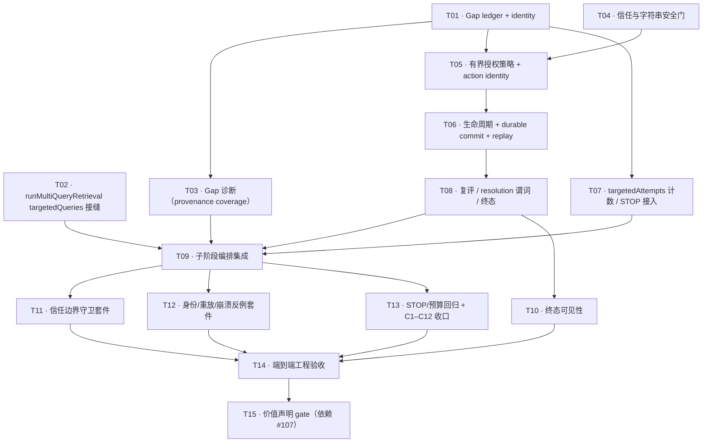

# P2-ARI #108 Ticket Graph V1 — 直接依赖、串行集成与并行车道

> **命名守卫**：本文 `P2-ARI` = `P2 / ADAPTIVE_RESEARCH_INTELLIGENCE`（#107–#112）。
> 与 2026-08-25 Product Direction 的 `LEGACY P2 = AUTHOR / PERSONAL INTELLIGENCE` 无关。

```text
DOCUMENT_ID = P2_ARI_108_TICKET_GRAPH_V1
STATUS = APPROVED / INTEGRATED（19 条直接边语义冻结；
         语义 = 被审 SHA 1de3c5481d876fefc2c59f17206a65e0b62fcff8）
AUTHORITY_CLASS = AUTHORITATIVE_TICKET_PLAN（PLANNING / EXECUTION TICKET PLAN）
BASE_MASTER_SHA = 504021b8965956d19fe4a17a9181cfe2c6bba93f
BRANCH = planning/p2-ari-f02-ticket-decomposition
TICKET_COUNT = 15
DIRECT_DEPENDENCY_EDGES = 19
IMPLEMENTATION_AUTHORIZATION = NONE
ISSUE_CREATION_AUTHORIZATION = YES（≠ 实现授权；IMPLEMENTATION_AUTHORIZATION = NONE）
REVIEWED_PLANNING_SHA = 1de3c5481d876fefc2c59f17206a65e0b62fcff8
MASTER_INTEGRATION = SERIAL
NEXT_LEGAL_ACTION = 已撤销 CANDIDATE 阶段的 ITGR gate → 发布 15 张 #108 child Issue
NEXT_GATE = P2A_INITIAL_START_GATE（单独授权）
```

详细合同、字段与覆盖矩阵见 [Decomposition](P2_ARI_108_TICKET_DECOMPOSITION_V1.md)。
本图不创建 Issue、不激活实现、不修改 Approved Spec / Seam / D12。

---

## 1. 依赖边语义

```text
BLOCKED_BY / BLOCKS = DIRECT EDGES ONLY
A BLOCKS B  ⟺  B BLOCKED_BY A
TRANSITIVE_AFFECTS = prose only, never mixed into direct edges
传递闭包必须覆盖全部语义依赖；任何被路径隐含的边不得重复编码为直接边
```

外部依赖（**不是** DAG 节点）：`Issue #107 / P2-F01 Research Evaluation Harness`
→ 只作用于 `P2A-T15`（价值声明 gate），不阻塞 T01–T14 的任何工程票。

---

## 2. DAG



---

## 3. 直接边清单（19 条，逐条互逆）

| # | 边 | 理由（直接依赖） |
|---|---|---|
| 1 | T01 → T03 | 诊断写 `diagnosedGaps[]`，需要 ledger 原语与 gap identity |
| 2 | T01 → T05 | 授权写 `targetedActions[]` 授权字段与 dedupe/attempt 索引，需要 ledger 持久化与合法状态集 |
| 3 | T01 → T07 | 计数导出函数读 ledger 的 action 状态与通道展开 |
| 4 | T04 → T05 | 授权策略调用信任门；无门即无授权 |
| 5 | T05 → T06 | 生命周期需要已授权且带 `targetedActionId` 的 action 条目 |
| 6 | T06 → T08 | 复评需要已 COMMITTED 的 action 与 pool diff |
| 7 | T03 → T09 | 编排需要先有诊断出的 gap |
| 8 | T02 → T09 | 编排需要 `targetedQueries` 执行接缝 |
| 9 | T07 → T09 | 编排需要把计数喂给 `evaluateRetrievalRound` |
| 10 | T08 → T09 | 编排需要复评终态来决定是否继续/落定 |
| 11 | T08 → T10 | 可见性渲染 gap 终态 |
| 12 | T09 → T11 | 信任守卫必须在真实执行路径上断言（plannedQueryVariants 非写入） |
| 13 | T09 → T12 | 崩溃边界反例需要完整提交路径 |
| 14 | T09 → T13 | STOP/预算回归需要完整编排路径 |
| 15 | T10 → T14 | 端到端验收需要产物可见性 |
| 16 | T11 → T14 | 端到端验收需要信任守卫通过 |
| 17 | T12 → T14 | 端到端验收需要身份/重放反例通过 |
| 18 | T13 → T14 | 端到端验收需要 C1–C12 全量收口 |
| 19 | T14 → T15 | 价值声明必须建立在工程验收之上 |

**传递影响（散文，不入边）**：

```text
T01 TRANSITIVE_AFFECTS T06/T08/T09/T10/T11/T12/T13/T14/T15
T02 TRANSITIVE_AFFECTS T11/T12/T13/T14/T15
T04 TRANSITIVE_AFFECTS T06/T08/T09/T10/T11/T12/T13/T14/T15
T05 TRANSITIVE_AFFECTS T08/T09/T10/T11/T12/T13/T14/T15
T06 TRANSITIVE_AFFECTS T09/T10/T11/T12/T13/T14/T15
T07 TRANSITIVE_AFFECTS T11/T12/T13/T14/T15
T08 TRANSITIVE_AFFECTS T11/T12/T13/T14/T15
T09 TRANSITIVE_AFFECTS T14/T15
T03 TRANSITIVE_AFFECTS T11/T12/T13/T14/T15
```

---

## 4. 拓扑层与并行车道

```text
W0  T01 · T02 · T04        （无前置；三个不同写面，可并行）
W1  T03 · T05 · T07        （T03/T07 ← T01；T05 ← T01 + T04）
W2  T06                    （← T05）
W3  T08                    （← T06）
W4  T09 · T10              （T09 ← T02/T03/T07/T08；T10 ← T08）
W5  T11 · T12 · T13        （← T09；三个独立测试套件）
W6  T14                    （← T10/T11/T12/T13）
W7  T15                    （← T14 + 外部 #107）
```

| 车道 | 票 | 判定 | 理由 |
|---|---|---|---|
| LANE A · 身份与持久化 | T01 → T05 → T06 → T08 → T10 | **SERIAL_REQUIRED** | 同一 targeted 模块 / ledger 与 action 字段的连续写者链；单写者矩阵要求串行 |
| LANE B · P1 原语接缝 | T02（`retrieval.mjs`）、T07（`retrieval-round-controller.mjs`） | **PARALLEL_SAFE**（与 LANE A 并行） | 各自独占一个 P1 文件，无交叉写者 |
| LANE C · 诊断与信任 | T03（←T01）、T04（无前置→并入 T05） | **PARALLEL_SAFE**（T03 与 T02/T04 并行） | T03 写 gap 记录；T04 无状态纯函数；但**并入 master 时与 LANE A 串行** |
| INTEGRATION_BARRIER | T09 | **SERIAL_REQUIRED** | `coverage-final-integration.mjs` / `p1-runtime-composer.mjs` 唯一写者；前序全部必须已集成 |
| TEST FANOUT | T11 / T12 / T13 | **PARALLEL_SAFE**（各自独立文件与 fixtures 命名空间） | 测试面互不写产品状态 |
| ACCEPTANCE | T14 → T15 | **SERIAL_REQUIRED** | 验收结论依赖工程证据；价值声明依赖 #107 |

**共享写面保护**：

```text
retrieval.mjs                        → 仅 T02
retrieval-round-controller.mjs       → 仅 T07
coverage-final-integration.mjs /
  p1-runtime-composer.mjs            → 仅 T09
targeted-requery 模块（ledger 等）   → T01 创建；T03/T05/T06/T08/T10 各自扩展不同字段，
                                       但同一模块同一时刻只允许一个活跃写者（串行集成）
test/ 与 fixtures                    → T11/T12/T13 使用独立文件名与 fixtures 命名空间
```

**不建议**：把 W5 的三个测试票合成一票（会丢掉"信任 / 重放 / STOP"三个不同 reviewer 关注面）；
也不建议把 LANE A 拆成并行分支（ledger 与 action 状态是同一可变面的连续写者）。

---

## 5. Reviewer 路由（按 `AGENTS.md` §5.1 与风险）

| 票 | TYPE | RISK | quorum |
|---|---|---|---|
| T01 | CODE | HIGH | 1 × CODE_REVIEWER + 1 × CONTRACT_REVIEWER（同 exact HEAD） |
| T02 | CODE | HIGH | 1 × CODE_REVIEWER + 1 × CONTRACT_REVIEWER |
| T03 | CODE | MEDIUM | 1 × CODE_REVIEWER |
| T04 | CODE（security/trust） | HIGH | 1 × SECURITY_REVIEWER + 1 × CODE_OR_CONTRACT_REVIEWER（同 exact HEAD） |
| T05 | CODE | HIGH | 1 × CODE_REVIEWER + 1 × CONTRACT_REVIEWER |
| T06 | CODE（crash/resume） | HIGH | 1 × CODE_REVIEWER + 1 × CONTRACT_REVIEWER |
| T07 | CODE（STOP/预算） | HIGH | 1 × CODE_REVIEWER + 1 × CONTRACT_REVIEWER |
| T08 | CODE | HIGH | 1 × CODE_REVIEWER + 1 × CONTRACT_REVIEWER |
| T09 | INTEGRATION | HIGH | 1 × CODE_REVIEWER + 1 × CONTRACT_REVIEWER |
| T10 | CODE | MEDIUM | 1 × CODE_REVIEWER |
| T11 | TEST/EVIDENCE（security） | HIGH | 1 × SECURITY_REVIEWER + 1 × CODE_REVIEWER |
| T12 | TEST/EVIDENCE | HIGH | 1 × CODE_REVIEWER + 1 × CONTRACT_REVIEWER |
| T13 | TEST/EVIDENCE | HIGH | 1 × CODE_REVIEWER + 1 × CONTRACT_REVIEWER |
| T14 | EVIDENCE/DOGFOOD | MEDIUM | 1 × ACCEPTANCE_EVIDENCE_REVIEWER |
| T15 | EVIDENCE/DOGFOOD（value claim） | MEDIUM | 1 × ACCEPTANCE_EVIDENCE_REVIEWER |

**不**为低风险胶水票要求最强/最贵 reviewer：昂贵通道保留给
身份（T01/T05）、信任（T04/T11）、resume（T06/T12）、STOP（T07/T13）、关键集成（T09/T14）。

---

## 6. #107 表示

```text
Issue #107 / P2-F01 = EXTERNAL_BLOCKING_DEPENDENCY（非 DAG 节点）
仅入边：P2A-T15 ← #107
T01–T14 均 NOT BLOCKED BY #107
T14 不得产出"研究质量改善"声明；该结论只可能出现在 T15，且必须附 #107/等价证据
```

---

## 7. 状态

```text
STATUS = APPROVED / INTEGRATED
AUTHORITY_CLASS = AUTHORITATIVE_TICKET_PLAN
IMPLEMENTATION_AUTHORIZATION = NONE
ISSUE_CREATION_AUTHORIZATION = YES
NEXT_LEGAL_ACTION = 发布 15 张 #108 child Issue + #108 tracker 更新（不启动实现）
NEXT_GATE = P2A_INITIAL_START_GATE
DEPENDENCY_READY_SET = { P2A-T01, P2A-T02, P2A-T04 }（记录用，READY_BUT_NOT_AUTHORIZED）
```

提升 provenance 与 `REVIEWED_PLANNING_SHA = 1de3c5481d876fefc2c59f17206a65e0b62fcff8`
记录在 [Decomposition §12.1](P2_ARI_108_TICKET_DECOMPOSITION_V1.md)；本文档不复制第二份 truth。
