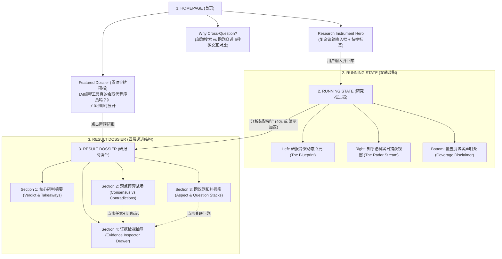

# ROUND 2: DESIGN DIRECTIONS & INFORMATION ARCHITECTURE
## Cross-Question Deep Research for Zhihu (Hackathon Edition)
> **Author**: Senior AI Product Designer · Interaction Designer · Frontend Design Director  
> **Status**: Design Exploration Phase (Strictly No Code / Design First)

---

## 一、三大设计方向深度推演与权衡 (Deep Evaluation)

根据 Round 1 的诊断，针对知乎 Hackathon 评委的心理模型，我们对三个方向进行极限场景压力测试：

### 1. 方向 A：【The Editorial Investigation / 深度调查卷宗】
* **评委 10 秒第一印象**：“这像是一份普利策级别的智库报告，极有深度和文字尊严。”
* **阅读体验优势**：
  * **长时间停留极佳**：评委如果真想读内容，单列排版（Max-width 720px）加舒适行距（1.75）是最不伤眼的排版。
  * **文字就是力量**：完全依赖排版节奏感（Type Hierarchy）、留白与标点细节，去除了 AI 的廉价塑料味。
* **致命痛点 / 极端风险**：
  * 如果评委只有 15 秒扫一眼，这种“纸质沉静感”可能无法在一瞬间建立“跨问题、海量计算”的视觉冲击，容易被误以为是“静态博客”或“常规总结”。

---

### 2. 方向 B：【Knowledge Cartography / 动态认知制图】
* **评委 10 秒第一印象**：“哇，视觉极其现代，知乎的讨论被拆成了一个个动态岛屿与航道！”
* **交互体验优势**：
  * **跨问题（Cross-Question）概念无需解释，肉眼可见**：左侧画布清晰呈现 4 个 Aspect 岛屿，每个岛屿下连接数个知乎原问题，鼠标滑过即可看到观点能量连线汇聚。
  * **Demo 舞台感顶级**：投影或大屏展示时，科技感与智识感拉满。
* **致命痛点 / 极端风险**：
  * **移动端完全不可用**：双栏画布在手机屏幕上只能强行叠放或直接隐藏地图，导致桌面与移动端割裂。
  * **认知负荷偏高**：评委眼睛不知道该看左边的图还是右边的字，容易产生交互疲劳。

---

### 3. 方向 C：【The Precision Instrument / 认知真理终端】
* **评委 10 秒第一印象**：“极其硬核的专业工具，信息吞吐量极大，像金融交易终端处理人类知识。”
* **产品体验优势**：
  * **工程能力不打自招**：Bento Grid 模块化、快捷键驱动（Cmd+K、J/K 上下选 Claim），评委一看就知道团队具有顶尖的前端工程掌控力。
  * **观点对撞（Contradiction）呈现最直观**：矩阵表格两栏对冲，像代码 Diff 一样清晰对比。
* **致命痛点 / 极端风险**：
  * 对于重视“知乎人文社区温度”的评委，可能会觉得过于冰冷、缺乏叙事张力。

---

## 二、设计总监推荐演进方案：【The Living Editorial Dossier / 活体调查卷宗】(A + B 混合体)

为了兼顾 **“评委前 10 秒的视觉冲击”** 与 **“后续 60 秒的深度阅读信任”**，我们推荐将 A 的优雅排版与 B 的空间叙事做有机融合：

### 复合设计策略：
1. **全局基底延续 Direction A（卷宗阅读尊严）**：
   * 采用象牙暖灰或深水墨黑基底，以高质量字型与留白构建“权威研报”的心智。
2. **在“跨议题全景”核心模块植入 Direction B 的微地图（Aspect Radar Canvas）**：
   * 不做全屏散乱的力导向大网，而是在报告第二层做精致的 **“议题拓扑切面卡（Topology Strip）”**。
   * 点击切面，正文相应 Claims 瞬间平滑聚焦（Scroll & Highlight），保持空间联系。
3. **在“观点博弈战场”融入 Direction C 的矩阵对冲（Contradiction Diff）**：
   * 像对比两份判决书一样呈现正反双方，红绿标签转换为深邃的克制对比色。

---

## 三、产品全局信息架构图 (Information Architecture)

---

## 四、页面核心模块交互规范 (Emil Kowalski 规范落地)

| 交互组件 | 行为规范 | 动效参数 (Duration / Easing) | 设计工程意图 (Why) |
| :--- | :--- | :--- | :--- |
| **Hero 搜索框** | 获得焦点时外边框发光扩散，回车时按钮产生微按压反馈 | `transform: scale(0.97)` on `:active`，`140ms ease-out` | 确认系统收到了用户的操作输入，符合触觉反馈原则 |
| **Featured 置顶研报展开** | 点击后原地平滑变大撑开成 Result 页面（Shared Element） | `320ms cubic-bezier(0.23, 1, 0.32, 1)` | 消除“路由跳转白屏感”，让评委体验到 0 延迟的丝滑感 |
| **Progress 骨架点亮** | 每一个 Aspect 解构完成时，卡片从淡灰变为纯白，边框流光一次 | `opacity: 0 -> 1`, `translateY(4px -> 0)`, `180ms ease-out` | 告知用户研究结构正在被稳步构建，降低等待焦虑 |
| **Evidence Inspector 抽屉** | 点击正文中的引用角标 `[1]` 时，右侧滑出抽屉，背景加轻微模糊 | `transform: translateX(100% -> 0)`, `backdrop-filter: blur(4px)`, `240ms` | 保留用户当前阅读上下文，避免打断沉浸感 |
| **Contradiction 争论卡切换** | 点击“反方论据”或“正方论据”标签，两栏高亮切换 | `transition: border-color 160ms ease-out, background 160ms` | 严禁使用全屏刷新或大篇幅位移，保持视觉稳定 |

---

## 五、响应式移动端降级矩阵 (Responsive Matrix)

Hackathon 场景下，评委很可能在微信或移动浏览器中打开链接。

| 模块 | 桌面端呈现 (Desktop ≥ 1024px) | 移动端呈现 (Mobile < 768px) |
| :--- | :--- | :--- |
| **Hero 区域** | 居中大幅面 Instrument，输入框内嵌键盘快捷提示 `Enter` | 顶部固定搜索栏，保留精简建议标签，去除多余装饰 |
| **Research Progress** | 双轨并列：左侧骨架点亮，右侧语料流 | 单列纵向：骨架进度条置顶收缩，语料流精简为 1 条跑马灯式摘要 |
| **Discussion Landscape** | 水平或网格分布的 Aspect 拓扑岛屿，带悬浮关联动效 | 纵向折叠手风琴（Accordion），默认展开第 1 个核心切面 |
| **Battleground 对撞区** | 左右并列两栏（Side-by-Side）针锋相对 | 上下堆叠卡片，支持滑动 Tab 切换（正方观点 / 反方观点） |
| **Evidence Inspector** | 屏幕右侧固定宽度（420px）侧滑抽屉，不遮挡主文 | 底部弹出上滑抽屉（BottomSheet / Drawer），支持下滑手势关闭 |

---

## 六、待用户确认的关键决策 (Checklist for Round 2)

在进入 Wireframe（线框图）与 Design System（视觉系统）具体构建前，请确认以下核心共识：

1. [ ] **方向锁定**：是否认可采用 **【The Living Editorial Dossier】（A 的阅读质感 + B 的切面拓扑 + C 的冲突对冲）** 作为最终基准方向？
2. [ ] **首屏主叙事文案**：是否定调为：
   * **主标题**：跨议题透视知乎真实经验，绘制有证据的认知全景
   * **副标题**：不向单一问题要和稀泥的摘要，向整个知乎要经得起检验的共识、分歧与真实论据
3. [ ] **演示用例确定**：用于 0 延迟展示的置顶真实研报，是否锁定为：《AI 编程工具真的会取代程序员吗？》（关联 23 个问题、396 篇语料、3 大核心分歧）？

一旦你确认或提出微调意见，我们将立即推进 **ROUND 3: Wireframe 线框图与组件分解**！
