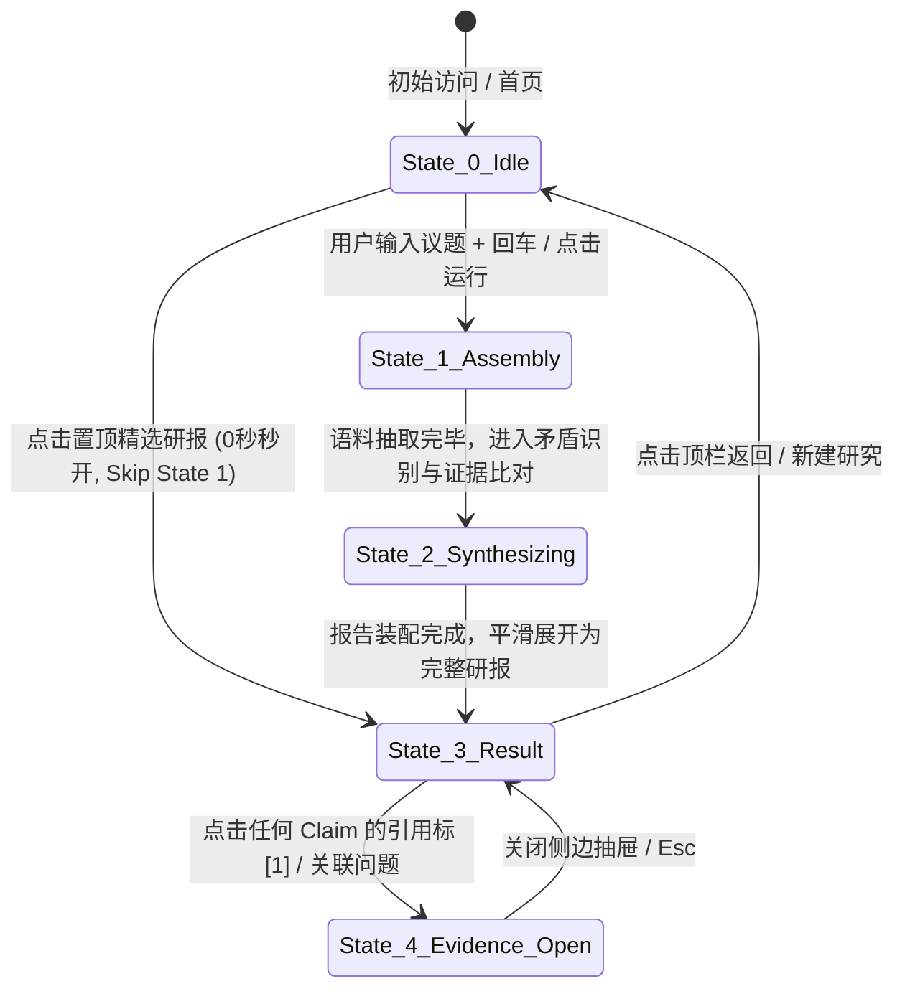

# ROUND 3 & 4: INFORMATION ARCHITECTURE, STATE MACHINE & WIREFRAMES
## Cross-Question Deep Research for Zhihu (Hackathon Edition)
> **Author**: Senior AI Product Designer · Interaction Designer · Frontend Design Director  
> **Status**: Design Phase (Strictly No Code / Design First)

---

## 一、系统状态机设计 (System State Machine)

整个产品体验由一个严格的 4 状态有限状态机（FSM）驱动，杜绝传统 Chat 界面的不可预测性与混乱交谈流：



### 状态细则：
* **State 0: Idle (沉浸探测台)**：主输入框获得焦点，提供置顶精选研报的零延迟入口与核心价值对比。
* **State 1: Assembly (研报骨架动态装配)**：双轨推进。左轨逐步点亮 Aspect 和关联问题，右轨实时捕获知乎高价值回答与答主脉冲。
* **State 2: Synthesizing (共识与分歧提取)**：进度进入 80%+，出现冲突卡片的预装配动效，消除长时间白屏或卡顿焦虑。
* **State 3: Result Dossier (研报阅读台)**：四层递进式结构展开，默认停留在第 1、2 层。
* **State 4: Evidence Inspector (证据检视态)**：侧边 420px 抽屉滑出，主阅读区轻微半透明遮罩，锁定当前证据链。

---

## 二、Desktop 界面线框图 (Desktop Wireframes)

### Wireframe 1: HOMEPAGE (首屏视界 · 桌面端)

```text
+-------------------------------------------------------------------------------------------------------+
|  [Logo] CrossZhihu · 知乎跨议题认知研报系统                  [真实案例库: 3] [关于本产品] [GitHub]     |
+-------------------------------------------------------------------------------------------------------+
|                                                                                                       |
|                                       · 跨 议 题 调 研 ·                                              |
|                           跨议题透视知乎真实经验，绘制有证据的认知全景                                   |
|               不向单一问题要和稀泥的总结，向整个知乎要经得起检验的共识、分歧与真实论据                 |
|                                                                                                       |
|    +---------------------------------------------------------------------------------------------+    |
|    |  🔍  输入一个你想在知乎穷尽调研的复杂议题... (例如: AI编程工具、新能源降价、职场生存法则)      |    |
|    |                                                                                             |    |
|    |  [ 常见范例: AI会取代初级程序员吗？] [ 新能源汽车价格战终局 ] [ AI Agent真实商业壁垒 ]         |    |
|    +---------------------------------------------------------------------------------------------+    |
|                                     [ ✦ 开始跨议题深度研究 (Enter) ]                                 |
|                                                                                                       |
|  - - - - - - - - - - - - - ⚡️ 零等待 · 历史真实研究成果深度透视 (Featured Dossier) - - - - - - - - -   |
|                                                                                                       |
|    +---------------------------------------------------------------------------------------------+    |
|    |  ★ 置顶精选真实研报                                              [ 真实语料库: 100%覆盖 ]    |    |
|    |                                                                                             |    |
|    |  《AI 编程工具真的会取代初级程序员吗？—— 基于 23 个知乎关联问题与 396 篇专业回答的认知解构》      |    |
|    |                                                                                             |    |
|    |  • 涵盖议题切面: [研发效能实测] [用人成本与招聘门槛] [系统维护与责任归属] [个人成长路径]        |    |
|    |  • 核心发现剧透: 发现 1 项全网强共识 · 揭示 2 处尖锐行业冲突 · 包含 14 位技术总监/架构师经验   |    |
|    |                                                                                             |    |
|    |  [ 立即展开这份完整研报 (0秒即时渲染) ➔ ]                                                   |    |
|    +---------------------------------------------------------------------------------------------+    |
|                                                                                                       |
|  - - - - - - - - - - - - - - - - - 为什么不同于普通 AI 搜索？ - - - - - - - - - - - - - - - - - - - -  |
|                                                                                                       |
|    +-----------------------------------------------+ +-----------------------------------------------+|
|    |  普通 AI 搜索 / Perplexity 模式               | |  Cross-Question 跨议题深度研报                |
|    |  -------------------------------------------  | |  -------------------------------------------  |
|    |  • 局限于单一提问的字面关键词匹配             | |  • 自动解构多重议题切面，拉取 10~30 个关联问题|
|    |  • 总结前 5 个回答，和稀泥给出折中套话        | |  • 提取核心 Claims，针锋相对呈现分歧与条件断言 |
|    |  • 来源孤立，无法追溯答主背景与争论上下文     | |  • 完整保留知乎答主身份、时间戳与原汁原味论据 |
|    +-----------------------------------------------+ +-----------------------------------------------+|
|                                                                                                       |
+-------------------------------------------------------------------------------------------------------+
```

---

### Wireframe 2: RESEARCH PROGRESS (研报骨架动态装配视界)

```text
+-------------------------------------------------------------------------------------------------------+
|  [Logo] CrossZhihu                       [ 议题: AI 编程工具真的会取代初级程序员吗？ ]    [终止研究]  |
+-------------------------------------------------------------------------------------------------------+
|                                                                                                       |
|  [ 阶段 3/4: 观点交叉比对与冲突识别中... ]  ============================================ 78%           |
|                                                                                                       |
|  +---------------------------------------------------+ +---------------------------------------------+ |
|  | 左轨: 研报蓝图生长区 (THE BLUEPRINT ASSEMBLY)     | | 右轨: 知乎实时捕获雷达流 (RADAR STREAM)     | |
|  | ------------------------------------------------- | | ------------------------------------------- | |
|  |                                                   | |                                             | |
|  | [✓] 议题切面解构完成 (已锁定 4 个研究维度)         | | ⚡️ [捕获知乎问题]                          | |
|  |                                                   | |    《Devin 发布后，程序员还有未来吗？》     | |
|  | [✓] 关联知乎讨论检索 (命中 23 个核心问题)         | |    ↳ 命中回答 18 条 · 提取高赞观点...      | |
|  |     ├── 效能实测: 8 个问题 (142 篇回答)           | |                                             | |
|  |     ├── 招聘市场: 6 个问题 (110 篇回答)           | | ⚡️ [观点碰撞提取]                          | |
|  |     ├── 架构隐患: 5 个问题 (86 篇回答)            | |    冲突点: “代码生成率42%” vs “Bug排查成本3x”|
|  |     └── 职业进阶: 4 个问题 (58 篇回答)            | |                                             | |
|  |                                                   | | ⚡️ [答主背景解析]                          | |
|  | [◐] 正在进行观点聚类与冲突挖掘 (248/396 篇)        | |    知乎知名架构师 @xxx: 强调工程职责边界... | |
|  |     ┌──────────────────────────────────────────┐  | |                                             | |
|  |     │ ⚔️ 锁定关键分歧:                         │  | | ⚡️ [时序演进捕捉]                          | |
|  |     │ “生成工具是否降低了初级程序员的进入门槛” │  | |    2023年乐观预期 vs 2025年落地疲惫...     | |
|  |     └──────────────────────────────────────────┘  | |                                             | |
|  |                                                   | | (实时脉冲流动，单条淡入后微上移，保持呼吸节奏) |
|  | [ ] 最终研报证据链与置信度审计                    | |                                             | |
|  +---------------------------------------------------+ +---------------------------------------------+ |
|                                                                                                       |
|  ---------------------------------------------------------------------------------------------------  |
|  ℹ️ 透明度声明: 本次研究已纳入 23 个关联问题、396 篇精选语料，分析覆盖率 100% (不代表知乎全站穷尽)。  |
+-------------------------------------------------------------------------------------------------------+
```

---

### Wireframe 3: RESULT DOSSIER (研报主体视界 · 桌面端)

```text
+-------------------------------------------------------------------------------------------------------+
|  [Logo] CrossZhihu             [ 议题: AI 编程工具会取代程序员吗？ ]           [ 导出PDF ] [ 复制研报 ]|
+-------------------------------------------------------------------------------------------------------+
|                                                                                                       |
|  ===================================================================================================  |
|  SECTION 1: 核心研判裁决 (THE BOTTOM LINE & TAKEAWAYS)                                                |
|  ===================================================================================================  |
|                                                                                                       |
|  【核心定性结论】                                                                                     |
|  AI 工具短期内不会“消灭”程序员岗位，但已实质性“焊死”初级代码搬运工的晋升通道；真实门槛从“写语法代码”  |
|  全面转移至“业务系统理解深度”与“故障兜底责任归属”。                                                   |
|                                                                                                       |
|  +-----------------------------+ +-----------------------------+ +-----------------------------+     |
|  | 🟢 结构性强共识             | | ⚔️ 尖锐行业分歧             | | ⚠️ 关键生效条件             |     |
|  | 单元测试与脚手架代码提效40%+ | | 团队规模缩减 vs 需求井喷扩招 | | 仅在中大型规范化系统成立     |     |
|  | [ 证据: 14位技术负责人认证 ]| | [ 正方: 裁撤 | 反方: 扩编 ] | | [ 依赖完备CI/CD基础设施 ]   |     |
|  +-----------------------------+ +-----------------------------+ +-----------------------------+     |
|                                                                                                       |
|  ===================================================================================================  |
|  SECTION 2: 观点博弈战场 (THE BATTLEGROUND: CONSENSUS & CONTROVERSIES)                                 |
|  ===================================================================================================  |
|                                                                                                       |
|  [ 争议对撞焦点 #1: 效能提升究竟导致研发团队裁减，还是催生更多软件需求？ ]                            |
|                                                                                                       |
|  +-------------------------------------------+   +-------------------------------------------+        |
|  | 正方主张 (裁减派 · 38% 答主)              |   | 反方主张 (扩张派 · 52% 答主)              |        |
|  | ----------------------------------------- |   | ----------------------------------------- |        |
|  | “原本需要 3 个初级前端的活，现在 1 个资深 |   | “杰文斯悖论（Jevons Paradox）显现：代码   |        |
|  | 带着 Copilot 一天搞定。HC 冻结已成大厂常态|   | 成本降低导致企业尝试更多边缘业务，总需求  |        |
|  | 事实。” [1] [2]                            |   | 不降反升。” [3] [4]                       |        |
|  |                                           |   |                                           |        |
|  | 核心论据: 2024秋招HC同比缩减65%           |   | 核心论据: 业务迭代周期从双周缩短至3天     |        |
|  | 代表答主: 某大厂研发效能总监              |   | 代表答主: 跨境电商技术合伙人              |        |
|  | [ 查看支持该观点的 8 篇知乎回答 ➔ ]       |   | [ 查看支持该观点的 12 篇知乎回答 ➔ ]      |        |
|  +-------------------------------------------+   +-------------------------------------------+        |
|                                                                                                       |
|  ===================================================================================================  |
|  SECTION 3: 跨议题拓扑卷宗 (DISCUSSION TOPOLOGY LANDSCAPE)                                            |
|  ===================================================================================================  |
|                                                                                                       |
|  [ 议题切面 1: 真实研发效能实测与技术债踩坑 (来自 8 个知乎问题 · 142 篇回答) ]               [收起/展开]|
|  ---------------------------------------------------------------------------------------------------  |
|  • 关联知乎原问题:                                                                                    |
|    ├─ 《日常开发中，GitHub Copilot 能提高多少效率？》 (最高赞回答 @张三: 语法糖提效，逻辑构思无用)   |
|    ├─ 《如何看待某团队引入 AI 编程后，生产环境故障率激增？》 (安全反思与合规边界讨论)                 |
|    └─ 《2025 年你还在用原生手写脚手架吗？》                                                          |
|                                                                                                       |
|  [ 议题切面 2: 劳动力市场实态与大厂招聘风向 (来自 6 个知乎问题 · 110 篇回答) ]               [展开]    |
|  [ 议题切面 3: 系统稳定性、合规与最终责任归属 (来自 9 个知乎问题 · 144 篇回答) ]             [展开]    |
|                                                                                                       |
+-------------------------------------------------------------------------------------------------------+
```

---

### Wireframe 4: EVIDENCE INSPECTOR (证据检视侧边抽屉 · 桌面端)

当用户在 Section 2 或 Section 3 点击任何引用角标 `[1]` 时，右侧平滑滑出：

```text
                                                  +-----------------------------------------------------+
                                                  | 证据检视器 (EVIDENCE INSPECTOR)                 [✕] |
                                                  +-----------------------------------------------------+
                                                  | 引用标记: [1]                                       |
                                                  | 支撑观点: “大厂初级岗位 HC 冻结与代码搬运工替代”    |
                                                  | 判定置信度: 强支持 (Verified Evidence)             |
                                                  | --------------------------------------------------- |
                                                  |                                                     |
                                                  | 📌 关联知乎原问题:                                  |
                                                  | 《作为研发总监，你现在招聘初级程序员的标准变了吗？》  |
                                                  | [在知乎打开原帖 ↗]                                   |
                                                  |                                                     |
                                                  | 👤 答主信息:                                        |
                                                  | @王工 (知乎认证: 某云计算大厂资深技术总监)          |
                                                  | 获得 3,420 赞同 · 回答于 2024-11                   |
                                                  |                                                     |
                                                  | 💬 核心原话摘录 (Highlighted Excerpt):              |
                                                  | “...我们组今年HC砍了80%，以前招应届生进来主要是     |
                                                  | 帮忙写增删改查和补单元测试。现在有了 Cursor 和内部  |
                                                  | 适配的 AI Agent，一个熟练工产出直接顶过去两个人。   |
                                                  | 我们现在只招能一眼看出 AI 生成代码潜在死锁的人，    |
                                                  | 不会调优的初级简历一律不过筛...”                   |
                                                  |                                                     |
                                                  | --------------------------------------------------- |
                                                  | 🔗 交叉验证来源 (其他支持此论点的知乎问题):         |
                                                  | • 《2024 计算机应届生真的找不到工作了吗？》(赞同2.1k)|
                                                  | • 《中小厂会全面跟进 AI 代码生成吗？》(赞同890)     |
                                                  +-----------------------------------------------------+
```

---

## 三、Mobile 响应式线框图 (Mobile Wireframe < 768px)

移动端针对评委在微信/手机浏览器环境做了**信息层级极简压实**：

```text
+------------------------------------+
| [Logo] CrossZhihu            [Menu]|
+------------------------------------+
| 跨议题透视知乎真实经验，绘制认知全景 |
|                                    |
| [ 🔍 输入议题...         ] [深度研]|
|                                    |
| ★ 置顶精选研报 (0秒即开):          |
| 《AI 编程工具真的会取代程序员吗？》 |
| 23个问题 · 396篇语料 · 发现3大分歧  |
| [ 立即阅读完整报告 ➔ ]             |
| ---------------------------------- |
| 核心研判裁决:                      |
| 短期不消灭岗位，但彻底焊死初级代码 |
| 搬运工通道；重点转向系统排障与责任。|
|                                    |
| [ 🟢 强共识: 单元测试提效40%+ ]    |
|                                    |
| ⚔️ 关键冲突 (滑动切换):            |
| +--------------------------------+ |
| | [裁减派 38%]  |  反方派 52%    | |
| | ------------------------------ | |
| | “原本3个初级干的活，现在1个资  | |
| | 深带AI全搞定。” [1]           | |
| | 来源: 某大厂技术总监 (3.4k赞) | |
| +--------------------------------+ |
|                                    |
| 📁 议题切面 (手风琴):              |
| [▼] 效能实测 (8问题 · 142回答)     |
| [▶] 招聘市场 (6问题 · 110回答)     |
| [▶] 责任归属 (9问题 · 144回答)     |
+------------------------------------+
| (点击[1]从屏幕底部滑出半屏 Drawer)  |
+------------------------------------+
```

---

## 四、下一步演进计划

随着 Wireframe 与状态机的冻结，下一步将进入：
* **ROUND 5: Design System（视觉规范、设计代币 Token、排版字阶、色彩语义）**；
* **ROUND 6: High-Fidelity UI & Mock Data Contract（真实案例数据结构定义）**。
